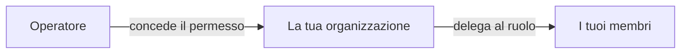

# Amministratore aziendale

**Sei responsabile della tua organizzazione dentro il registro.** Chi ha un account, che cosa può fare, come accede e come la tua società è identificata on-chain.

Non è un'area di lavoro a sé — compare come **Company Admin** dentro l'area Emittente. È una responsabilità che si sovrappone a tutto il resto di ciò che fai.

---

## Che cosa c'è qui

| Scheda | Per |
|---|---|
| **Users** | Invitare persone, assegnare ruoli, disattivare chi esce. |
| **IdP Settings** | Collegare il single sign-on aziendale. |
| **Organization** | La tua identità on-chain e i wallet ad essa vincolati. |
| **External IDs** | Identificativi che collegano la tua organizzazione ai sistemi esterni. |

---

## Users

*Company Admin → Users.*

Inviti persone, assegni ruoli e le disattivi quando se ne vanno. Ruoli che puoi concedere all'interno della tua organizzazione:

| Ruolo | Consente di |
|---|---|
| `INVESTOR` | Detenere e consultare strumenti finanziari. |
| `TRADER` | Comprare, vendere e usare i mercati di liquidità. |
| `ISSUER` | Creare e amministrare emissioni. |
| `COMPANY_ADMIN` | Tutto ciò che sta in questa pagina. |
| `DAPP_PUBLISHER` | Pubblicare applicazioni sul marketplace. |

Una persona può averne più di uno. I ruoli determinano quali [aree di lavoro](index.md) compaiono e — cosa più importante — che cosa il backend consente davvero.

!!! danger "Disattiva chi esce lo stesso giorno"
    Un account che funziona ancora dopo che qualcuno ha lasciato l'organizzazione è un account che può ancora muovere strumenti finanziari.

    La disattivazione è immediata e reversibile. Non cancella nulla: le azioni passate restano nella [pista di controllo](../../platform/audit-log.md), attribuite a chi le ha compiute, in modo permanente. È proprio questo il punto — puoi togliere l'accesso a qualcuno senza cancellare la traccia di ciò che ha fatto.

!!! warning "Non puoi concedere più di quanto hai"
    Né un ruolo che la tua organizzazione non possiede. Se il tuo soggetto è registrato come investitore, non puoi rendere emittente uno dei tuoi utenti. È una decisione dell'operatore.

### Quando l'accesso è gestito altrove

Se il tuo registro gira su Microsoft Entra ID e la tua organizzazione è **federata** — le tue persone accedono con gli account aziendali vostri —, il ciclo di vita degli utenti vive nel *vostro* provider di identità, non qui. La pagina te lo dice.

I ruoli Registerwerk li assegni comunque qui. Chi esiste è affare del vostro IdP; che cosa può fare è affare tuo.

---

## Impostazioni IdP

*Company Admin → IdP Settings.* Collega il tuo provider di identità conforme a OIDC in modo che le persone accedano con le credenziali aziendali anziché con una password separata.

Fornisci una **URL dell'emittente** e un **client ID**.

!!! info "Non c'è un client secret, deliberatamente"
    Forse ti aspetti un terzo campo. Non c'è, e non è una dimenticanza.

    La federazione in entrata si stabilisce **da tenant a tenant nel tuo provider di identità**. Registerwerk non esegue mai un flusso authorization-code verso il tuo tenant, quindi non ha alcun uso per il tuo client secret — e conservarlo significherebbe custodire una vostra credenziale di cui non ha bisogno.

    Il campo è stato rimosso e i valori esistenti azzerati.

Due righe di questa pagina sono di **sola lettura**, ed entrambe le imposta l'operatore del registro:

| | |
|---|---|
| **Identity model** | Se i tuoi utenti sono ospiti nel tenant dell'operatore, membri dello stesso, o federati dal vostro. |
| **Inbound MFA trust** | Se l'autenticazione a due fattori eseguita nel *vostro* tenant è accettata qui. |

!!! warning "Perché la fiducia sull'MFA non spetta a te"
    Un cliente che dichiarasse «fidatevi della nostra MFA» sarebbe un vettore di elevazione di privilegi: potresti abbassare l'asticella di autenticazione applicata ai tuoi stessi utenti dichiarando sufficienti le tue disposizioni.

    È una decisione dell'operatore. Chiedigli di cambiarla; tu non puoi.

[:octicons-arrow-right-24: Accedere](../authentication.md) · [:octicons-arrow-right-24: Configurazione Entra ID](../../platform/entra-setup.md)

---

## Organization — la tua identità on-chain

*Company Admin → Organization.*

La tua organizzazione ha un'identità **sulla blockchain** oltre che nel registro. È l'ancoraggio dei permessi nell'ecosistema: quali wallet agiscono per te e che cosa le applicazioni possono fare per tuo conto.

### Vincolare un wallet

Per vincolare un wallet alla tua organizzazione dimostri di controllarlo firmando una **sfida nonce** — la piattaforma emette un valore casuale, tu lo firmi con la chiave del wallet, e la firma prova il possesso senza mai rivelare la chiave.

Una volta vincolato, quel wallet agisce on-chain per la tua organizzazione.

!!! warning "Un'organizzazione per wallet per chain"
    Un wallet non può rappresentare due organizzazioni sulla stessa chain. Se ti servono identità separate, usa wallet separati.

### Permessi e delega

L'operatore concede **permessi** alla tua organizzazione — il diritto di usare una certa funzionalità. Tu poi li deleghi a ruoli interni all'organizzazione e, se vuoi, marchi un permesso come **vincolato al ruolo**: possederlo a livello di organizzazione non basta più; il singolo membro deve avere anche il ruolo delegato.

È così che una dApp può fidarsi che il wallet che la sta chiamando appartiene a un'organizzazione legittimata a ciò che chiede — senza che la dApp sappia nulla della vostra struttura interna.

??? note "Per lo specialista: i contratti sottostanti"

    **OrgRegistry** conserva i vincoli wallet-organizzazione; l'organizzazione *è* il suo indirizzo ONCHAINID. L'autorizzazione è duplice: un operatore con `OPERATOR_ROLE`, oppure una chiave MANAGEMENT ERC-734 sull'ONCHAINID dell'organizzazione stessa.

    **PermissionRegistry** conserva i permessi concessi dall'operatore come `keccak256("<slug>.<action>")`, oltre alla delega dell'org-admin ai ruoli dei membri e al flag di vincolo al ruolo.

    **PermissionOracle** è la facciata stabile che una dApp memorizza. Le dApp dei clienti ereditano `RegisterwerkGated`, che espone `requiresPermission`, `requiresClaim` e `requiresActiveMember`. Questa indirezione evita di ridistribuire le dApp quando i registri cambiano indirizzo.

    [:octicons-arrow-right-24: Sviluppo di dApp](../../platform/dapp-development.md)

---

## External IDs

Identificativi che collegano la tua organizzazione a sistemi esterni al registro — LEI, numeri di registro nazionale, riferimenti del depositario.

Poco appariscenti, e sono ciò che rende possibile la riconciliazione con il mondo esterno.

---

## I tuoi compiti ricorrenti

- **Ogni ingresso e ogni uscita.** Disattiva lo stesso giorno in cui una persona se ne va.
- **Ogni trimestre, rivedi i ruoli.** I permessi si accumulano. Le persone cambiano squadra e conservano accessi che non servono più.
- **Tieni d'occhio la scadenza del KYC.** Quando la verifica della tua organizzazione decade, i trasferimenti si fermano per tutti. Il rinnovo richiede tempo — comincia prima della scadenza, non dopo.
- **Mantieni aggiornati i vincoli dei wallet.** Un wallet vincolato che nessuno controlla più è un rischio.

---

## Dove andare adesso

- [Ruoli e permessi](../../operator/customers/roles.md) — il modello completo
- [Accedere](../authentication.md)
- [Editore di dApp](dapp-publisher.md)
