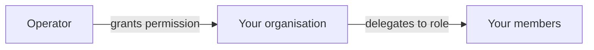

# Company administrator

**You are responsible for your organisation inside the registry.** Who has an account, what they may do, how they sign in, and how your company is identified on-chain.

This is not a workspace of its own — it appears as **Company Admin** inside the Issuer workspace. It is a responsibility layered on whatever else you do.

---

## What is here

| Tab | For |
|---|---|
| **Users** | Inviting people, assigning roles, deactivating leavers. |
| **IdP Settings** | Connecting your corporate single sign-on. |
| **Organization** | Your on-chain identity and the wallets bound to it. |
| **External IDs** | Identifiers linking your organisation to outside systems. |

---

## Users

*Company Admin → Users.*

You invite people, assign roles, and deactivate them when they leave. Roles you can grant within your organisation:

| Role | Lets them |
|---|---|
| `INVESTOR` | Hold and view securities. |
| `TRADER` | Buy, sell, and use liquidity markets. |
| `ISSUER` | Create and administer issuances. |
| `COMPANY_ADMIN` | Everything on this page. |
| `DAPP_PUBLISHER` | Publish applications to the marketplace. |

A person can hold several. Roles determine which [workspaces](index.md) appear, and — more importantly — what the backend will actually let them do.

!!! danger "Deactivate leavers the same day"
    An account that still works after somebody has left your organisation is an account that can still move securities.

    Deactivation is immediate and reversible. It does not delete anything: their past actions remain in the [audit log](../../platform/audit-log.md), attributed to them, permanently. That is the point — you can remove someone's access without erasing the record of what they did.

!!! warning "You cannot grant yourself more than you have"
    Nor can you grant a role your organisation does not hold. If your entity is registered as an investor, you cannot make one of your users an issuer. That is an operator decision.

### When sign-in is managed elsewhere

If your registry runs on Microsoft Entra ID and your organisation is **federated** — your people sign in with your own corporate accounts — then user lifecycle lives in *your* identity provider, not here. The page tells you so.

You still assign Registerwerk roles here. Who exists is your IdP's business; what they may do is yours.

---

## IdP settings

*Company Admin → IdP Settings.* Connect your OIDC-compliant identity provider so your people sign in with corporate credentials instead of a separate password.

You supply an **issuer URL** and a **client ID**.

!!! info "There is no client secret, deliberately"
    You may expect a third field. There is not one, and this is not an oversight.

    Inbound federation is established **tenant-to-tenant in your identity provider**. Registerwerk never runs an authorisation-code flow against your tenant, so it has no use for your client secret — and storing one would mean holding a credential of yours that it does not need.

    The field was removed and existing values were cleared.

Two rows on this page are **read-only**, and both are set by the registry operator:

| | |
|---|---|
| **Identity model** | Whether your users are guests in the operator's tenant, members of it, or federated from your own. |
| **Inbound MFA trust** | Whether two-factor authentication performed in *your* tenant is accepted here. |

!!! warning "Why MFA trust is not yours to set"
    A customer asserting "trust our MFA" would be a privilege-escalation vector: you could lower the authentication bar applied to your own users by declaring your own arrangements sufficient.

    It is the operator's decision. Ask them to change it; you cannot.

[:octicons-arrow-right-24: Signing in](../authentication.md) · [:octicons-arrow-right-24: Entra ID setup](../../platform/entra-setup.md)

---

## Organization — your on-chain identity

*Company Admin → Organization.*

Your organisation has an identity **on the blockchain** as well as in the register. It is the anchor for permissions in the ecosystem: which wallets act for you, and what applications may do on your behalf.

### Binding a wallet

To bind a wallet to your organisation you prove you control it, by signing a **nonce challenge** — the platform issues a random value, you sign it with the wallet's key, and the signature proves possession without ever revealing the key.

Once bound, that wallet acts for your organisation on-chain.

!!! warning "One organisation per wallet per chain"
    A wallet cannot represent two organisations on the same chain. If you need separate identities, use separate wallets.

### Permissions and delegation

The operator grants **permissions** to your organisation — the right to use a given capability. You then delegate those to roles within your organisation, and optionally mark a permission **role-restricted**, meaning holding it at organisation level is not enough; the individual member needs the delegated role too.

This is how a dApp can trust that the wallet calling it belongs to an organisation entitled to what it is asking for — without the dApp knowing anything about your internal structure.

??? note "For the specialist: the contracts underneath"

    **OrgRegistry** holds wallet-to-organisation bindings; the organisation *is* its ONCHAINID address. Authorisation is dual: either an operator holding `OPERATOR_ROLE`, or an ERC-734 MANAGEMENT key on the organisation's own ONCHAINID.

    **PermissionRegistry** holds operator-granted permissions as `keccak256("<slug>.<action>")`, plus org-admin delegation to member roles and the role-restriction flag.

    **PermissionOracle** is the stable facade a dApp stores. Customer dApps inherit `RegisterwerkGated`, which exposes `requiresPermission`, `requiresClaim` and `requiresActiveMember`. The indirection means dApps do not need redeploying when the registries move.

    [:octicons-arrow-right-24: dApp development](../../platform/dapp-development.md)

---

## External IDs

Identifiers connecting your organisation to systems outside the registry — LEI, national register numbers, custodian references.

Unglamorous, and the thing that makes reconciliation with the outside world possible.

---

## Your recurring jobs

- **Every joiner and leaver.** Deactivate the same day someone leaves.
- **Quarterly, review roles.** Permissions accumulate. People move teams and keep access they no longer need.
- **Watch your KYC expiry.** When your organisation's verification lapses, transfers stop for everyone. Renewal takes time — start before it expires, not after.
- **Keep wallet bindings current.** A bound wallet nobody controls any more is a liability.

---

## Where next

- [Roles and permissions](../../operator/customers/roles.md) — the full model
- [Signing in](../authentication.md)
- [dApp publisher](dapp-publisher.md)
