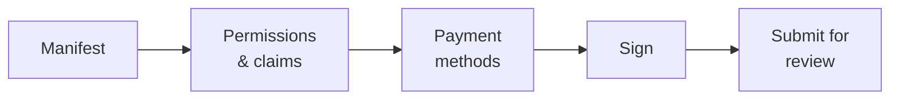

# dApp-Herausgeber

**Sie haben etwas gebaut, das sich an das Register anschließt** — ein Governance-Werkzeug, einen Anleihe-Desk, ein Reporting-Frontend — und möchten, dass andere Kunden es finden und nutzen.

Der Marketplace ist der Ort dafür. Diese Seite beschreibt den Veröffentlichungsprozess; der [Entwicklerleitfaden](../../platform/dapp-development.md) beschreibt, wie man die Sache baut.

---

## Was der Marketplace tatsächlich ist

Verstehen Sie das vor allem anderen, denn es prägt alles:

!!! info "Der Marketplace listet Metadaten. Er hostet nichts."
    Registerwerk speichert ein **Manifest**, das Ihre Anwendung beschreibt, und verankert — bei Genehmigung — einen Hash dieses Manifests on-chain.

    Es betreibt nicht Ihre Container, hostet nicht Ihr Frontend, verwahrt nicht Ihre Contracts und liefert nicht Ihren Code aus. Ihre Anwendung läuft dort, wo Sie sie betreiben. Was der Marketplace bietet, ist *Auffindbarkeit* und *Bestätigung*: Ein Kunde kann verifizieren, dass das, was er vor sich hat, dasselbe ist, was der Betreiber geprüft hat.

Deshalb muss jedes Container-Image über den **OCI-Digest** festgenagelt sein, nicht über ein Tag. Ein Tag kann nach der Prüfung auf anderen Inhalt umgebogen werden; ein Digest nicht. Der Digest ist es, der „der Betreiber hat das genehmigt" etwas Bestimmtes bedeuten lässt.

---

## Was Sie zuerst brauchen

- Die Rolle `DAPP_PUBLISHER`, von Ihrem [Unternehmensadministrator](company-admin.md).
- Ihre Organisation on-chain registriert, mit gebundener Wallet — siehe [Organization](company-admin.md#organization-ihre-on-chain-identitat). Mit dieser Wallet signieren Sie das Manifest.
- Eine lauffähige Anwendung, mit ausgebrachten Contracts und per Digest veröffentlichten Images.
- Ein Manifest.

---

## Das Manifest

Ein JSON-Dokument, das Ihre Anwendung beschreibt und gegen ein veröffentlichtes Schema validiert wird.

| Feld | |
|---|---|
| `slug` | Im Marketplace eindeutige Kennung, klein geschrieben und mit Bindestrichen. Die On-Chain-dApp-Id ist `keccak256(slug)`. |
| `name`, `version`, `description` | Für Menschen. Die Version ist semantisch. |
| `category` | Zum Stöbern. |
| `contracts` | Ihre ausgebrachten Contracts, mit Chain und Adresse. |
| `images` | Container-Images, **per OCI-Digest festgenagelt**. |
| `permissions`, `claims` | Was Ihre Anwendung von der Organisation eines Nutzers braucht. |
| `paymentMethods` | Mit welchen Zahlungswegen Sie arbeiten. |
| `contact` | Wo ein Kunde Sie erreicht. |

### Berechtigungen und Claims

Das ist der interessante Teil und der Grund, warum es den Rahmen gibt.

Ihre Anwendung erklärt, was sie braucht — eine Berechtigung wie `boardroom.vote` oder einen Claim wie *KYC verifiziert*. Zur Laufzeit beantwortet der [PermissionOracle](company-admin.md#berechtigungen-und-delegation), ob die Organisation der aufrufenden Wallet ihn hält.

Sie implementieren Zulässigkeit nie selbst. Sie fragen.

!!! tip "Erklären Sie das Minimum"
    Jede Berechtigung, die Sie verlangen, ist ein Kunde, dem sie erst erteilt werden muss, bevor er Ihre Anwendung nutzen kann. Mehr zu verlangen als nötig ist Reibung, die Sie bei jeder Installation bezahlen.

### Zahlungsmethoden

Entweder ein Verweis auf einen vom Betreiber kuratierten Zahlungsweg — `{"rail": "aueur"}` — oder ein `{"custom": {...}}`-Deskriptor für etwas, das Sie selbst umsetzen.

Verweise auf Zahlungswege werden **zweimal** gegen den Katalog aktiver Wege validiert: beim Einreichen und noch einmal bei der Genehmigung durch den Betreiber. Ein zwischenzeitlich deaktivierter Weg fällt vor der Genehmigung auf, statt von einem Kunden entdeckt zu werden.

!!! warning "Dieses Feld ist ein Hinweis, keine Freigabeliste"
    Eine Zahlungsmethode zu erklären beschreibt, womit Ihre Anwendung arbeitet. Es beschränkt nicht, was sie tun kann, und es ist keine Bestätigung des Betreibers, dass Ihre Zahlungsabwicklung korrekt ist.

---

## Veröffentlichen

*My dApps → Publish.* Fünf Schritte.

### Signieren

Sie signieren das Manifest mit der gebundenen Wallet Ihrer Organisation. Das bindet die Einreichung an Ihre Organisation — der Betreiber weiß, wer veröffentlicht hat, und Kunden können es später verifizieren.

!!! warning "Sie signieren den Hash als Zeichenkette, nicht als Bytes"
    Die Signatur ist ein EIP-191-`personal_sign` über die **0x-präfixierte Hex-Zeichenkette** von `keccak256(manifest_raw_bytes)` — nicht über die rohen 32 Hash-Bytes.

    Darüber stolpern beim ersten Mal fast alle. Wird Ihre Signatur abgelehnt und sind Sie sich beim Schlüssel sicher, ist das der Grund. Der Assistent erledigt es richtig; eine eigene Integration muss es ebenso tun.

### Prüfung

Der Betreiber prüft das Manifest, die Contracts, die Images und die erklärten Berechtigungen. Die Genehmigung verlangt [Step-up-Authentifizierung und das Vier-Augen-Prinzip](../../compliance/step-up-mfa.md) — zwei verschiedene Mitarbeitende des Betreibers.

Bei Genehmigung wird der Manifest-Hash **on-chain verankert**. Jeder kann dann prüfen, ob ein gegebenes Manifest das genehmigte ist: hashen, vergleichen.

| Status | |
|---|---|
| `DRAFT` | Ihres, bearbeitbar. |
| `SUBMITTED` | Beim Betreiber. |
| `PUBLISHED` | Genehmigt, verankert, im Marketplace sichtbar. |
| `REJECTED` | Mit Begründung zurückgegeben. Beheben und erneut einreichen. |

---

## Nach der Veröffentlichung

**Aktualisieren** bedeutet eine neue Manifest-Version, erneut eingereicht und geprüft. Die Verankerung gilt je Manifest-Hash; ein geändertes Manifest ist also ein geänderter Hash und braucht eine frische Genehmigung. Bearbeiten an Ort und Stelle gibt es nicht — genau diese Eigenschaft macht die Verankerung überhaupt etwas wert.

**Instanz-Bestätigung** ist optional und freiwillig: Eine laufende Installation Ihrer Anwendung kann on-chain bestätigt werden, sodass ein Kunde prüfen kann, ob die Instanz, mit der er spricht, eine echte Installation eines genehmigten Manifests ist und keine Nachahmung.

---

## Zwei ausgearbeitete Beispiele liegen der Plattform bei

Beide sind echter, getesteter Code zum Lesen statt Beschreibungen:

| | |
|---|---|
| **BoardroomGovernance** (`boardroom`) | Rollenbindung und Delegation durch Org-Admins. |
| **EwpgBondDesk** (`bond-desk`) | Eine ERC-3643-Suite mit Berechtigungsprüfung des Ökosystems und konfigurierter Stablecoin-Zahlungsseite. |

Beide liegen als Manifeste bei und werden als `PUBLISHED`-Demo-Einträge angelegt, wenn Demodaten aktiviert sind. Die minimale Integration ist `SampleGatedDapp` in den Contract-Tests.

!!! note "Das sind technische Beispiele"
    Sie führen Mechanismen vor. Sie sind keine rechtlich eingeordneten Instrumente, keine geprüften Zahlungsvereinbarungen und keine produktionsreifen Produkte.

---

## Wohin als Nächstes

- [Leitfaden zur dApp-Entwicklung](../../platform/dapp-development.md) — das Bauen
- [Unternehmensadministrator](company-admin.md) — Organisationsidentität und Berechtigungen
- [DeFi-Interoperabilität](../../platform/defi-interoperability.md) — Zahlungswege
