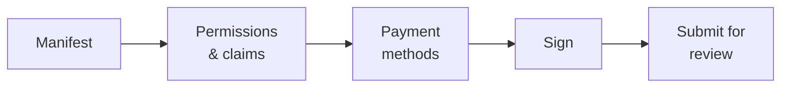

# Editor de dApps

**Ha construido algo que se enchufa al registro** — una herramienta de gobernanza, una mesa de bonos, un front end de reporte — y quiere que otros clientes lo encuentren y lo usen.

El mercado es donde eso ocurre. Esta página describe el proceso de publicación; la [guía del desarrollador](../../platform/dapp-development.md) explica cómo construir la cosa.

---

## Qué es realmente el mercado

Entienda esto antes que nada, porque lo condiciona todo:

!!! info "El mercado lista metadatos. No aloja nada."
    Registerwerk guarda un **manifiesto** que describe su aplicación y — al aprobarla — ancla on-chain un hash de ese manifiesto.

    No ejecuta sus contenedores, no aloja su front end, no custodia sus contratos ni sirve su código. Su aplicación corre donde usted la haga correr. Lo que el mercado aporta es *descubrimiento* y *atestación*: un cliente puede verificar que lo que tiene delante es lo que el operador revisó.

Por eso toda imagen de contenedor debe fijarse por **digest OCI** y no por una etiqueta. Una etiqueta puede reapuntarse a otro contenido después de la revisión; un digest no. Es el digest lo que hace que «el operador aprobó esto» signifique algo concreto.

---

## Qué necesita primero

- La función `DAPP_PUBLISHER`, de su [administrador de empresa](company-admin.md).
- Su organización registrada on-chain con un monedero vinculado — véase [Organization](company-admin.md#organization-su-identidad-on-chain). Con ese monedero firma el manifiesto.
- Una aplicación que funcione, con contratos desplegados e imágenes publicadas por digest.
- Un manifiesto.

---

## El manifiesto

Un documento JSON que describe su aplicación, validado contra un esquema publicado.

| Campo | |
|---|---|
| `slug` | Identificador único en el mercado, en minúsculas y con guiones. El id on-chain de la dApp es `keccak256(slug)`. |
| `name`, `version`, `description` | Para personas. La versión es semántica. |
| `category` | Para la navegación. |
| `contracts` | Sus contratos desplegados, con cadena y dirección. |
| `images` | Imágenes de contenedor, **fijadas por digest OCI**. |
| `permissions`, `claims` | Qué necesita su aplicación de la organización de un usuario. |
| `paymentMethods` | Con qué vías de pago trabaja. |
| `contact` | Dónde le localiza un cliente. |

### Permisos y atestaciones

Esta es la parte interesante, y la razón de ser del marco.

Su aplicación declara qué necesita — un permiso como `boardroom.vote`, o una atestación como *KYC verificado*. En ejecución, el [PermissionOracle](company-admin.md#permisos-y-delegacion) responde si la organización del monedero que llama lo posee.

Usted nunca implementa la elegibilidad. Usted pregunta.

!!! tip "Declare el mínimo"
    Cada permiso que exige es un cliente al que habrá que concedérselo antes de que pueda usar su aplicación. Pedir más de lo necesario es fricción que paga en cada instalación.

### Métodos de pago

O una referencia a una vía curada por el operador — `{"rail": "aueur"}` — o un descriptor `{"custom": {...}}` para algo que implemente usted mismo.

Las referencias a vías se validan **dos veces** contra el catálogo de vías habilitadas: al enviar, y otra vez cuando el operador aprueba. Una vía deshabilitada entretanto se detecta antes de la aprobación en lugar de descubrirla un cliente.

!!! warning "Este campo es orientativo, no una lista blanca"
    Declarar un método de pago describe con qué trabaja su aplicación. No restringe lo que puede hacer, y no es el operador certificando que su tratamiento de pagos sea correcto.

---

## Publicar

*My dApps → Publish.* Cinco pasos.

### Firma

Firma el manifiesto con el monedero vinculado de su organización. Eso ata el envío a su organización — el operador sabe quién publicó, y los clientes pueden verificarlo después.

!!! warning "Firma el hash como cadena, no como bytes"
    La firma es un `personal_sign` EIP-191 sobre la **cadena hexadecimal con prefijo 0x** de `keccak256(manifest_raw_bytes)` — no sobre los 32 bytes crudos del hash.

    Casi todo el mundo tropieza con esto la primera vez. Si su firma se rechaza y está seguro de la clave, ese es el motivo. El asistente lo hace bien; una integración propia debe hacerlo igual.

### Revisión

El operador revisa el manifiesto, los contratos, las imágenes y los permisos declarados. La aprobación exige [autenticación reforzada y doble control](../../compliance/step-up-mfa.md) — dos empleados distintos del operador.

Al aprobar, el hash del manifiesto queda **anclado on-chain**. Cualquiera puede entonces verificar que un manifiesto dado es el aprobado: se calcula el hash y se compara.

| Estado | |
|---|---|
| `DRAFT` | Suyo, editable. |
| `SUBMITTED` | En manos del operador. |
| `PUBLISHED` | Aprobado, anclado, visible en el mercado. |
| `REJECTED` | Devuelto con un motivo. Corrija y vuelva a enviar. |

---

## Después de publicar

**Actualizar** significa una nueva versión del manifiesto, enviada y revisada de nuevo. El anclaje es por hash de manifiesto, así que un manifiesto cambiado es un hash cambiado y necesita aprobación nueva. No hay edición en sitio — esa propiedad es justamente lo que da valor al anclaje.

**La atestación de instancia** es opcional y voluntaria: un despliegue en funcionamiento de su aplicación puede atestarse on-chain, de modo que un cliente pueda comprobar que la instancia con la que habla es un despliegue real de un manifiesto aprobado y no un imitador.

---

## La plataforma incluye dos ejemplos desarrollados

Ambos son código real y probado que puede leer, en lugar de descripciones:

| | |
|---|---|
| **BoardroomGovernance** (`boardroom`) | Restricción por función y delegación por el administrador de la organización. |
| **EwpgBondDesk** (`bond-desk`) | Una suite ERC-3643 con control de permisos del ecosistema y una pata de pago en stablecoin configurada. |

Ambos se entregan como manifiestos y se siembran como anuncios de demostración `PUBLISHED` cuando los datos de demostración están activos. La integración mínima es `SampleGatedDapp` en las pruebas de contratos.

!!! note "Son ejemplos técnicos"
    Demuestran mecanismos. No son instrumentos jurídicamente calificados, ni disposiciones de pago verificadas, ni productos listos para producción.

---

## Adónde ir ahora

- [Guía de desarrollo de dApps](../../platform/dapp-development.md) — construirla
- [Administrador de empresa](company-admin.md) — identidad de la organización y permisos
- [Interoperabilidad DeFi](../../platform/defi-interoperability.md) — vías de pago
