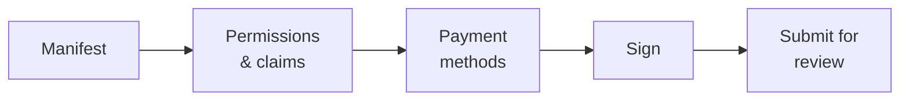

# Éditeur de dApp

**Vous avez construit quelque chose qui se branche sur le registre** — un outil de gouvernance, un desk obligataire, une interface de reporting — et vous voulez que d'autres clients le trouvent et l'utilisent.

C'est le rôle de la place de marché. Cette page décrit le processus de publication ; le [guide du développeur](../../platform/dapp-development.md) explique comment construire la chose.

---

## Ce qu'est réellement la place de marché

Comprenez ceci avant tout le reste, car cela façonne tout :

!!! info "La place de marché référence des métadonnées. Elle n'héberge rien."
    Registerwerk conserve un **manifeste** décrivant votre application et — à l'approbation — ancre on-chain un hachage de ce manifeste.

    Elle n'exécute pas vos conteneurs, n'héberge pas votre interface, ne conserve pas vos contrats et ne sert pas votre code. Votre application tourne là où vous la faites tourner. Ce que la place de marché apporte, c'est la *découverte* et l'*attestation* : un client peut vérifier que ce qu'il regarde est bien ce que l'opérateur a examiné.

C'est pourquoi chaque image de conteneur doit être épinglée par **empreinte OCI** plutôt que par une étiquette. Une étiquette peut être repointée vers un autre contenu après l'examen ; une empreinte, non. C'est l'empreinte qui donne un sens précis à « l'opérateur a approuvé ceci ».

---

## Ce qu'il vous faut d'abord

- Le rôle `DAPP_PUBLISHER`, auprès de votre [administrateur d'entreprise](company-admin.md).
- Votre organisation enregistrée on-chain avec un portefeuille lié — voir [Organization](company-admin.md#organization-votre-identite-on-chain). C'est avec ce portefeuille que vous signez le manifeste.
- Une application qui fonctionne, avec des contrats déployés et des images publiées par empreinte.
- Un manifeste.

---

## Le manifeste

Un document JSON décrivant votre application, validé contre un schéma publié.

| Champ | |
|---|---|
| `slug` | Identifiant unique sur la place de marché, en minuscules et tirets. L'identifiant de dApp on-chain est `keccak256(slug)`. |
| `name`, `version`, `description` | Destinés aux humains. La version est sémantique. |
| `category` | Pour la navigation. |
| `contracts` | Vos contrats déployés, avec chaîne et adresse. |
| `images` | Images de conteneurs, **épinglées par empreinte OCI**. |
| `permissions`, `claims` | Ce dont votre application a besoin de la part de l'organisation d'un utilisateur. |
| `paymentMethods` | Les moyens de paiement avec lesquels vous travaillez. |
| `contact` | Où un client vous joint. |

### Permissions et attestations

C'est la partie intéressante, et la raison d'être du cadre.

Votre application déclare ce dont elle a besoin — une permission telle que `boardroom.vote`, ou une attestation telle que *KYC vérifié*. À l'exécution, le [PermissionOracle](company-admin.md#permissions-et-delegation) répond si l'organisation du portefeuille appelant la détient.

Vous n'implémentez jamais l'éligibilité vous-même. Vous demandez.

!!! tip "Déclarez le minimum"
    Chaque permission que vous exigez est un client à qui il faudra l'accorder avant qu'il puisse utiliser votre application. Demander plus que nécessaire est un frottement que vous payez à chaque installation.

### Moyens de paiement

Soit une référence à un dispositif curé par l'opérateur — `{"rail": "aueur"}` — soit un descripteur `{"custom": {...}}` pour quelque chose que vous mettez en œuvre vous-même.

Les références de dispositif sont validées **deux fois** contre le catalogue des dispositifs actifs : à la soumission, puis de nouveau à l'approbation par l'opérateur. Un dispositif désactivé entre-temps est détecté avant l'approbation plutôt que découvert par un client.

!!! warning "Ce champ est indicatif, ce n'est pas une liste blanche"
    Déclarer un moyen de paiement décrit ce avec quoi votre application fonctionne. Cela ne restreint pas ce qu'elle peut faire, et ce n'est pas l'opérateur certifiant que votre traitement des paiements est correct.

---

## Publier

*My dApps → Publish.* Cinq étapes.

### Signature

Vous signez le manifeste avec le portefeuille lié de votre organisation. Cela rattache la soumission à votre organisation — l'opérateur sait qui a publié, et les clients peuvent le vérifier plus tard.

!!! warning "Vous signez le hachage en tant que chaîne, pas en tant qu'octets"
    La signature est un `personal_sign` EIP-191 sur la **chaîne hexadécimale préfixée 0x** de `keccak256(manifest_raw_bytes)` — et non sur les 32 octets bruts du hachage.

    Presque tout le monde trébuche là-dessus la première fois. Si votre signature est rejetée et que vous êtes sûr de la clé, c'est la raison. L'assistant s'en charge ; une intégration maison doit faire de même.

### Examen

L'opérateur examine le manifeste, les contrats, les images et les permissions déclarées. L'approbation exige une [authentification renforcée et une double validation](../../compliance/step-up-mfa.md) — deux collaborateurs différents de l'opérateur.

À l'approbation, le hachage du manifeste est **ancré on-chain**. Quiconque peut alors vérifier qu'un manifeste donné est bien celui qui a été approuvé : le hacher, comparer.

| Statut | |
|---|---|
| `DRAFT` | Le vôtre, modifiable. |
| `SUBMITTED` | Chez l'opérateur. |
| `PUBLISHED` | Approuvé, ancré, visible sur la place de marché. |
| `REJECTED` | Renvoyé avec un motif. Corrigez et resoumettez. |

---

## Après la publication

**Mettre à jour** signifie une nouvelle version du manifeste, soumise et réexaminée. L'ancrage porte sur le hachage du manifeste : un manifeste modifié est un hachage modifié et exige une nouvelle approbation. Il n'y a pas de modification sur place — c'est précisément cette propriété qui donne sa valeur à l'ancrage.

**L'attestation d'instance** est facultative et sur option : un déploiement en fonctionnement de votre application peut être attesté on-chain, de sorte qu'un client puisse vérifier que l'instance à laquelle il parle est un vrai déploiement d'un manifeste approuvé, et non un sosie.

---

## Deux exemples complets sont livrés avec la plateforme

Tous deux sont du code réel et testé, à lire plutôt que des descriptions :

| | |
|---|---|
| **BoardroomGovernance** (`boardroom`) | Restriction par rôle et délégation par l'administrateur d'organisation. |
| **EwpgBondDesk** (`bond-desk`) | Une suite ERC-3643 avec contrôle de permissions de l'écosystème et une jambe de paiement en stablecoin configurée. |

Tous deux sont livrés sous forme de manifestes et sont créés comme annonces de démonstration `PUBLISHED` lorsque les données de démonstration sont activées. L'intégration minimale est `SampleGatedDapp` dans les tests de contrats.

!!! note "Ce sont des exemples techniques"
    Ils démontrent des mécanismes. Ce ne sont pas des instruments juridiquement qualifiés, ni des dispositifs de paiement vérifiés, ni des produits prêts pour la production.

---

## Et ensuite

- [Guide de développement de dApp](../../platform/dapp-development.md) — la construction
- [Administrateur d'entreprise](company-admin.md) — identité d'organisation et permissions
- [Interopérabilité DeFi](../../platform/defi-interoperability.md) — les moyens de paiement
