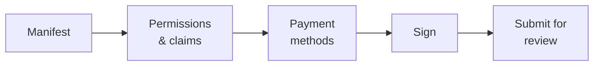

# Editore di dApp

**Hai costruito qualcosa che si innesta sul registro** — uno strumento di governance, un desk obbligazionario, un front end di reportistica — e vuoi che altri clienti lo trovino e lo usino.

È il marketplace il luogo dove ciò accade. Questa pagina descrive il processo di pubblicazione; la [guida per sviluppatori](../../platform/dapp-development.md) spiega come costruire la cosa.

---

## Che cos'è davvero il marketplace

Capisci questo prima di ogni altra cosa, perché plasma tutto il resto:

!!! info "Il marketplace elenca metadati. Non ospita nulla."
    Registerwerk conserva un **manifesto** che descrive la tua applicazione e — all'approvazione — ancora on-chain un hash di quel manifesto.

    Non esegue i tuoi container, non ospita il tuo front end, non custodisce i tuoi contratti e non serve il tuo codice. La tua applicazione gira dove la fai girare tu. Ciò che il marketplace fornisce è *scoperta* e *attestazione*: un cliente può verificare che ciò che sta guardando è ciò che l'operatore ha esaminato.

Per questo ogni immagine container deve essere fissata tramite **digest OCI** anziché tramite un tag. Un tag può essere ripuntato su contenuti diversi dopo l'esame; un digest no. È il digest a dare un significato preciso a «l'operatore ha approvato questo».

---

## Che cosa ti serve prima

- Il ruolo `DAPP_PUBLISHER`, dal tuo [amministratore aziendale](company-admin.md).
- La tua organizzazione registrata on-chain con un wallet vincolato — vedi [Organization](company-admin.md#organization-la-tua-identita-on-chain). Con quel wallet firmi il manifesto.
- Un'applicazione funzionante, con contratti distribuiti e immagini pubblicate per digest.
- Un manifesto.

---

## Il manifesto

Un documento JSON che descrive la tua applicazione, validato rispetto a uno schema pubblicato.

| Campo | |
|---|---|
| `slug` | Identificativo univoco nel marketplace, minuscolo e con trattini. L'id on-chain della dApp è `keccak256(slug)`. |
| `name`, `version`, `description` | Per le persone. La versione è semantica. |
| `category` | Per la navigazione. |
| `contracts` | I tuoi contratti distribuiti, con chain e indirizzo. |
| `images` | Immagini container, **fissate per digest OCI**. |
| `permissions`, `claims` | Che cosa serve alla tua applicazione dall'organizzazione di un utente. |
| `paymentMethods` | Con quali canali di pagamento lavori. |
| `contact` | Dove un cliente ti raggiunge. |

### Permessi e claim

È la parte interessante, e il motivo per cui il framework esiste.

La tua applicazione dichiara che cosa le serve — un permesso come `boardroom.vote`, o un claim come *KYC verificato*. A runtime il [PermissionOracle](company-admin.md#permessi-e-delega) risponde se l'organizzazione del wallet chiamante lo possiede.

L'ammissibilità non la implementi mai tu. La chiedi.

!!! tip "Dichiara il minimo"
    Ogni permesso che pretendi è un cliente a cui va concesso prima che possa usare la tua applicazione. Chiedere più del necessario è attrito che paghi a ogni installazione.

### Metodi di pagamento

O un riferimento a un canale curato dall'operatore — `{"rail": "aueur"}` — oppure un descrittore `{"custom": {...}}` per qualcosa che implementi tu.

I riferimenti ai canali sono validati **due volte** rispetto al catalogo dei canali abilitati: all'invio e di nuovo all'approvazione dell'operatore. Un canale disabilitato nel frattempo viene intercettato prima dell'approvazione anziché scoperto da un cliente.

!!! warning "Questo campo è indicativo, non una whitelist"
    Dichiarare un metodo di pagamento descrive con che cosa lavora la tua applicazione. Non limita ciò che può fare, e non è l'operatore che certifica che la tua gestione dei pagamenti sia corretta.

---

## Pubblicare

*My dApps → Publish.* Cinque passaggi.

### Firma

Firmi il manifesto con il wallet vincolato della tua organizzazione. Questo lega l'invio alla tua organizzazione — l'operatore sa chi ha pubblicato, e i clienti possono verificarlo in seguito.

!!! warning "Firmi l'hash come stringa, non come byte"
    La firma è un `personal_sign` EIP-191 sulla **stringa esadecimale con prefisso 0x** di `keccak256(manifest_raw_bytes)` — non sui 32 byte grezzi dell'hash.

    Ci inciampano quasi tutti la prima volta. Se la tua firma viene rifiutata e sei sicuro della chiave, il motivo è questo. La procedura guidata se ne occupa; un'integrazione fatta in casa deve fare lo stesso.

### Esame

L'operatore esamina il manifesto, i contratti, le immagini e i permessi dichiarati. L'approvazione richiede [autenticazione rafforzata e principio dei quattro occhi](../../compliance/step-up-mfa.md) — due diversi addetti dell'operatore.

All'approvazione, l'hash del manifesto viene **ancorato on-chain**. Chiunque può poi verificare che un dato manifesto sia quello approvato: lo si calcola e si confronta.

| Stato | |
|---|---|
| `DRAFT` | Tuo, modificabile. |
| `SUBMITTED` | Presso l'operatore. |
| `PUBLISHED` | Approvato, ancorato, visibile nel marketplace. |
| `REJECTED` | Restituito con una motivazione. Correggi e reinvia. |

---

## Dopo la pubblicazione

**Aggiornare** significa una nuova versione del manifesto, reinviata ed esaminata di nuovo. L'ancoraggio è per hash del manifesto, quindi un manifesto modificato è un hash modificato e richiede una nuova approvazione. Non esiste modifica sul posto — è proprio questa proprietà a dare valore all'ancoraggio.

**L'attestazione di istanza** è facoltativa e su adesione: una distribuzione in esercizio della tua applicazione può essere attestata on-chain, così che un cliente possa controllare che l'istanza con cui parla sia una vera distribuzione di un manifesto approvato e non un sosia.

---

## Con la piattaforma sono forniti due esempi completi

Entrambi sono codice reale e testato da leggere, non descrizioni:

| | |
|---|---|
| **BoardroomGovernance** (`boardroom`) | Vincolo al ruolo e delega da parte dell'amministratore dell'organizzazione. |
| **EwpgBondDesk** (`bond-desk`) | Una suite ERC-3643 con controllo dei permessi dell'ecosistema e una gamba di pagamento in stablecoin configurata. |

Entrambi arrivano come manifesti e vengono creati come annunci dimostrativi `PUBLISHED` quando i dati demo sono abilitati. L'integrazione minima è `SampleGatedDapp` nei test dei contratti.

!!! note "Sono esempi tecnici"
    Dimostrano meccanismi. Non sono strumenti giuridicamente qualificati, né dispositivi di pagamento verificati, né prodotti pronti per la produzione.

---

## Dove andare adesso

- [Guida allo sviluppo di dApp](../../platform/dapp-development.md) — costruirla
- [Amministratore aziendale](company-admin.md) — identità dell'organizzazione e permessi
- [Interoperabilità DeFi](../../platform/defi-interoperability.md) — i canali di pagamento
