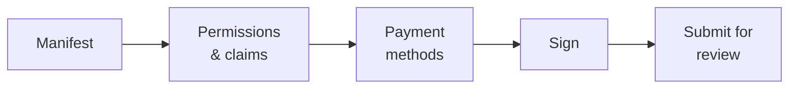

# dApp publisher

**You have built something that plugs into the registry** — a governance tool, a bond desk, a reporting front end — and you want other customers to find and use it.

The marketplace is where that happens. This page is the publishing process; the [developer guide](../../platform/dapp-development.md) is how to build the thing.

---

## What the marketplace actually is

Understand this before anything else, because it shapes everything:

!!! info "The marketplace lists metadata. It does not host anything."
    Registerwerk stores a **manifest** describing your application, and — on approval — anchors a hash of that manifest on-chain.

    It does not run your containers, host your front end, custody your contracts, or serve your code. Your application runs wherever you run it. What the marketplace provides is *discovery* and *attestation*: a customer can verify that the thing they are looking at is the thing the operator reviewed.

That is why every container image must be pinned by **OCI digest** rather than a tag. A tag can be repointed at different content after review; a digest cannot. The digest is what makes "the operator approved this" mean something specific.

---

## What you need first

- The `DAPP_PUBLISHER` role, from your [company administrator](company-admin.md).
- Your organisation registered on-chain with a bound wallet — see [Organization](company-admin.md#organization-your-on-chain-identity). You sign the manifest with that wallet.
- A working application, with contracts deployed and images published by digest.
- A manifest.

---

## The manifest

A JSON document describing your application, validated against a published schema.

| Field | |
|---|---|
| `slug` | Marketplace-unique identifier, lowercase and hyphenated. The on-chain dApp id is `keccak256(slug)`. |
| `name`, `version`, `description` | Human-facing. Version is semantic. |
| `category` | For browsing. |
| `contracts` | Your deployed contracts, with chain and address. |
| `images` | Container images, **pinned by OCI digest**. |
| `permissions`, `claims` | What your application needs from a user's organisation. |
| `paymentMethods` | Which payment rails you work with. |
| `contact` | Where a customer reaches you. |

### Permissions and claims

This is the interesting part, and the reason the framework exists.

Your application declares what it needs — a permission such as `boardroom.vote`, or a claim such as *KYC verified*. At runtime the [PermissionOracle](company-admin.md#permissions-and-delegation) answers whether the calling wallet's organisation holds it.

You never implement eligibility yourself. You ask.

!!! tip "Declare the minimum"
    Every permission you require is a customer who must be granted it before they can use your application. Asking for more than you need is friction you pay for at every install.

### Payment methods

Either a reference to an operator-curated rail — `{"rail": "aueur"}` — or a `{"custom": {...}}` descriptor for something you implement yourself.

Rail references are validated against the enabled-rail catalogue **twice**: when you submit, and again when the operator approves. A rail disabled in between is caught before approval rather than discovered by a customer.

!!! warning "This field is advisory, not a whitelist"
    Declaring a payment method describes what your application works with. It does not restrict what it can do, and it is not the operator certifying that your payment handling is correct.

---

## Publishing

*My dApps → Publish.* Five steps.

### Signing

You sign the manifest with your bound organisation wallet. This binds the submission to your organisation — the operator knows who published, and customers can verify it later.

!!! warning "You sign the hash as a string, not as bytes"
    The signature is an EIP-191 `personal_sign` over the **0x-prefixed hex string** of `keccak256(manifest_raw_bytes)` — not over the raw 32 hash bytes.

    This trips up almost everyone implementing it the first time. If your signature is rejected and you are confident the key is right, this is why. The wizard handles it; a custom integration must not.

### Review

The operator reviews the manifest, the contracts, the images and the declared permissions. Approval requires [step-up authentication and four eyes](../../compliance/step-up-mfa.md) — two different operator staff.

On approval, the manifest hash is **anchored on-chain**. Anyone can then verify that a given manifest is the one that was approved: hash it, compare.

| Status | |
|---|---|
| `DRAFT` | Yours, editable. |
| `SUBMITTED` | With the operator. |
| `PUBLISHED` | Approved, anchored, visible in the marketplace. |
| `REJECTED` | Returned with a reason. Fix and resubmit. |

---

## After publishing

**Updating** means a new manifest version, submitted and reviewed again. The anchor is per manifest hash, so a changed manifest is a changed hash and needs fresh approval. There is no editing in place — that is the property that makes the anchor worth anything.

**Instance attestation** is optional and opt-in: a running deployment of your application can be attested on-chain, so a customer can check that the instance they are talking to is a real deployment of an approved manifest rather than a look-alike.

---

## Two worked examples ship with the platform

Both are real, tested code you can read rather than descriptions:

| | |
|---|---|
| **BoardroomGovernance** (`boardroom`) | Organisation-admin role restriction and delegation. |
| **EwpgBondDesk** (`bond-desk`) | An ERC-3643 suite with ecosystem permission gating and a configured stablecoin payment leg. |

Both ship as manifests and are seeded as `PUBLISHED` demo listings when demo data is enabled. The minimal integration is `SampleGatedDapp` in the contract tests.

!!! note "These are technical examples"
    They demonstrate mechanisms. They are not legally classified instruments, verified payment arrangements, or production-ready products.

---

## Where next

- [dApp development guide](../../platform/dapp-development.md) — building it
- [Company administrator](company-admin.md) — organisation identity and permissions
- [DeFi interoperability](../../platform/defi-interoperability.md) — payment rails
