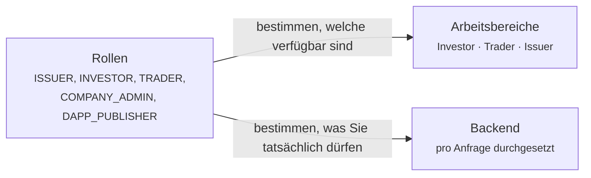

# Ihr Arbeitsbereich

[Der Lebenszyklus eines Wertpapiers](../lifecycle/index.md) erzählte eine Geschichte von Anfang bis Ende. Diese Seiten sind der andere Schnitt: **eine Seite je Nutzerart**, mit allem, was diese Person tut, in der Reihenfolge, in der sie es tun wird.

Finden Sie sich unten.

---

## Die drei Arbeitsbereiche

Der Umschalter oben links wechselt zwischen ihnen. Welche Sie sehen, hängt von Ihren Rollen ab.

-   :material-piggy-bank:{ .lg .middle } **[Anleger](investor.md)**

    ---

    Sie besitzen Wertpapiere. Sie wollen sehen, was Sie halten, was es tut und was Ihnen zusteht.

    *Positions · Investments · Marketplace*

-   :material-chart-line:{ .lg .middle } **[Händler](trader.md)**

    ---

    Sie kaufen und verkaufen und finanzieren Positionen, statt sie nur zu halten.

    *Trading Desk · Liquidity · Positions · Marketplace*

-   :material-file-document-edit:{ .lg .middle } **[Emittent](issuer.md)**

    ---

    Sie beschaffen Kapital durch die Emission von Wertpapieren und verwalten sie danach.

    *Issuances · My dApps · Company Admin · Marketplace*

## Drei Rollen, die keine Arbeitsbereiche sind

-   :material-account-cog:{ .lg .middle } **[Unternehmensadministrator](company-admin.md)**

    ---

    Sie verwalten die Nutzer Ihrer Organisation und ihre Identität im Register. Eine Verantwortung, die auf allem anderen aufsetzt, was Sie tun.

-   :material-widgets:{ .lg .middle } **[dApp-Herausgeber](dapp-publisher.md)**

    ---

    Sie bauen Anwendungen, die sich in das Ökosystem einklinken, und veröffentlichen sie auf dem Marktplatz.

-   :material-magnify-scan:{ .lg .middle } **[Prüfer](auditor.md)**

    ---

    Sie prüfen. Nur lesend, umfassend und bewusst außerstande, etwas zu ändern.

---

## Wie Rollen und Arbeitsbereiche zusammenhängen

Sie sind nicht dasselbe, und beides zu verwechseln stiftet Verwirrung.

**Rollen** sind Berechtigungen. Sie werden von Ihrem Unternehmensadministrator oder vom Registerbetreiber vergeben, vom Backend bei jeder einzelnen Anfrage durchgesetzt, und Sie können Ihre eigenen nicht ändern.

**Arbeitsbereiche** sind Navigation. Sie bündeln die Werkzeuge für eine Aufgabe, damit jemand mit vier Rollen nicht auf sämtliche Funktionen gleichzeitig starrt.

!!! info "Der Wechsel des Arbeitsbereichs verleiht nichts"
    Den Issuer-Bereich zu wählen gibt Ihnen keine Emittentenrechte. Fehlt Ihnen die Rolle, laden die Seiten nicht, und die API weist Sie ab.

    Ihre Wahl wird im Browser gemerkt, übersteht also die Abmeldung auf diesem Gerät, folgt Ihnen aber nicht auf ein anderes.

| Rolle | Schaltet frei |
|---|---|
| `INVESTOR` | Arbeitsbereich Investor |
| `TRADER` | Arbeitsbereich Trader |
| `ISSUER` | Arbeitsbereich Issuer |
| `COMPANY_ADMIN` | Arbeitsbereich Issuer, dazu [Company Admin](company-admin.md) |
| `DAPP_PUBLISHER` | Arbeitsbereich Issuer, dazu [My dApps](dapp-publisher.md) |
| `AUDIT` | Nur-Lese-Zugriff über das gesamte Register |
| `REGISTRY_ADMIN` | Betreiberpersonal. Sieht alle drei Bereiche bei der [Identitätsübernahme](../../operator/customers/impersonation.md). |

---

## Was alle haben, unabhängig davon

Drei Dinge stehen außerhalb der Arbeitsbereiche, in der oberen Leiste, weil sie unabhängig davon gelten, was Sie gerade tun.

| | |
|---|---|
| **[KYC](../kyc.md)** | Der Verifizierungsstatus Ihrer Organisation. Läuft er ab, hört das meiste auf zu funktionieren. |
| **[Endpunkte](../investors/wallet-setup.md)** | Die von Ihnen registrierten Wallet-Adressen. Ohne eine kann Sie kein Wertpapier erreichen. |
| **[Sicherheit](../authentication.md)** | Ihre Anmelde- und Zwei-Faktor-Einstellungen. |
