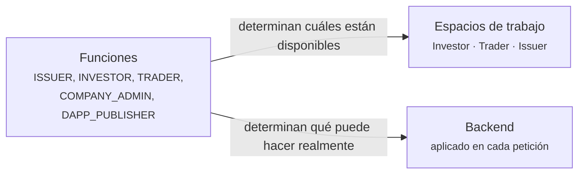

# Su espacio de trabajo

[La vida de un valor](../lifecycle/index.md) contaba una historia de principio a fin. Estas páginas son el otro corte: **una página por tipo de usuario**, con todo lo que esa persona hace, en el orden en que lo hará.

Encuéntrese a sí mismo más abajo.

---

## Los tres espacios de trabajo

El selector de la parte superior izquierda cambia entre ellos. Cuáles ve depende de sus funciones.

-   :material-piggy-bank:{ .lg .middle } **[Inversor](investor.md)**

    ---

    Posee valores. Quiere ver qué tiene, qué está haciendo y qué se le debe.

    *Positions · Investments · Marketplace*

-   :material-chart-line:{ .lg .middle } **[Trader](trader.md)**

    ---

    Compra y vende, y financia posiciones en lugar de limitarse a mantenerlas.

    *Trading Desk · Liquidity · Positions · Marketplace*

-   :material-file-document-edit:{ .lg .middle } **[Emisor](issuer.md)**

    ---

    Capta fondos emitiendo valores, y después los administra.

    *Issuances · My dApps · Company Admin · Marketplace*

## Tres funciones que no son espacios de trabajo

-   :material-account-cog:{ .lg .middle } **[Administrador de la empresa](company-admin.md)**

    ---

    Gestiona los usuarios de su organización y su identidad en el registro. Una responsabilidad que se superpone a todo lo demás que haga.

-   :material-widgets:{ .lg .middle } **[Editor de dApps](dapp-publisher.md)**

    ---

    Construye aplicaciones que se conectan al ecosistema y las publica en el mercado.

-   :material-magnify-scan:{ .lg .middle } **[Auditor](auditor.md)**

    ---

    Inspecciona. Solo lectura, exhaustiva y deliberadamente incapaz de cambiar nada.

---

## Cómo se relacionan funciones y espacios de trabajo

No son lo mismo, y confundirlos genera desconcierto.

Las **funciones** son permisos. Las concede su administrador de la empresa o el operador del registro, el backend las aplica en cada petición, y usted no puede cambiar las suyas.

Los **espacios de trabajo** son navegación. Agrupan las herramientas de un oficio para que quien acumula cuatro funciones no se enfrente a todas las prestaciones a la vez.

!!! info "Cambiar de espacio de trabajo no concede nada"
    Elegir el espacio Issuer no le da derechos de emisor. Si le falta la función, las páginas no cargan y la API le deniega.

    Su elección se recuerda en el navegador: sobrevive al cierre de sesión en esa máquina, pero no le sigue a otra.

| Función | Desbloquea |
|---|---|
| `INVESTOR` | Espacio Investor |
| `TRADER` | Espacio Trader |
| `ISSUER` | Espacio Issuer |
| `COMPANY_ADMIN` | Espacio Issuer, más [Company Admin](company-admin.md) |
| `DAPP_PUBLISHER` | Espacio Issuer, más [My dApps](dapp-publisher.md) |
| `AUDIT` | Acceso de lectura en todo el registro |
| `REGISTRY_ADMIN` | Personal del operador. Ve los tres espacios en [modo soporte](../../operator/customers/impersonation.md). |

---

## Lo que todos tienen, pase lo que pase

Tres cosas quedan fuera de los espacios de trabajo, en la barra superior, porque le afectan haga lo que haga.

| | |
|---|---|
| **[KYC](../kyc.md)** | El estado de verificación de su organización. Si caduca, la mayoría de las cosas dejan de funcionar. |
| **[Puntos finales](../investors/wallet-setup.md)** | Las direcciones de monedero que ha registrado. Sin ellas, ningún valor puede llegarle. |
| **[Seguridad](../authentication.md)** | Sus ajustes de inicio de sesión y de doble factor. |
