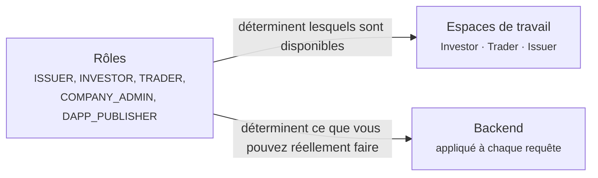

# Votre espace de travail

[La vie d'un titre financier](../lifecycle/index.md) racontait une histoire du début à la fin. Ces pages en sont l'autre découpe : **une page par type d'utilisateur**, couvrant tout ce que cette personne fait, dans l'ordre où elle le fera.

Trouvez-vous ci-dessous.

---

## Les trois espaces de travail

Le sélecteur en haut à gauche permet de passer de l'un à l'autre. Ceux que vous voyez dépendent de vos rôles.

-   :material-piggy-bank:{ .lg .middle } **[Investisseur](investor.md)**

    ---

    Vous détenez des titres. Vous voulez voir ce que vous avez, ce qu'il devient et ce qui vous est dû.

    *Positions · Investments · Marketplace*

-   :material-chart-line:{ .lg .middle } **[Trader](trader.md)**

    ---

    Vous achetez et vendez, et vous financez des positions au lieu de simplement les conserver.

    *Trading Desk · Liquidity · Positions · Marketplace*

-   :material-file-document-edit:{ .lg .middle } **[Émetteur](issuer.md)**

    ---

    Vous levez des fonds en émettant des titres, et vous les administrez ensuite.

    *Issuances · My dApps · Company Admin · Marketplace*

## Trois rôles qui ne sont pas des espaces de travail

-   :material-account-cog:{ .lg .middle } **[Administrateur d'entreprise](company-admin.md)**

    ---

    Vous gérez les utilisateurs de votre organisation et son identité dans le registre. Une responsabilité qui se superpose à tout ce que vous faites par ailleurs.

-   :material-widgets:{ .lg .middle } **[Éditeur de dApp](dapp-publisher.md)**

    ---

    Vous construisez des applications qui se branchent sur l'écosystème et vous les publiez sur la place de marché.

-   :material-magnify-scan:{ .lg .middle } **[Auditeur](auditor.md)**

    ---

    Vous inspectez. En lecture seule, de façon exhaustive, et délibérément incapable de modifier quoi que ce soit.

---

## Comment rôles et espaces de travail s'articulent

Ce ne sont pas la même chose, et les confondre est source de perplexité.

**Les rôles** sont des autorisations. Ils sont attribués par votre administrateur d'entreprise ou par l'opérateur du registre, appliqués par le backend à chaque requête, et vous ne pouvez pas modifier les vôtres.

**Les espaces de travail** sont de la navigation. Ils regroupent les outils d'un métier pour qu'une personne cumulant quatre rôles ne se retrouve pas face à toutes les fonctionnalités à la fois.

!!! info "Changer d'espace de travail ne confère rien"
    Choisir l'espace Issuer ne vous donne aucun droit d'émetteur. Si vous n'avez pas le rôle, les pages ne se chargent pas et l'API vous refuse.

    Votre choix est mémorisé dans votre navigateur : il survit à la déconnexion sur cette machine, mais ne vous suit pas sur une autre.

| Rôle | Débloque |
|---|---|
| `INVESTOR` | Espace Investor |
| `TRADER` | Espace Trader |
| `ISSUER` | Espace Issuer |
| `COMPANY_ADMIN` | Espace Issuer, plus [Company Admin](company-admin.md) |
| `DAPP_PUBLISHER` | Espace Issuer, plus [My dApps](dapp-publisher.md) |
| `AUDIT` | Accès en lecture sur l'ensemble du registre |
| `REGISTRY_ADMIN` | Personnel de l'opérateur. Voit les trois espaces en [mode support](../../operator/customers/impersonation.md). |

---

## Ce que tout le monde a, quoi qu'il arrive

Trois éléments se situent hors des espaces de travail, dans la barre supérieure, parce qu'ils s'appliquent quoi que vous fassiez.

| | |
|---|---|
| **[KYC](../kyc.md)** | Le statut de vérification de votre organisation. S'il expire, la plupart des choses cessent de fonctionner. |
| **[Points de réception](../investors/wallet-setup.md)** | Les adresses de portefeuille que vous avez enregistrées. Sans elles, aucun titre ne peut vous parvenir. |
| **[Sécurité](../authentication.md)** | Vos paramètres de connexion et d'authentification à deux facteurs. |
