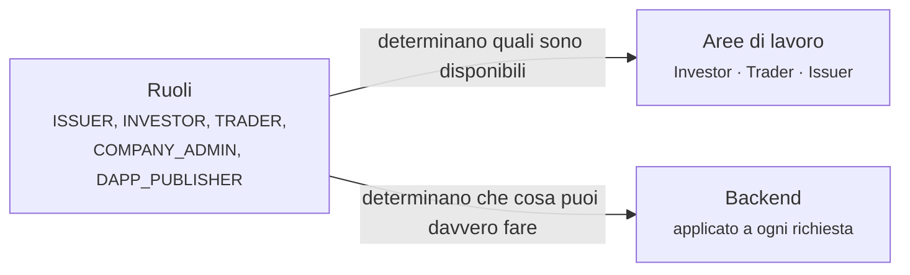

# La tua area di lavoro

[La vita di uno strumento finanziario](../lifecycle/index.md) raccontava una storia dall'inizio alla fine. Queste pagine sono l'altro taglio: **una pagina per ciascun tipo di utente**, con tutto ciò che quella persona fa, nell'ordine in cui lo farà.

Trova te stesso qui sotto.

---

## Le tre aree di lavoro

Il selettore in alto a sinistra passa dall'una all'altra. Quali vedi dipende dai tuoi ruoli.

-   :material-piggy-bank:{ .lg .middle } **[Investitore](investor.md)**

    ---

    Possiedi strumenti finanziari. Vuoi vedere che cosa detieni, che cosa sta facendo e che cosa ti spetta.

    *Positions · Investments · Marketplace*

-   :material-chart-line:{ .lg .middle } **[Negoziatore](trader.md)**

    ---

    Compri e vendi, e finanzi posizioni invece di limitarti a tenerle.

    *Trading Desk · Liquidity · Positions · Marketplace*

-   :material-file-document-edit:{ .lg .middle } **[Emittente](issuer.md)**

    ---

    Raccogli capitale emettendo strumenti finanziari, e poi li amministri.

    *Issuances · My dApps · Company Admin · Marketplace*

## Tre ruoli che non sono aree di lavoro

-   :material-account-cog:{ .lg .middle } **[Amministratore aziendale](company-admin.md)**

    ---

    Gestisci gli utenti della tua organizzazione e la sua identità nel registro. Una responsabilità che si somma a qualunque altra cosa tu faccia.

-   :material-widgets:{ .lg .middle } **[Editore di dApp](dapp-publisher.md)**

    ---

    Costruisci applicazioni che si innestano nell'ecosistema e le pubblichi sul marketplace.

-   :material-magnify-scan:{ .lg .middle } **[Revisore](auditor.md)**

    ---

    Ispezioni. Sola lettura, completa, e deliberatamente incapace di modificare qualcosa.

---

## Come si rapportano ruoli e aree di lavoro

Non sono la stessa cosa, e confonderli genera fraintendimenti.

I **ruoli** sono permessi. Li assegna il tuo amministratore aziendale o l'operatore del registro, il backend li applica a ogni singola richiesta, e i tuoi non puoi cambiarli.

Le **aree di lavoro** sono navigazione. Raggruppano gli strumenti di un mestiere, così che chi ricopre quattro ruoli non si trovi davanti tutte le funzioni insieme.

!!! info "Cambiare area di lavoro non concede nulla"
    Scegliere l'area Issuer non ti dà diritti di emittente. Se ti manca il ruolo, le pagine non si caricano e l'API ti rifiuta.

    La tua scelta è ricordata nel browser: sopravvive alla disconnessione su quella macchina, ma non ti segue su un'altra.

| Ruolo | Sblocca |
|---|---|
| `INVESTOR` | Area Investor |
| `TRADER` | Area Trader |
| `ISSUER` | Area Issuer |
| `COMPANY_ADMIN` | Area Issuer, più [Company Admin](company-admin.md) |
| `DAPP_PUBLISHER` | Area Issuer, più [My dApps](dapp-publisher.md) |
| `AUDIT` | Accesso in sola lettura sull'intero registro |
| `REGISTRY_ADMIN` | Personale dell'operatore. Vede tutte e tre le aree in [modalità supporto](../../operator/customers/impersonation.md). |

---

## Che cosa ha chiunque, in ogni caso

Tre elementi stanno fuori dalle aree di lavoro, nella barra superiore, perché valgono qualunque cosa tu stia facendo.

| | |
|---|---|
| **[KYC](../kyc.md)** | Lo stato di verifica della tua organizzazione. Se scade, la maggior parte delle cose smette di funzionare. |
| **[Endpoint](../investors/wallet-setup.md)** | Gli indirizzi wallet che hai registrato. Senza, nessuno strumento può raggiungerti. |
| **[Sicurezza](../authentication.md)** | Le tue impostazioni di accesso e di autenticazione a due fattori. |
