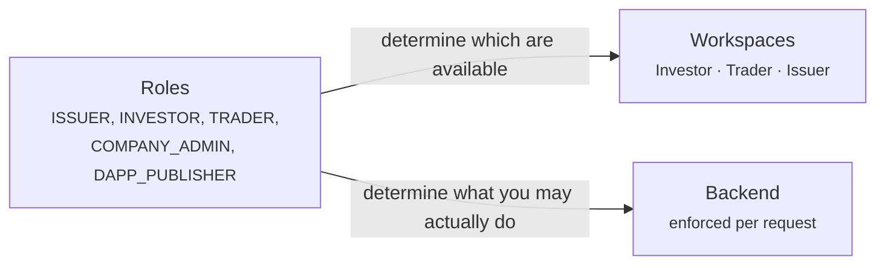

# Your workspace

The [life of a security](../lifecycle/index.md) told one story from beginning to end. These pages are the other cut: **one page per kind of user**, covering everything that person does, in the order they will do it.

Find yourself below.

---

## The three workspaces

The switcher at the top left of the portal moves between these. Which ones you see depends on your roles.

-   :material-piggy-bank:{ .lg .middle } **[Investor](investor.md)**

    ---

    You own securities. You want to see what you hold, what it is doing, and what you are owed.

    *Positions · Investments · Marketplace*

-   :material-chart-line:{ .lg .middle } **[Trader](trader.md)**

    ---

    You buy and sell, and you finance positions rather than just holding them.

    *Trading Desk · Liquidity · Positions · Marketplace*

-   :material-file-document-edit:{ .lg .middle } **[Issuer](issuer.md)**

    ---

    You raise money by issuing securities, and you administer them afterwards.

    *Issuances · My dApps · Company Admin · Marketplace*

## Three roles that are not workspaces

-   :material-account-cog:{ .lg .middle } **[Company administrator](company-admin.md)**

    ---

    You manage your organisation's users and its identity in the registry. A responsibility layered on top of whatever else you do.

-   :material-widgets:{ .lg .middle } **[dApp publisher](dapp-publisher.md)**

    ---

    You build applications that plug into the ecosystem and publish them to the marketplace.

-   :material-magnify-scan:{ .lg .middle } **[Auditor](auditor.md)**

    ---

    You inspect. Read-only, comprehensive, and deliberately unable to change anything.

---

## How roles and workspaces relate

They are not the same thing, and conflating them causes confusion.

**Roles** are permissions. They are granted by your company administrator or the registry operator, they are enforced by the backend on every single request, and you cannot change your own.

**Workspaces** are navigation. They group the tools for one job so that a person who holds four roles is not staring at every feature at once.

!!! info "Switching workspace grants nothing"
    Selecting the Issuer workspace does not give you issuer rights. If you lack the role, the pages will not load and the API will refuse you.

    Your choice is remembered in your browser, so it survives sign-out on that machine but does not follow you to another.

| Role | Unlocks |
|---|---|
| `INVESTOR` | Investor workspace |
| `TRADER` | Trader workspace |
| `ISSUER` | Issuer workspace |
| `COMPANY_ADMIN` | Issuer workspace, plus [Company Admin](company-admin.md) |
| `DAPP_PUBLISHER` | Issuer workspace, plus [My dApps](dapp-publisher.md) |
| `AUDIT` | Read-only access across the registry |
| `REGISTRY_ADMIN` | Operator staff. Sees all three workspaces when [impersonating](../../operator/customers/impersonation.md). |

---

## What everybody has, regardless

Three things sit outside the workspaces, in the top bar, because they apply to you no matter what you are doing.

| | |
|---|---|
| **[KYC](../kyc.md)** | Your organisation's verification status. If this lapses, most things stop working. |
| **[Endpoints](../investors/wallet-setup.md)** | The wallet addresses you have registered. Securities cannot reach you without one. |
| **[Security](../authentication.md)** | Your sign-in and two-factor settings. |
