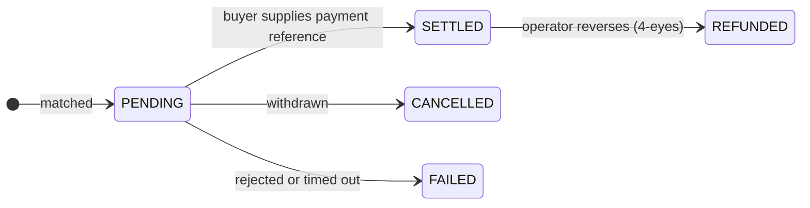

# Trader

**Sie halten Wertpapiere nicht nur, Sie arbeiten mit ihnen.** Sie kaufen, wenn etwas günstig ist, verkaufen, wenn Sie Liquidität brauchen, und beleihen Bestände, statt sie aufzulösen.

Der Arbeitsbereich Trader ist der Arbeitsbereich Anleger plus die beiden Dinge, die einen Bestand aktiv machen: einen **Trading Desk** und **Liquiditätsmärkte**.

---

## Was es hier gibt

| | |
|---|---|
| **Dashboard** | Bestände, jüngste Ausführungen, alles, was Aufmerksamkeit braucht. |
| **Trading Desk** | Verkaufsangebote anlegen, Angebote durchsehen, ausführen, abwickeln. |
| **Liquidity** | Bestände beleihen oder Kapital bereitstellen und verdienen. Nur wenn der Betreiber es freigeschaltet hat. |
| **My Positions** | Alles, was Sie halten, einschließlich des Verpfändeten. |
| **Marketplace** | dApps des Ökosystems. |

---

## Einrichtung vor dem ersten Geschäft

Die **Trader settings** (*Trading Desk → Settings*) legen fest, wo Wertpapiere landen, wenn Sie kaufen. Einmal richtig gesetzt, geht jedes weitere Geschäft schneller.

| Einstellung | Warum sie zählt |
|---|---|
| **Global default wallet** | Wohin Käufe gehen, sofern Sie nichts anderes sagen. |
| **Per-asset-type defaults** | Verschiedene Wallets für verschiedene Chains — meist genau das, was Sie wollen, denn eine Ethereum-Adresse kann keinen Solana-Token halten. |
| **Accepted payment options** | Welche Zahlungswege Sie beim Verkauf akzeptieren. |

Bei der Ausführung können Sie stets abweichen: Standard-Wallet, Standard je Asset-Typ, ein bestimmter registrierter [Endpunkt](../investors/wallet-setup.md) oder eine einmalige Adresse.

!!! warning "Eine einmalige Adresse wird nicht geprüft wie ein Endpunkt"
    Registrierte Endpunkte sind der Plattform und der Sanktionsprüfung bekannt. Eine roh eingetippte Adresse umgeht diese Zuordnung. Bevorzugen Sie Endpunkte; heben Sie sich freie Adressen für Fälle auf, über die Sie tatsächlich nachgedacht haben.

---

## Verkaufen

*Trading Desk → Create listing* (Verkaufsangebot anlegen).

Wählen Sie den Bestand, die Menge, Ihren Preis je Einheit, die akzeptierten Zahlungswege und den Handelsplatz.

Dann warten Sie. Ein Angebot ist ein Angebot — es wird nicht ausgeführt, bis jemand zugreift. Sie können es bis zur Abwicklung jederzeit zurückziehen.

!!! tip "Preis ist nicht Nennbetrag"
    Eine Anleihe mit 1.000 € Nennbetrag kann zu 960 € oder 1.040 € angeboten werden. Der Nennbetrag ist das, was bei Fälligkeit zurückgezahlt wird; der Preis ist das, was jemand Ihnen heute für dieses Recht zahlt. Sind die Zinsen seit der Emission gestiegen, handelt eine ältere Anleihe mit niedrigerem Kupon mit Abschlag — und umgekehrt.

---

## Kaufen

*Trading Desk → browse offers.* Sie sehen nur, was Sie halten dürfen.

| Ordertyp | |
|---|---|
| **Market** | Zum angebotenen Preis zugreifen. |
| **Limit** | Ein Maximum setzen. Liegt das Angebot darüber, wird die Order abgelehnt statt schlechter ausgeführt. |

Danach wählen Sie Ihre Empfangs-Wallet und eine Zahlungsoption, die der Verkäufer akzeptiert.

---

## In der Abwicklung liegt das Risiko

Lesen Sie das, selbst wenn Sie alles andere auf dieser Seite überspringen.

Eine Ausführung beginnt als **`PENDING`**. Das heißt: Das Geschäft ist vereinbart, das Geld ist nicht bestätigt, und **die Wertpapiere haben sich nicht bewegt.**

Zur Abwicklung liefert der Käufer eine **payment reference** (Zahlungsreferenz) — einen Stablecoin-Transaktions-Hash, eine SEPA-Referenz, was auch immer die Zahlung auf dem gewählten Weg belegt. Erst dann bewegt das Register die Einheiten.

!!! warning "Was eine Zahlungsreferenz belegt — und was nicht"
    Sie hält fest, dass der Käufer eine Zahlung behauptet hat, und gibt der Abstimmung etwas Konkretes zum Prüfen. Sie ist **keine** Bestätigung der Plattform, dass Geld angekommen ist.

    Wenn Sie verkaufen, überzeugen Sie sich selbst, dass die Zahlung echt ist, bevor Sie sich auf die Abwicklung verlassen. Sollen beide Seiten wirklich voneinander abhängen, handeln Sie über einen [LgZ-Weg](../lifecycle/primary-issuance.md#wo-das-geld-bleibt) mit beiden Seiten auf einem Ledger.

Liegengebliebene `PENDING`-Geschäfte laufen automatisch ab. Ein abgewickeltes Geschäft kann der Betreiber rückabwickeln, aber nur im [Vier-Augen-Prinzip](../../compliance/step-up-mfa.md).

---

## Liquidity: Beleihen, was Sie halten

*Liquidity → Borrow.* Einen Bestand verpfänden, ein Darlehen aufnehmen, das Wertpapier behalten.

Die vollständige Mechanik — Sicherheiten, LLTV, Sicherheitsfaktor, Verwertung und das Design isolierter Märkte — steht in [Pensionsgeschäfte und Wertpapierleihe](../lifecycle/repo-lending.md). Drei Dinge gehören hierher, weil sie speziell einen Trader treffen:

!!! danger "Wer das Maximum leiht, hat keinen Spielraum mehr"
    Wenn der Bildschirm sagt, Sie könnten 67.200 € aufnehmen, bringen Sie sich mit 67.200 € genau an die Verwertungsschwelle. Jeder Kursrückgang führt zur Verwertung. Der Abstand zwischen dem, was Sie aufnehmen, und dem, was Sie aufnehmen könnten, **ist** Ihr Sicherheitspuffer.

!!! danger "Ein unzuverlässiger Sicherheitsfaktor heißt: Die Plattform weiß es nicht"
    Ist der Oracle-Preis veraltet, wird der Sicherheitsfaktor als unzuverlässig gekennzeichnet statt als selbstsichere Zahl angezeigt. Das ist kein Anzeigefehler — es heißt, dass derzeit niemand weiß, wie sicher die Position ist. Nehmen Sie gegen eine so gekennzeichnete Zahl nichts zusätzlich auf.

!!! danger "Die Verwertung eines regulierten Wertpapiers kann langsam sein"
    Ein Verwerter muss zugelassener Inhaber dieses Instruments sein. Sind nur wenige verifiziert, wird eine unterdeckte Position womöglich nicht zeitnah verwertet. Das ist ein bekannter offener Befund, keine theoretische Sorge — [siehe die Prüfung](../../compliance/lending-facility-review.md).

Die Gegenseite ist **Supply & Earn**: Kapital in einen Markt einlegen und an Darlehensnehmern verdienen, zu einem Satz, der der Auslastung folgt. Das ist Kreditvergabe, kein Sparen — Ihr Kapital ist gefährdet, wenn Sicherheiten schneller fallen, als die Verwertung reagieren kann.

---

## Compliance während eines Geschäfts

Sie bedienen diese Mechanismen nicht; sie wirken auf Sie.

- **Zulässigkeit** — Sie sehen und nehmen nur Angebote für Instrumente an, die Sie rechtmäßig halten dürfen.
- **On-Chain-Compliance** — bei [ERC-3643](../../token-standards/erc3643.md)-Instrumenten scheitert die Übertragung, wenn der Empfänger nicht zugelassen ist oder eine Regel verletzt wird.
- **[Sanktionsprüfung](../../compliance/sanctions-screening.md)** — beide Seiten werden geprüft. Ein Treffer hält die Übertragung zur menschlichen Prüfung an; er storniert sie nicht stillschweigend.
- **[Travel Rule](../../compliance/travel-rule.md)** — Angaben zu Auftraggeber und Begünstigtem begleiten Übertragungen oberhalb eines Schwellenwerts.

All das arbeitet fail-closed. Ist ein Prüfdienst nicht erreichbar, werden Übertragungen abgewiesen statt ungeprüft durchgelassen. Ein Ausfall sieht aus wie Ablehnung, nicht wie Erlaubnis.

---

## Wohin als Nächstes

- [Sekundärhandel](../lifecycle/secondary-market.md) — das vollständige Bild
- [Pensionsgeschäfte und Wertpapierleihe](../lifecycle/repo-lending.md) — Sicherheiten und Hebel in der Tiefe
- [Wallet verbinden](../investors/wallet-setup.md)
