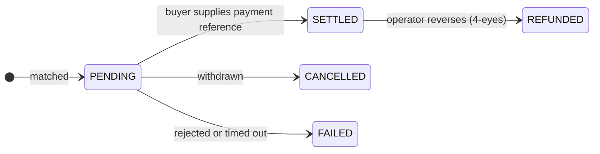

# Trader

**No se limita a mantener valores: los pone a trabajar.** Compra cuando algo está barato, vende cuando necesita efectivo y toma prestado contra sus posiciones en lugar de deshacerlas.

El espacio Trader es el espacio Investor más las dos cosas que hacen activa una posición: una **mesa de negociación** y unos **mercados de liquidez**.

---

## Qué hay aquí

| | |
|---|---|
| **Dashboard** | Posiciones, ejecuciones recientes, todo lo que requiere atención. |
| **Trading Desk** | Crear ofertas de venta, revisar ofertas, ejecutar, liquidar. |
| **Liquidity** | Tomar prestado contra sus tenencias, o aportar efectivo y obtener rendimiento. Solo si el operador lo ha habilitado. |
| **My Positions** | Todo lo que mantiene, incluido lo pignorado. |
| **Marketplace** | dApps del ecosistema. |

---

## Configurar antes de su primera operación

Los **Trader settings** (*Trading Desk → Settings*) deciden dónde aterrizan los valores cuando compra. Bien ajustado una vez, cada operación posterior es más rápida.

| Ajuste | Por qué importa |
|---|---|
| **Global default wallet** | Adónde van las compras salvo que indique otra cosa. |
| **Per-asset-type defaults** | Monederos distintos para cadenas distintas — normalmente lo que quiere, ya que una dirección de Ethereum no puede mantener un token de Solana. |
| **Accepted payment options** | Qué vías de pago aceptará al vender. |

En el momento de ejecutar siempre puede apartarse: el monedero por defecto, el del tipo de activo, un [punto final](../investors/wallet-setup.md) registrado concreto, o una dirección puntual.

!!! warning "Una dirección puntual no se filtra como un punto final"
    Los puntos finales registrados son conocidos por la plataforma y por el filtrado de sanciones. Teclear una dirección en bruto elude esa asociación. Prefiera los puntos finales; reserve las direcciones libres para casos que haya pensado de verdad.

---

## Vender

*Trading Desk → Create listing* (crear oferta de venta).

Elija la tenencia, la cantidad, su precio por unidad, las vías de pago que acepta y el centro de negociación.

Luego espere. Una oferta es una oferta — no se ejecuta hasta que alguien la toma. Puede cancelarla en cualquier momento antes de la liquidación.

!!! tip "El precio no es el valor nominal"
    Un bono de 1.000 € de nominal puede ofrecerse a 960 € o a 1.040 €. El valor nominal es lo que se amortiza al vencimiento; el precio es lo que alguien le paga hoy por ese derecho. Si los tipos han subido desde la emisión, un bono antiguo con cupón más bajo cotiza con descuento, y a la inversa.

---

## Comprar

*Trading Desk → browse offers.* Solo ve aquello que está habilitado para mantener.

| Tipo de orden | |
|---|---|
| **Market** | Tomar el precio publicado. |
| **Limit** | Fijar un máximo. Si la oferta lo supera, la orden se rechaza en lugar de ejecutarse peor. |

Después elija su monedero de recepción y una opción de pago que el vendedor acepte.

---

## El riesgo vive en la liquidación

Lea esto aunque se salte todo lo demás de la página.

Una ejecución nace en **`PENDING`**. Eso significa que la operación está acordada, el dinero no está confirmado y **los valores no se han movido.**

Para liquidar, el comprador aporta una **payment reference** (referencia de pago) — un hash de transacción de una stablecoin, una referencia SEPA, lo que acredite el pago en la vía elegida. Solo entonces mueve el registro las unidades.

!!! warning "Qué prueba y qué no prueba una referencia de pago"
    Deja constancia de que el comprador afirmó haber pagado y da a la conciliación algo concreto que comprobar. **No** es la plataforma confirmando que el dinero llegó.

    Si vende, convénzase usted mismo de que el pago es real antes de fiarse de la liquidación. Si quiere que las dos patas dependan de verdad una de la otra, negocie en una [vía de entrega contra pago](../lifecycle/primary-issuance.md#adonde-va-el-dinero) con ambas patas en la misma cadena.

Las operaciones que se quedan en `PENDING` caducan automáticamente. Una operación liquidada puede revertirla el operador, pero solo bajo [doble control](../../compliance/step-up-mfa.md).

---

## Liquidity: tomar prestado contra lo que mantiene

*Liquidity → Borrow.* Pignore una tenencia, tome un préstamo, conserve el valor.

Toda la mecánica — garantías, LLTV, factor de salud, ejecución y el diseño de mercados aislados — está en [Repo y financiación](../lifecycle/repo-lending.md). Tres cosas corresponden aquí porque muerden específicamente a un trader:

!!! danger "Tomar prestado el máximo no le deja margen"
    Si la pantalla dice que puede tomar 67.200 €, tomar 67.200 € le sitúa exactamente en el umbral de ejecución. Cualquier caída de precio le ejecuta. La distancia entre lo que toma y lo que podría tomar **es** su margen de seguridad.

!!! danger "Un factor de salud no fiable significa que la plataforma no lo sabe"
    Cuando el precio del oráculo está caducado, el factor de salud se marca como no fiable en lugar de mostrarse como una cifra segura. No es un fallo de visualización — significa que ahora mismo nadie sabe cuán segura está la posición. No se endeude más apoyándose en una cifra así marcada.

!!! danger "La ejecución de un valor regulado puede ser lenta"
    Quien ejecuta la garantía debe ser un titular admitido de ese instrumento. Si hay pocos verificados, una posición bajo el agua puede no ejecutarse con prontitud. Es un hallazgo abierto conocido, no una inquietud teórica — [véase la revisión](../../compliance/lending-facility-review.md).

La otra cara es **Supply & Earn**: depositar efectivo en un mercado y ganar de los prestatarios, a un tipo que sigue la tasa de utilización. Es prestar, no ahorrar — su capital está en riesgo si la garantía cae más rápido de lo que la ejecución puede responder.

---

## Cumplimiento durante una operación

Usted no maneja estos mecanismos; ellos actúan sobre usted.

- **Elegibilidad** — solo ve y solo puede tomar ofertas de instrumentos que pueda mantener lícitamente.
- **Cumplimiento on-chain** — en instrumentos [ERC-3643](../../token-standards/erc3643.md) la transmisión falla si el destinatario no está admitido o se infringe una regla.
- **[Filtrado de sanciones](../../compliance/sanctions-screening.md)** — se filtra a ambas partes. Una coincidencia detiene la transmisión para revisión humana; no la cancela en silencio.
- **[Travel Rule](../../compliance/travel-rule.md)** — la información de ordenante y beneficiario viaja con las transmisiones por encima de un umbral.

Todo ello opera por denegación por defecto. Si un servicio de filtrado no está disponible, las transmisiones se rechazan en lugar de dejarse pasar sin comprobar. Una caída se parece a un rechazo, no a un permiso.

---

## Adónde ir ahora

- [Mercado secundario](../lifecycle/secondary-market.md) — el cuadro completo
- [Repo y financiación](../lifecycle/repo-lending.md) — garantías y apalancamiento en profundidad
- [Conectar un monedero](../investors/wallet-setup.md)
