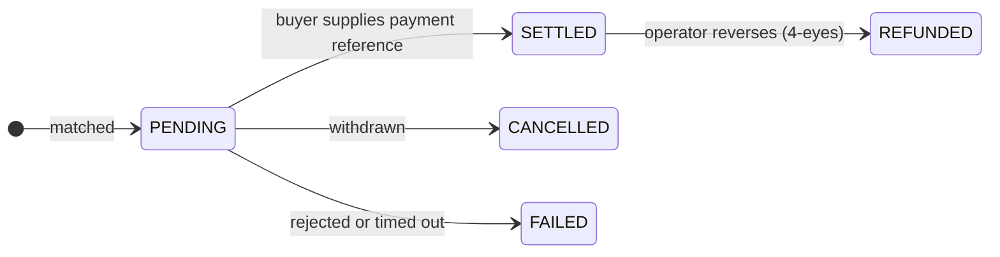

# Trader

**Vous ne vous contentez pas de détenir des titres, vous les faites travailler.** Vous achetez quand c'est bon marché, vous vendez quand vous avez besoin de liquidités, et vous empruntez contre vos positions plutôt que de les déboucler.

L'espace Trader, c'est l'espace Investisseur plus les deux choses qui rendent une position active : un **desk de négociation** et des **marchés de liquidité**.

---

## Ce que vous y trouvez

| | |
|---|---|
| **Dashboard** | Positions, exécutions récentes, tout ce qui demande attention. |
| **Trading Desk** | Créer des offres de vente, parcourir les offres, exécuter, régler. |
| **Liquidity** | Emprunter contre vos avoirs, ou apporter des liquidités et percevoir un rendement. Seulement si l'opérateur l'a activé. |
| **My Positions** | Tout ce que vous détenez, y compris ce qui est nanti. |
| **Marketplace** | Les dApps de l'écosystème. |

---

## À configurer avant votre première transaction

Les **Trader settings** (*Trading Desk → Settings*) déterminent où les titres arrivent lorsque vous achetez. Bien réglé une fois, chaque transaction suivante est plus rapide.

| Réglage | Pourquoi cela compte |
|---|---|
| **Global default wallet** | Où vont les achats, sauf indication contraire. |
| **Per-asset-type defaults** | Des portefeuilles différents pour des chaînes différentes — généralement ce que vous voulez, puisqu'une adresse Ethereum ne peut pas détenir un jeton Solana. |
| **Accepted payment options** | Les moyens de paiement que vous acceptez à la vente. |

À l'exécution, vous pouvez toujours déroger : le portefeuille par défaut, celui du type d'actif, un [point de réception](../investors/wallet-setup.md) enregistré précis, ou une adresse ponctuelle.

!!! warning "Une adresse ponctuelle n'est pas filtrée comme un point de réception"
    Les points de réception enregistrés sont connus de la plateforme et du filtrage des sanctions. Saisir une adresse brute contourne cette association. Privilégiez les points de réception ; gardez les adresses libres pour les cas auxquels vous avez réellement réfléchi.

---

## Vendre

*Trading Desk → Create listing* (créer une offre de vente).

Choisissez l'avoir, la quantité, votre prix unitaire, les moyens de paiement acceptés et la plateforme de négociation.

Puis attendez. Une offre est une offre — elle ne s'exécute que si quelqu'un la prend. Vous pouvez l'annuler à tout moment avant le règlement.

!!! tip "Le prix n'est pas la valeur nominale"
    Une obligation de 1 000 € de nominal peut s'afficher à 960 € ou 1 040 €. La valeur nominale est ce qui sera remboursé à l'échéance ; le prix est ce que quelqu'un vous paie aujourd'hui pour ce droit. Si les taux ont monté depuis l'émission, une obligation ancienne à coupon plus faible se négocie avec décote, et inversement.

---

## Acheter

*Trading Desk → browse offers.* Vous ne voyez que ce que vous êtes habilité à détenir.

| Type d'ordre | |
|---|---|
| **Market** | Prendre le prix affiché. |
| **Limit** | Fixer un maximum. Si l'offre est au-dessus, l'ordre est refusé plutôt qu'exécuté moins bien. |

Choisissez ensuite votre portefeuille de réception et un moyen de paiement accepté par le vendeur.

---

## Le risque se loge dans le règlement

Lisez ceci même si vous sautez tout le reste de la page.

Une exécution démarre en **`PENDING`**. Cela signifie que la transaction est convenue, que l'argent n'est pas confirmé, et que **les titres n'ont pas bougé.**

Pour régler, l'acheteur fournit une **payment reference** (référence de paiement) — un hachage de transaction stablecoin, une référence SEPA, ce qui atteste le paiement sur le moyen retenu. C'est seulement alors que le registre déplace les unités.

!!! warning "Ce qu'une référence de paiement prouve, et ce qu'elle ne prouve pas"
    Elle consigne le fait que l'acheteur a affirmé avoir payé et donne au rapprochement quelque chose de concret à vérifier. Ce n'est **pas** la plateforme qui confirme l'arrivée des fonds.

    Si vous vendez, assurez-vous vous-même que le paiement est réel avant de vous fier au règlement. Si vous voulez que les deux jambes soient véritablement conditionnées l'une à l'autre, négociez sur un [dispositif LCP](../lifecycle/primary-issuance.md#ou-va-largent) avec les deux jambes sur un même registre.

Les transactions restées `PENDING` expirent automatiquement. Une transaction réglée peut être annulée par l'opérateur, mais uniquement en [double validation](../../compliance/step-up-mfa.md).

---

## Liquidity : emprunter contre ce que vous détenez

*Liquidity → Borrow.* Nantir un avoir, prendre un prêt, garder le titre.

Toute la mécanique — garanties, LLTV, facteur de santé, réalisation de la garantie et conception des marchés isolés — figure dans [Pension livrée et financement](../lifecycle/repo-lending.md). Trois points relèvent d'ici, parce qu'ils frappent spécifiquement un trader :

!!! danger "Emprunter le maximum ne vous laisse aucune marge"
    Si l'écran indique que vous pouvez emprunter 67 200 €, emprunter 67 200 € vous place exactement au seuil de réalisation. La moindre baisse de prix déclenche la réalisation. L'écart entre ce que vous empruntez et ce que vous pourriez emprunter **est** votre marge de sécurité.

!!! danger "Un facteur de santé non fiable signifie que la plateforme ne sait pas"
    Lorsque le prix de l'oracle est périmé, le facteur de santé est signalé comme non fiable au lieu d'être affiché comme un chiffre sûr. Ce n'est pas un défaut d'affichage — cela signifie que personne ne sait actuellement à quel point la position est sûre. N'empruntez pas davantage sur la foi d'un chiffre ainsi marqué.

!!! danger "La réalisation d'un titre réglementé peut être lente"
    Celui qui réalise la garantie doit être un titulaire admis de cet instrument. Si peu de personnes sont vérifiées, une position en perte peut ne pas être réalisée rapidement. C'est un constat ouvert connu, pas une inquiétude théorique — [voir la revue](../../compliance/lending-facility-review.md).

L'autre versant est **Supply & Earn** : déposer des liquidités dans un marché et percevoir un rendement des emprunteurs, à un taux qui suit le taux d'utilisation. C'est du prêt, pas de l'épargne — votre capital est à risque si la garantie chute plus vite que la réalisation ne peut réagir.

---

## La conformité pendant une transaction

Vous ne pilotez pas ces mécanismes ; ils s'appliquent à vous.

- **Éligibilité** — vous ne voyez et ne pouvez prendre que des offres portant sur des instruments que vous pouvez légalement détenir.
- **Conformité on-chain** — pour les instruments [ERC-3643](../../token-standards/erc3643.md), le transfert échoue si le destinataire n'est pas admis ou si une règle est enfreinte.
- **[Filtrage des sanctions](../../compliance/sanctions-screening.md)** — les deux parties sont filtrées. Une correspondance suspend le transfert pour examen humain ; elle ne l'annule pas silencieusement.
- **[Travel Rule](../../compliance/travel-rule.md)** — les informations sur le donneur d'ordre et le bénéficiaire accompagnent les transferts au-delà d'un seuil.

Tout cela fonctionne en rejet par défaut. Si un service de filtrage est indisponible, les transferts sont refusés plutôt que laissés passer sans contrôle. Une panne ressemble à un refus, pas à une autorisation.

---

## Et ensuite

- [Marché secondaire](../lifecycle/secondary-market.md) — le tableau complet
- [Pension livrée et financement](../lifecycle/repo-lending.md) — garanties et effet de levier en profondeur
- [Connecter un portefeuille](../investors/wallet-setup.md)
