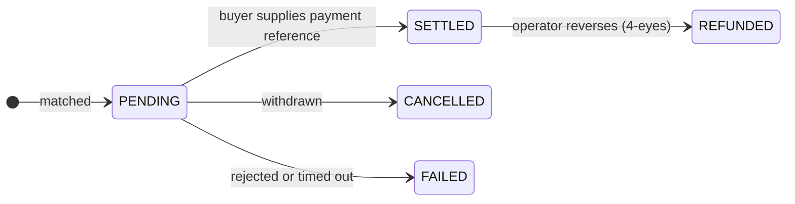

# Trader

**Non ti limiti a detenere strumenti finanziari, li fai lavorare.** Compri quando qualcosa costa poco, vendi quando ti serve liquidità e prendi a prestito contro le posizioni anziché smontarle.

L'area Trader è l'area Investitore più le due cose che rendono attiva una posizione: un **desk di negoziazione** e i **mercati di liquidità**.

---

## Che cosa c'è qui

| | |
|---|---|
| **Dashboard** | Posizioni, esecuzioni recenti, tutto ciò che richiede attenzione. |
| **Trading Desk** | Creare proposte di vendita, sfogliare le offerte, eseguire, regolare. |
| **Liquidity** | Prendere a prestito contro i tuoi averi, oppure apportare liquidità e ottenerne un rendimento. Solo se l'operatore l'ha abilitato. |
| **My Positions** | Tutto ciò che detieni, compreso ciò che è costituito in garanzia. |
| **Marketplace** | Le dApp dell'ecosistema. |

---

## Da configurare prima della prima operazione

Le **Trader settings** (*Trading Desk → Settings*) decidono dove arrivano gli strumenti quando compri. Impostate bene una volta, ogni operazione successiva è più rapida.

| Impostazione | Perché conta |
|---|---|
| **Global default wallet** | Dove finiscono gli acquisti, salvo diversa indicazione. |
| **Per-asset-type defaults** | Wallet diversi per chain diverse — di solito è ciò che serve, dato che un indirizzo Ethereum non può detenere un token Solana. |
| **Accepted payment options** | Quali canali di pagamento accetti in vendita. |

Al momento dell'esecuzione puoi sempre derogare: il wallet predefinito, quello per tipo di asset, uno specifico [endpoint](../investors/wallet-setup.md) registrato, oppure un indirizzo estemporaneo.

!!! warning "Un indirizzo estemporaneo non è filtrato come un endpoint"
    Gli endpoint registrati sono noti alla piattaforma e allo screening sanzioni. Digitare un indirizzo grezzo aggira quell'associazione. Preferisci gli endpoint; tieni gli indirizzi liberi per i casi su cui hai davvero ragionato.

---

## Vendere

*Trading Desk → Create listing* (creare una proposta di vendita).

Scegli la posizione, la quantità, il prezzo per unità, i canali di pagamento che accetti e la sede di negoziazione.

Poi aspetti. Una proposta è una proposta — non si esegue finché qualcuno non la prende. Puoi annullarla in qualsiasi momento prima del regolamento.

!!! tip "Il prezzo non è il valore nominale"
    Un'obbligazione da 1.000 € di nominale può essere proposta a 960 € o a 1.040 €. Il valore nominale è ciò che viene rimborsato a scadenza; il prezzo è ciò che qualcuno ti paga oggi per quel diritto. Se i tassi sono saliti dopo l'emissione, un'obbligazione più vecchia con cedola più bassa tratta a sconto, e viceversa.

---

## Comprare

*Trading Desk → browse offers.* Vedi soltanto ciò che sei legittimato a detenere.

| Tipo di ordine | |
|---|---|
| **Market** | Prendere il prezzo esposto. |
| **Limit** | Fissare un massimo. Se la proposta è più alta, l'ordine viene rifiutato anziché eseguito peggio. |

Poi scegli il wallet di ricezione e un'opzione di pagamento accettata dal venditore.

---

## È nel regolamento che vive il rischio

Leggi questo anche se salti tutto il resto della pagina.

Un'esecuzione parte come **`PENDING`**. Significa che l'operazione è concordata, il denaro non è confermato e **gli strumenti non si sono mossi.**

Per regolare, l'acquirente fornisce una **payment reference** (riferimento di pagamento) — un hash di transazione di uno stablecoin, un riferimento SEPA, qualunque cosa attesti il pagamento sul canale scelto. Solo allora il registro muove le unità.

!!! warning "Che cosa dimostra un riferimento di pagamento e che cosa no"
    Registra che l'acquirente ha affermato di aver pagato e dà alla riconciliazione qualcosa di concreto da verificare. **Non** è la piattaforma che conferma l'arrivo del denaro.

    Se stai vendendo, accertati tu stesso che il pagamento sia reale prima di fare affidamento sul regolamento. Se vuoi che le due gambe siano davvero condizionate l'una all'altra, negozia su un canale [consegna contro pagamento](../lifecycle/primary-issuance.md#dove-va-il-denaro) con entrambe le gambe sullo stesso ledger.

Le operazioni rimaste `PENDING` scadono automaticamente. Un'operazione regolata può essere stornata dall'operatore, ma solo con il [principio dei quattro occhi](../../compliance/step-up-mfa.md).

---

## Liquidity: prendere a prestito contro ciò che detieni

*Liquidity → Borrow.* Costituisci in garanzia una posizione, prendi un prestito, tieni lo strumento.

Tutta la meccanica — garanzie, LLTV, fattore di salute, escussione e il disegno dei mercati isolati — è in [Pronti contro termine e prestito titoli](../lifecycle/repo-lending.md). Tre cose stanno qui perché colpiscono specificamente un trader:

!!! danger "Prendere a prestito il massimo non ti lascia margine"
    Se lo schermo dice che puoi prendere 67.200 €, prendere 67.200 € ti mette esattamente sulla soglia di escussione. Qualsiasi calo di prezzo ti fa escutere. La distanza tra ciò che prendi e ciò che potresti prendere **è** il tuo margine di sicurezza.

!!! danger "Un fattore di salute non affidabile significa che la piattaforma non sa"
    Quando il prezzo dell'oracolo è vecchio, il fattore di salute viene segnalato come non affidabile anziché mostrato come un numero sicuro. Non è un difetto di visualizzazione — significa che al momento nessuno sa quanto sia sicura la posizione. Non aumentare l'indebitamento sulla base di una cifra così contrassegnata.

!!! danger "L'escussione di uno strumento regolamentato può essere lenta"
    Chi escute deve essere un titolare ammesso di quello strumento. Se pochi sono verificati, una posizione sott'acqua può non essere escussa tempestivamente. È un rilievo aperto noto, non una preoccupazione teorica — [vedi la revisione](../../compliance/lending-facility-review.md).

L'altro versante è **Supply & Earn**: depositare liquidità in un mercato e guadagnare dai debitori, a un tasso che segue il tasso di utilizzo. È prestito, non risparmio — il tuo capitale è a rischio se la garanzia scende più in fretta di quanto l'escussione riesca a reagire.

---

## La conformità durante un'operazione

Non sei tu a governarli; sono loro ad applicarsi a te.

- **Ammissibilità** — vedi e puoi prendere solo offerte su strumenti che puoi lecitamente detenere.
- **Conformità on-chain** — per gli strumenti [ERC-3643](../../token-standards/erc3643.md) il trasferimento fallisce se il destinatario non è ammesso o se una regola è violata.
- **[Screening sanzioni](../../compliance/sanctions-screening.md)** — entrambe le parti vengono filtrate. Una corrispondenza sospende il trasferimento per un esame umano; non lo annulla silenziosamente.
- **[Travel Rule](../../compliance/travel-rule.md)** — le informazioni su ordinante e beneficiario viaggiano con i trasferimenti oltre una soglia.

Tutto questo funziona in rifiuto in caso di errore. Se un servizio di screening non è raggiungibile, i trasferimenti vengono rifiutati anziché lasciati passare senza controllo. Un'interruzione somiglia a un rifiuto, non a un permesso.

---

## Dove andare adesso

- [Negoziazione secondaria](../lifecycle/secondary-market.md) — il quadro completo
- [Pronti contro termine e finanziamento](../lifecycle/repo-lending.md) — garanzie e leva in profondità
- [Collegare un wallet](../investors/wallet-setup.md)
