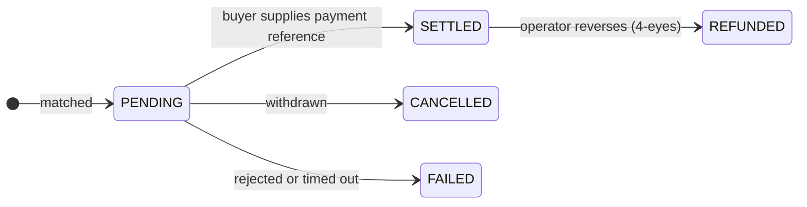

# Trader

**You do not just hold securities, you work them.** You buy when something is cheap, sell when you need the cash, and borrow against positions rather than unwinding them.

The Trader workspace is the Investor workspace plus three tools that make a position active: a **trading desk**, a bilateral **Repo Desk**, and **securities-backed lending markets**.

---

## What is here

| | |
|---|---|
| **Dashboard** | Positions, recent executions, anything needing attention. |
| **Trading Desk** | Create listings, browse offers, execute, settle. |
| **Repo Desk** | Send targeted or broadcast repo RFQs, negotiate private quotes, and manage bilateral settlement. |
| **Securities-backed Lending** | Borrow against holdings, or supply cash and earn. Only if the operator enabled it. |
| **My Positions** | Everything you hold, including what is pledged. |
| **Marketplace** | Ecosystem dApps. |

---

## Set up before your first trade

**Trader settings** (*Trading Desk → Settings*) decide where securities land when you buy. Get this right once and every subsequent trade is faster.

| Setting | Why it matters |
|---|---|
| **Global default wallet** | Where purchases go unless you say otherwise. |
| **Per-asset-type defaults** | Different wallets for different chains — usually what you want, since an Ethereum address cannot hold a Solana token. |
| **Accepted payment options** | Which rails you will take when selling. |

At execution time you can always override: use the global default, the asset-type default, a specific registered [endpoint](../investors/wallet-setup.md), or a one-off address.

!!! warning "A one-off address is not screened the way an endpoint is"
    Registered endpoints are known to the platform and to sanctions screening. Typing a raw address bypasses that association. Prefer endpoints; keep custom addresses for cases you have actually thought about.

---

## Selling

*Trading Desk → Create listing.*

Pick the holding, the quantity, your price per unit, which payment rails you accept, and the venue.

Then wait. A listing is an offer — it does not execute until somebody takes it. You can cancel any time before settlement.

!!! tip "Price is not face value"
    A €1,000 face-value bond might list at €960 or €1,040. The face value is what gets repaid at maturity; the price is what somebody will pay you for that right today. If rates have risen since issuance, an older bond with a lower coupon trades at a discount, and vice versa.

---

## Buying

*Trading Desk → browse offers.* You only see what you are eligible to hold.

| Order type | |
|---|---|
| **Market** | Take the listed price. |
| **Limit** | Set a maximum. If the listing is above it, the order is refused rather than filled worse. |

Then choose your receiving wallet and a payment option the seller accepts.

---

## Settlement is where the risk lives

Read this even if you skip everything else on the page.

An execution starts **`PENDING`**. That means the trade is agreed, the money is not confirmed, and **the securities have not moved.**

To settle, the buyer provides a **payment reference** — a stablecoin transaction hash, a SEPA reference, whatever evidences payment on the chosen rail. Only then does the register move the units.

!!! warning "What a payment reference does and does not prove"
    It records that the buyer asserted a payment and gives reconciliation something concrete to check. It is **not** the platform confirming money arrived.

    If you are selling, satisfy yourself the payment is real before you rely on the settlement. If you want the two legs genuinely conditional on each other, trade on a [DvP rail](../lifecycle/primary-issuance.md#where-the-money-goes) with both legs on one ledger.

Stale `PENDING` trades time out automatically. A settled trade can be reversed by the operator, but only under [four eyes](../../compliance/step-up-mfa.md).

---

## Repo Desk: bilateral term funding

*Repo Desk → New RFQ.* Choose whether you want to borrow or lend cash, the collateral, principal, dates, indicative rate and haircut. A **targeted** RFQ is visible only to selected companies; a **broadcast** RFQ is visible to all eligible traders. Dealer quotes remain private: an RFQ owner sees every response, while a dealer sees only its own.

Accepting a quote fixes the ACT/360 repurchase amount and creates a trade. Each recipient then confirms the opening leg it actually received. The same two-sided process applies at close. Margin calls and collateral substitutions are recorded in the shared lifecycle rather than hidden in email. See [Repo trading](../lifecycle/repo-trading.md).

## Securities-backed lending: borrowing against what you hold

*Liquidity → Borrow.* Pledge a holding, take a loan, keep the security.

The full mechanics — collateral, LLTV, health factor, liquidation, and the isolated-market design — are in [Securities-backed lending](../lifecycle/repo-lending.md). Three things belong here because they will bite a trader specifically:

!!! danger "Borrowing the maximum leaves you no room"
    If the screen says you can borrow €67,200, borrowing €67,200 puts you exactly at the liquidation threshold. Any price fall liquidates you. The gap between what you borrow and what you could borrow *is* your safety margin.

!!! danger "An unreliable health factor means the platform does not know"
    When the oracle price is stale, the health factor is flagged unreliable rather than shown as a confident number. That is not a display glitch — it means nobody currently knows how safe the position is. Do not add borrowing against a figure marked that way.

!!! danger "Liquidation of a regulated security may be slow"
    A liquidator must be an admitted holder of that instrument. If few are verified, an under-water position may not be liquidated promptly. This is a known open finding, not a theoretical concern — [see the review](../../compliance/lending-facility-review.md).

The other side is **Supply & Earn**: deposit cash into a market and earn from borrowers, at a rate that follows utilisation. It is lending, not saving — your capital is at risk if collateral falls faster than liquidation can respond.

---

## Compliance during a trade

You do not operate these; they operate on you.

- **Eligibility** — you only see and can only take offers for instruments you may lawfully hold.
- **On-chain compliance** — for [ERC-3643](../../token-standards/erc3643.md) instruments, the transfer reverts if the receiver is not admitted or a rule is breached.
- **[Sanctions screening](../../compliance/sanctions-screening.md)** — both parties are screened. A hit pauses the transfer for human review; it does not silently cancel.
- **[Travel Rule](../../compliance/travel-rule.md)** — originator and beneficiary information travels with transfers above a threshold.

All of these fail closed. If a screening service is unavailable, transfers are refused rather than let through unchecked. An outage looks like refusal, not permission.

---

## Where next

- [Secondary trading](../lifecycle/secondary-market.md) — the full picture
- [Repo trading](../lifecycle/repo-trading.md) — bilateral RFQs, settlement, margin and close
- [Securities-backed lending](../lifecycle/repo-lending.md) — pooled collateral and leverage in depth
- [Connecting a wallet](../investors/wallet-setup.md)
