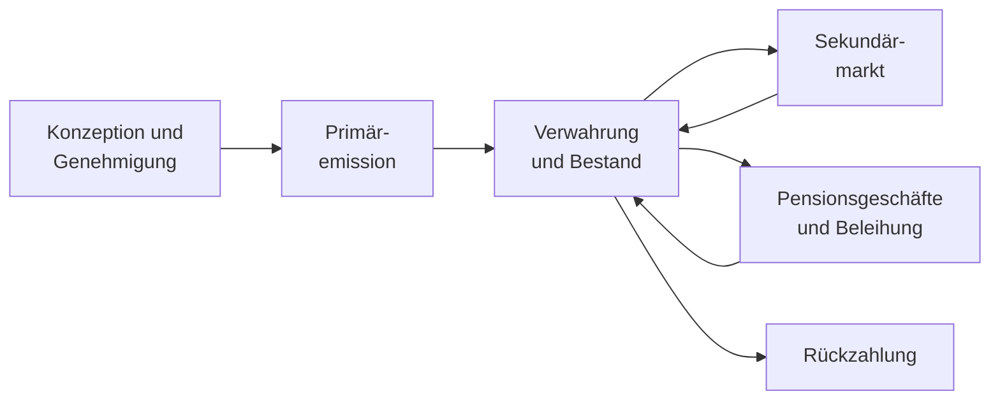
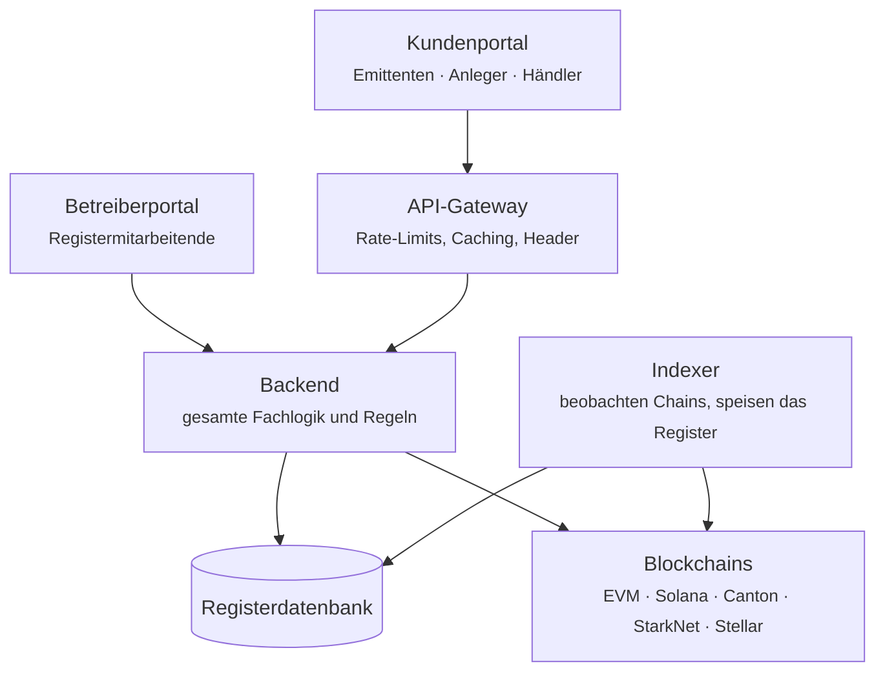

# Registerwerk

**Früher war ein Wertpapier ein Stück Papier im Tresor.** Jemand musste es verwahren, bewachen und bei einem Verkauf aushändigen. Registerwerk ist für die Zeit danach gebaut: Das Wertpapier ist nur noch ein Registereintrag, und dieses Register wird teils in einer Datenbank, teils auf einer Blockchain geführt.

Das klingt nach einer kleinen Änderung. Ist es nicht. Sobald die Urkunde entfällt, muss jede Frage, die man früher mit einem Fingerzeig auf ein Blatt Papier beantwortet hat — *wem gehört das?*, *ist wirklich übertragen worden?*, *darf dieser Erwerber das überhaupt halten?* — von einem System beantwortet werden. Um dieses System geht es hier.

---

## Wählen Sie Ihren Einstieg

-   :material-account-tie:{ .lg .middle } **Ich nutze Registerwerk geschäftlich**

    ---

    Sie emittieren Wertpapiere, investieren, handeln oder beleihen sie. Sie wollen wissen, was die Schaltflächen tun und warum.

    [:octicons-arrow-right-24: Für Kunden](customer/index.md)

-   :material-server-network:{ .lg .middle } **Ich betreibe Registerwerk**

    ---

    Sie führen das Register: Kunden aufnehmen, Emissionen genehmigen, die Plattform am Laufen halten und helfen, wenn etwas schiefgeht.

    [:octicons-arrow-right-24: Für Betreiber](operator/index.md)

-   :material-scale-balance:{ .lg .middle } **Ich muss es beurteilen**

    ---

    Sie sind Compliance-Beauftragte, Prüferin, Aufseher oder Jurist und müssen genau sehen, welche Kontrolle was bewirkt.

    [:octicons-arrow-right-24: Rechtsrahmen](legal/index.md) · [Compliance-Komponenten](compliance/index.md)

-   :material-code-braces:{ .lg .middle } **Ich baue darauf auf**

    ---

    Sie binden eine Chain an, schreiben eine dApp oder lesen den Quellcode.

    [:octicons-arrow-right-24: Architektur](intro/architecture.md) · [Module](platform/modules.md) · [API](platform/api.md)

---

## Wenn Sie nur eines lesen

Lesen Sie **[Der Lebenszyklus eines Wertpapiers](customer/lifecycle/index.md)**. Der Abschnitt begleitet eine erfundene Anleihe vom ersten Einfall des Emittenten über Genehmigung, Emission an Anleger, Handel zwischen ihnen, Verpfändung als Sicherheit bis zur Rückzahlung und Vernichtung. Jede Station verweist weiter in die Tiefe.

Vorausgesetzt wird nur, dass Sie wissen, was ein Kredit ist. Für Finanz- und Blockchain-Fachleute stehen die genauen Mechanismen in aufklappbaren Abschnitten — so muss niemand über das hinauslesen, was er ohnehin weiß.

---

## Was Registerwerk tatsächlich ist

Eine **Referenzimplementierung**: lauffähige Software, die zeigt, wie ein elektronisches Wertpapierregister gebaut werden kann — damit der Entwurf geprüft, kritisiert und weiterverwendet werden kann.

Und sie ist bewusst ehrlich darüber, was das nicht bedeutet:

!!! warning "Was diese Software Ihnen nicht verschafft"

    Der Betrieb dieses Codes macht Sie weder eWpG-konform noch konform mit irgendeinem anderen Gesetz, verschafft keine aufsichtsrechtliche Erlaubnis und verleiht einem Token keine Rechtswirkung als Wertpapier. Das hängt an Ihrer Erlaubnis, Ihrer Organisation, Ihren Instrumenten, Ihren Kunden und Ihrem Deployment — nichts davon kann ein Repository liefern.

    Wenn diese Dokumentation eine Kontrolle als Umsetzung einer rechtlichen Anforderung beschreibt, heißt das: *der Code setzt einen Mechanismus um, der diese Anforderung unterstützen soll*. Ob er sie in Ihrem Fall erfüllt, entscheiden Ihre Rechtsberatung und Ihre Aufsicht.

Die gesamte Dokumentation versucht, diese Linie zu halten. Wenn eine Seite sagt, eine Prüfung sei hinweisend statt durchsetzend, oder ein Status bedeute „wir haben übermittelt" statt „die Behörde hat angenommen", dann ist diese Unterscheidung beabsichtigt und tragend.

---

## Der Aufbau des Systems

Zwei Eingänge, ein Kopf, mehrere Ledger.

Das Wichtigste an diesem Bild: **das Backend entscheidet alles.** Das Gateway formt den Verkehr; es entscheidet nicht, wer Sie sind oder was Sie tun dürfen. Beide Portale senden ein signiertes Token, und das Backend prüft dieses Token bei jeder Anfrage selbst. Es gibt keinen vertrauenswürdigen Header und keine Abkürzung „das Gateway hat schon geprüft". [Sicherheit und Authentifizierung](platform/security.md) erklärt, warum das zählt und wie es durchgesetzt wird.

---

## Auf einen Blick

| | |
|---|---|
| **Abgebildete Jurisdiktionen** | Deutschland (eWpG), Luxemburg (CSSF), Frankreich (AMF), Liechtenstein (TVTG) |
| **Token-Standards** | ERC-20, ERC-721, ERC-1155, ERC-3525, ERC-3643, ERC-4626, ERC-7540, SPL-2022, DAML-Anleihen, dazu vertrauliche Varianten |
| **Chains** | Ethereum, Polygon, Base, Arbitrum, Avalanche, Optimism, Solana, Canton, StarkNet, Stellar, Fhenix, Inco — Mainnet und Testnet |
| **Berührte Regelwerke** | eWpG · GwG/AMLD6 · TFR · MiFIR RTS 22 · DAC8/CARF · DORA · MiCAR · TVTG · CSSF · AMF · DSGVO |

---

## Wie diese Dokumentation zu lesen ist

Jede Seite ist so geschrieben, dass sie auch verstanden wird, wenn man die vorherige nicht gelesen hat. Fachbegriffe werden dort erklärt, wo sie zuerst auftauchen. Abkürzungen sind unterstrichen — fahren Sie mit der Maus darüber.

Abschnitte, die tiefer gehen, als ein allgemeiner Leser braucht, sind eingeklappt:

??? note "Für Fachleute: warum überhaupt einklappen?"

    Weil die Alternative schlechter ist. Ein Dokument, das gleichzeitig Juristin, Portfoliomanager und Solidity-Entwicklerin bedienen soll, bedient meist niemanden: zu vage, um nützlich zu sein, zu dicht, um lesbar zu sein.

    Durch das Einklappen bleibt die Seite kurz für den, der das Konzept braucht, und vollständig für den, der die Mechanik braucht.

    Sie können jeden dieser Abschnitte aufklappen und die Seite als vollständige technische Spezifikation lesen.

Nutzen Sie die **Suche** für alles Konkrete — sie indexiert jede Seite, auch die regulatorische und die API-Referenz.
