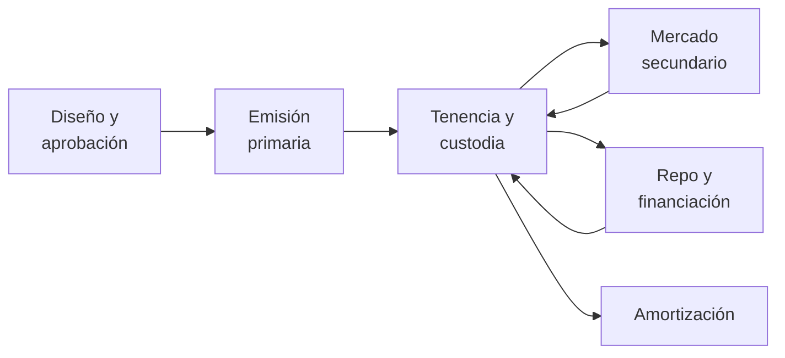
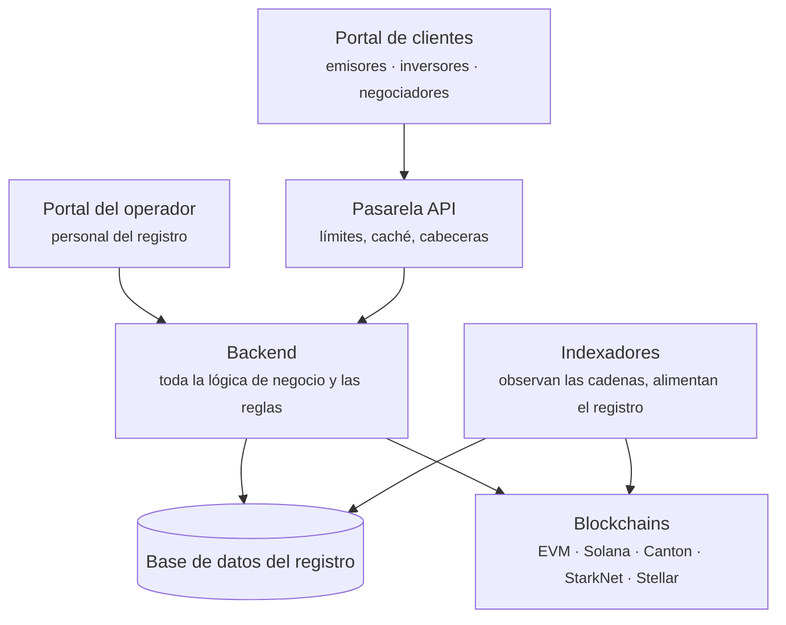

# Registerwerk

**Antes, un valor era un papel en una caja fuerte.** Alguien tenía que custodiarlo, vigilarlo y entregarlo al venderlo. Registerwerk está construido para el mundo posterior: aquel en el que el valor es una inscripción en un registro, llevado en parte en una base de datos y en parte en una blockchain.

Parece un cambio pequeño. No lo es. Una vez desaparecido el título físico, toda pregunta que antes se respondía señalando un papel — *¿de quién es esto?*, *¿se ha transmitido realmente?*, *¿puede este comprador tenerlo legalmente?* — tiene que responderla un sistema. De ese sistema trata esta documentación.

---

## Elija su puerta de entrada

-   :material-account-tie:{ .lg .middle } **Uso Registerwerk en mi negocio**

    ---

    Emite valores, invierte en ellos, los negocia o toma préstamos con ellos como garantía. Quiere saber qué hacen los botones y por qué.

    [:octicons-arrow-right-24: Para clientes](customer/index.md)

-   :material-server-network:{ .lg .middle } **Yo opero Registerwerk**

    ---

    Lleva el registro: dar de alta clientes, aprobar emisiones, mantener viva la plataforma y ayudar cuando algo falla.

    [:octicons-arrow-right-24: Para operadores](operator/index.md)

-   :material-scale-balance:{ .lg .middle } **Tengo que evaluarlo**

    ---

    Es responsable de cumplimiento, auditor, supervisor o abogado, y necesita ver exactamente qué hace cada control.

    [:octicons-arrow-right-24: Marcos jurídicos](legal/index.md) · [Componentes de cumplimiento](compliance/index.md)

-   :material-code-braces:{ .lg .middle } **Construyo sobre ello**

    ---

    Integra una cadena, escribe una dApp o lee el código fuente.

    [:octicons-arrow-right-24: Arquitectura](intro/architecture.md) · [Módulos](platform/modules.md) · [API](platform/api.md)

---

## Si solo lee una cosa

Lea **[La vida de un valor](customer/lifecycle/index.md)**. La sección sigue a un bono ficticio desde la idea inicial del emisor hasta su amortización, pasando por la aprobación, la emisión a los inversores, la negociación entre ellos, la pignoración como garantía de un préstamo y, por último, la destrucción del valor. Cada etapa enlaza con el material más profundo.

Solo da por supuesto que usted sabe qué es un préstamo. Los especialistas en finanzas y blockchain encontrarán la mecánica precisa en bloques desplegables, de modo que nadie tenga que leer más allá de lo que ya sabe.

---

## Qué es realmente Registerwerk

Una **implementación de referencia**: software funcional que muestra cómo puede construirse un registro de valores electrónicos, para que el diseño pueda examinarse, criticarse y reutilizarse.

Y es deliberadamente honesta sobre lo que eso no significa:

!!! warning "Lo que este software no le proporciona"

    Ejecutar este código no le hace conforme a la eWpG alemana ni a ninguna otra ley, no otorga autorización supervisora alguna y no confiere a un token efecto jurídico de valor negociable. Eso depende de su autorización, su organización, sus instrumentos, sus clientes y su despliegue — nada de lo cual puede aportar un repositorio.

    Cuando la documentación describe un control como implementación de un requisito legal, significa: *el código implementa un mecanismo destinado a respaldar ese requisito*. Si lo satisface en su caso es una cuestión para sus asesores jurídicos y su supervisor.

Toda la documentación intenta mantener esa línea. Si una página dice que un control es orientativo y no vinculante, o que un estado significa «lo hemos transmitido» y no «la autoridad lo ha aceptado», la distinción es deliberada y estructural.

---

## La forma del sistema

Dos puertas de entrada, un cerebro, varios registros.

Lo más importante de este esquema: **el backend lo decide todo.** La pasarela da forma al tráfico; no decide quién es usted ni qué puede hacer. Ambos portales envían un token firmado, y el backend verifica ese token por sí mismo en cada petición. No hay ninguna cabecera de confianza ni atajo del tipo «la pasarela ya lo comprobó». [Seguridad y autenticación](platform/security.md) explica por qué importa y cómo se impone.

---

## De un vistazo

| | |
|---|---|
| **Jurisdicciones modeladas** | Alemania (eWpG), Luxemburgo (CSSF), Francia (AMF), Liechtenstein (TVTG) |
| **Estándares de token** | ERC-20, ERC-721, ERC-1155, ERC-3525, ERC-3643, ERC-4626, ERC-7540, SPL-2022, bonos DAML, además de las variantes confidenciales |
| **Cadenas** | Ethereum, Polygon, Base, Arbitrum, Avalanche, Optimism, Solana, Canton, StarkNet, Stellar, Fhenix, Inco — mainnet y testnet |
| **Marcos regulatorios tocados** | eWpG · GwG/AMLD6 · TFR · MiFIR RTS 22 · DAC8/CARF · DORA · MiCAR · TVTG · CSSF · AMF · RGPD |

---

## Cómo leer esta documentación

Cada página está escrita para leerse de principio a fin por alguien que no ha leído la anterior. Cada término se define en la frase en que aparece por primera vez. Las abreviaturas están subrayadas — pase el ratón por encima.

Las partes que profundizan más de lo que necesita un lector general están plegadas:

??? note "Para especialistas: ¿por qué plegar nada?"

    Porque la alternativa es peor. Escribir un solo documento para un abogado, un gestor de carteras y un desarrollador de Solidity suele producir un documento que no sirve a ninguno: demasiado vago para ser útil, demasiado denso para ser legible.

    El plegado mantiene la página breve para quien necesita el concepto y completa para quien necesita la mecánica.

    Puede desplegar todos estos bloques y leer la página como una especificación técnica completa.

Use el **buscador** para cualquier cosa concreta: indexa todas las páginas, incluidas las referencias regulatorias y de la API.
