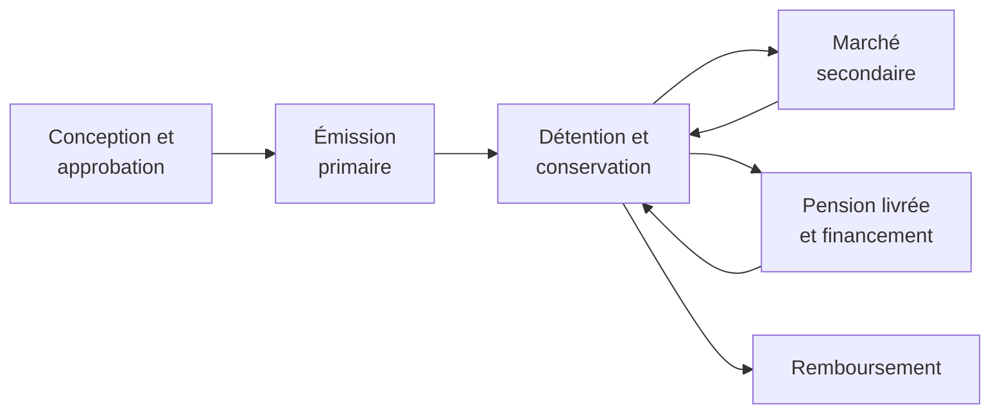
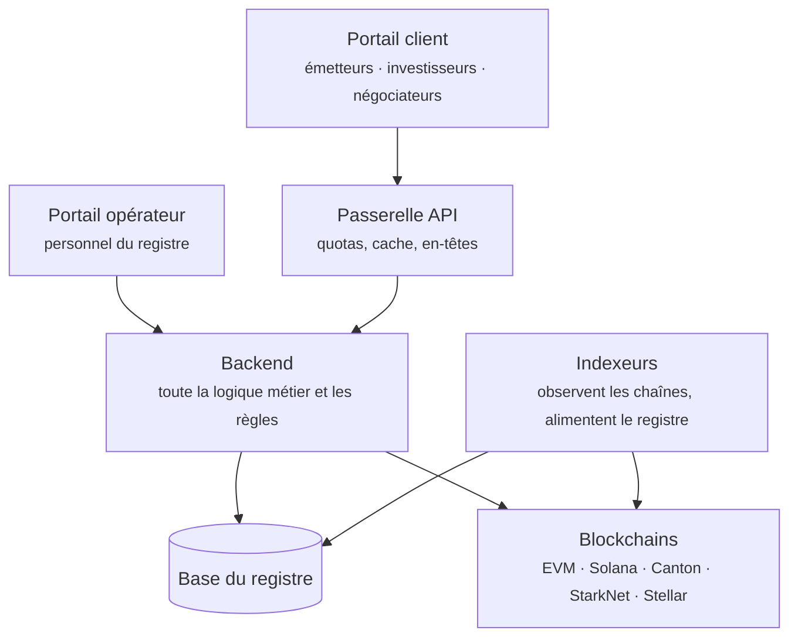

# Registerwerk

**Autrefois, un titre financier était une feuille de papier dans un coffre.** Quelqu'un devait le détenir, le garder et le remettre lors d'une vente. Registerwerk est conçu pour le monde d'après : celui où le titre n'est plus qu'une inscription dans un registre, tenu pour partie dans une base de données et pour partie sur une blockchain.

Le changement paraît mineur. Il ne l'est pas. Une fois le papier disparu, toute question à laquelle on répondait en le montrant du doigt — *à qui cela appartient-il ?*, *le transfert a-t-il vraiment eu lieu ?*, *cet acquéreur a-t-il le droit de détenir ce titre ?* — doit être tranchée par un système. C'est de ce système qu'il s'agit ici.

---

## Choisissez votre porte d'entrée

-   :material-account-tie:{ .lg .middle } **J'utilise Registerwerk pour mon activité**

    ---

    Vous émettez des titres, vous y investissez, vous les négociez ou vous empruntez contre eux. Vous voulez savoir ce que font les boutons, et pourquoi.

    [:octicons-arrow-right-24: Pour les clients](customer/index.md)

-   :material-server-network:{ .lg .middle } **J'exploite Registerwerk**

    ---

    Vous tenez le registre : intégrer les clients, approuver les émissions, maintenir la plateforme et aider quand quelque chose ne va pas.

    [:octicons-arrow-right-24: Pour les opérateurs](operator/index.md)

-   :material-scale-balance:{ .lg .middle } **Je dois l'évaluer**

    ---

    Vous êtes responsable conformité, auditeur, régulateur ou juriste, et vous devez voir exactement ce que fait chaque contrôle.

    [:octicons-arrow-right-24: Cadres juridiques](legal/index.md) · [Composants de conformité](compliance/index.md)

-   :material-code-braces:{ .lg .middle } **Je construis dessus**

    ---

    Vous intégrez une chaîne, vous écrivez une dApp ou vous lisez le code source.

    [:octicons-arrow-right-24: Architecture](intro/architecture.md) · [Modules](platform/modules.md) · [API](platform/api.md)

---

## Si vous ne lisez qu'une chose

Lisez **[La vie d'un titre financier](customer/lifecycle/index.md)**. Cette section suit une obligation fictive depuis l'idée de l'émetteur jusqu'au remboursement, en passant par l'approbation, l'émission auprès des investisseurs, la négociation entre eux, la mise en garantie pour un emprunt, et enfin la destruction du titre. Chaque étape renvoie vers les développements plus techniques.

Elle suppose que vous savez ce qu'est un prêt, et rien d'autre. Les spécialistes de la finance et de la blockchain trouveront la mécanique précise dans des encadrés dépliables : personne n'a à lire au-delà de ce qu'il sait déjà.

---

## Ce qu'est réellement Registerwerk

Une **implémentation de référence** : un logiciel fonctionnel qui montre comment un registre de titres électroniques peut être construit, afin que la conception puisse être examinée, critiquée et réutilisée.

Elle est délibérément franche sur ce que cela ne signifie pas :

!!! warning "Ce que ce logiciel ne vous donne pas"

    Exécuter ce code ne vous rend conforme ni à l'eWpG allemand ni à aucune autre loi, ne confère aucun agrément et ne donne à un jeton aucun effet juridique de titre financier. Cela dépend de votre agrément, de votre organisation, de vos instruments, de vos clients et de votre déploiement — rien de tout cela ne peut être fourni par un dépôt de code.

    Lorsque la documentation décrit un contrôle comme mettant en œuvre une exigence juridique, cela signifie : *le code implémente un mécanisme destiné à soutenir cette exigence*. Savoir s'il la satisfait dans votre cas relève de votre conseil et de votre superviseur.

Toute la documentation s'efforce de tenir cette ligne. Quand une page indique qu'un contrôle est indicatif plutôt que contraignant, ou qu'un statut signifie « nous avons transmis » et non « l'autorité a accepté », la distinction est voulue et structurante.

---

## La forme du système

Deux portes d'entrée, un cerveau, plusieurs registres.

Le point le plus important de ce schéma : **c'est le backend qui décide de tout.** La passerelle met en forme le trafic ; elle ne décide ni qui vous êtes ni ce que vous pouvez faire. Les deux portails envoient un jeton signé, et le backend vérifie lui-même ce jeton à chaque requête. Aucun en-tête n'est digne de confiance, aucun raccourci du type « la passerelle a déjà vérifié ». [Sécurité et authentification](platform/security.md) explique pourquoi cela compte et comment c'est appliqué.

---

## En un coup d'œil

| | |
|---|---|
| **Juridictions modélisées** | Allemagne (eWpG), Luxembourg (CSSF), France (AMF), Liechtenstein (TVTG) |
| **Normes de jetons** | ERC-20, ERC-721, ERC-1155, ERC-3525, ERC-3643, ERC-4626, ERC-7540, SPL-2022, obligations DAML, ainsi que les variantes confidentielles |
| **Chaînes** | Ethereum, Polygon, Base, Arbitrum, Avalanche, Optimism, Solana, Canton, StarkNet, Stellar, Fhenix, Inco — mainnet et testnet |
| **Cadres réglementaires touchés** | eWpG · GwG/AMLD6 · TFR · MiFIR RTS 22 · DAC8/CARF · DORA · MiCAR · TVTG · CSSF · AMF · RGPD |

---

## Comment lire cette documentation

Chaque page est écrite pour être lue de bout en bout par quelqu'un qui n'a pas lu la précédente. Un terme est défini dans la phrase où il apparaît pour la première fois. Les abréviations sont soulignées — survolez-les.

Les passages qui vont plus loin que ce dont un lecteur généraliste a besoin sont repliés :

??? note "Pour les spécialistes : pourquoi replier ?"

    Parce que l'alternative est pire. Écrire un seul document pour un juriste, un gérant de portefeuille et un développeur Solidity produit généralement un document qui ne sert aucun des trois : trop vague pour être utile, trop dense pour être lisible.

    Le repli permet à la page de rester courte pour qui cherche le concept, et complète pour qui cherche la mécanique.

    Vous pouvez déplier chacun de ces encadrés et lire la page comme une spécification technique complète.

Utilisez la **recherche** pour tout point précis — elle indexe chaque page, y compris les références réglementaires et l'API.
