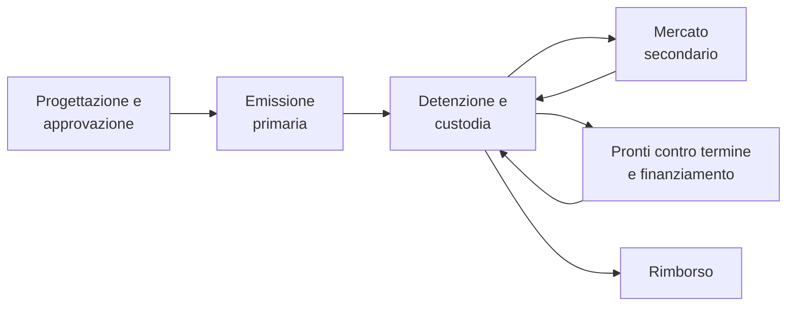
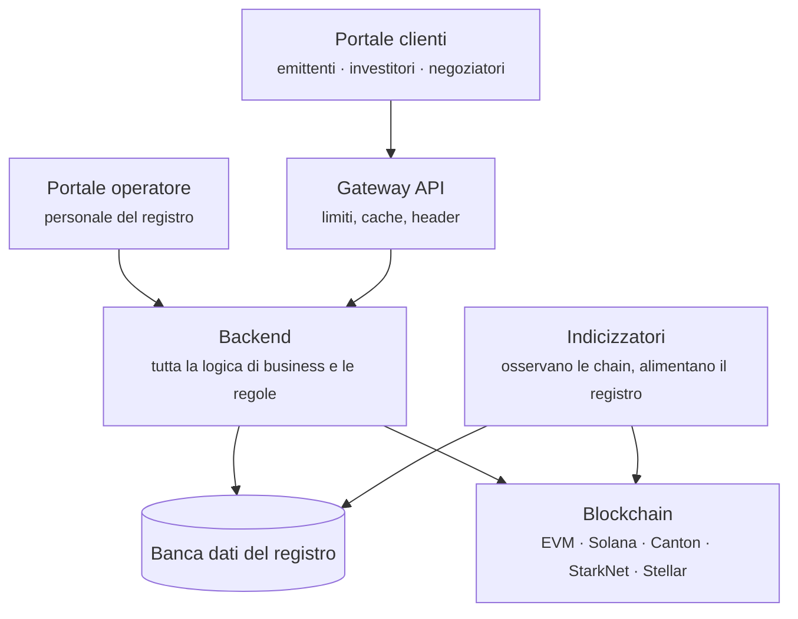

# Registerwerk

**Un tempo uno strumento finanziario era un foglio di carta in un caveau.** Qualcuno doveva custodirlo, sorvegliarlo e consegnarlo al momento della vendita. Registerwerk è costruito per il mondo successivo: quello in cui lo strumento è un'iscrizione in un registro, tenuto in parte in una banca dati e in parte su una blockchain.

Sembra un cambiamento piccolo. Non lo è. Una volta scomparso il certificato, ogni domanda a cui si rispondeva indicando un pezzo di carta — *di chi è?*, *il trasferimento è davvero avvenuto?*, *questo acquirente può legittimamente detenerlo?* — deve trovare risposta in un sistema. È di questo sistema che si parla qui.

---

## Scegli il tuo ingresso

-   :material-account-tie:{ .lg .middle } **Uso Registerwerk per la mia attività**

    ---

    Emetti strumenti finanziari, ci investi, li negozi o ci prendi a prestito. Vuoi sapere che cosa fanno i pulsanti e perché.

    [:octicons-arrow-right-24: Per i clienti](customer/index.md)

-   :material-server-network:{ .lg .middle } **Gestisco Registerwerk**

    ---

    Tieni il registro: attivi i clienti, approvi le emissioni, mantieni viva la piattaforma e aiuti quando qualcosa non va.

    [:octicons-arrow-right-24: Per gli operatori](operator/index.md)

-   :material-scale-balance:{ .lg .middle } **Devo valutarlo**

    ---

    Sei responsabile della conformità, revisore, autorità o legale, e devi vedere esattamente che cosa fa ciascun controllo.

    [:octicons-arrow-right-24: Quadri normativi](legal/index.md) · [Componenti di conformità](compliance/index.md)

-   :material-code-braces:{ .lg .middle } **Ci costruisco sopra**

    ---

    Integri una chain, scrivi una dApp o leggi il codice sorgente.

    [:octicons-arrow-right-24: Architettura](intro/architecture.md) · [Moduli](platform/modules.md) · [API](platform/api.md)

-   :material-database-sync:{ .lg .middle } **Uso Chaincache** · *Componente opzionale*

    ---

    Usi Chaincache da solo o con Registerwerk e cerchi indicazioni per l'uso, la gestione, l'amministrazione o lo sviluppo.

    [:octicons-arrow-right-24: Documentazione Chaincache](chaincache/index.md)

---

## Se leggi una cosa sola

Leggi **[La vita di uno strumento finanziario](customer/lifecycle/index.md)**. La sezione segue un'obbligazione immaginaria dall'idea iniziale dell'emittente fino al rimborso, passando per l'approvazione, l'emissione agli investitori, la negoziazione tra loro, la costituzione in garanzia per un prestito e infine la distruzione del titolo. Ogni fase rimanda agli approfondimenti.

Presuppone che tu sappia che cos'è un prestito, e nient'altro. Gli specialisti di finanza e blockchain troveranno la meccanica precisa in riquadri espandibili, così nessuno deve leggere oltre ciò che già sa.

---

## Che cos'è davvero Registerwerk

Un'**implementazione di riferimento**: software funzionante che mostra come si può costruire un registro di strumenti finanziari digitali, perché il progetto possa essere esaminato, criticato e riutilizzato.

Ed è deliberatamente onesta su ciò che questo non significa:

!!! warning "Che cosa questo software non ti dà"

    Eseguire questo codice non ti rende conforme all'eWpG tedesco né a qualunque altra legge, non conferisce alcuna autorizzazione di vigilanza e non attribuisce a un token efficacia giuridica di strumento finanziario. Tutto ciò dipende dalla tua autorizzazione, dalla tua organizzazione, dai tuoi strumenti, dai tuoi clienti e dal tuo deployment — niente di tutto questo può essere fornito da un repository.

    Quando la documentazione descrive un controllo come attuazione di un requisito normativo, significa: *il codice implementa un meccanismo destinato a sostenere quel requisito*. Se lo soddisfi nel tuo caso è una questione per i tuoi legali e la tua autorità di vigilanza.

Tutta la documentazione cerca di tenere questa linea. Se una pagina dice che un controllo è indicativo anziché vincolante, o che uno stato significa «abbiamo trasmesso» e non «l'autorità ha accettato», la distinzione è voluta e portante.

---

## La forma del sistema

Due ingressi, un cervello, più registri.

La cosa più importante di questo schema: **decide tutto il backend.** Il gateway modella il traffico; non decide nulla. Entrambi i portali inviano un token firmato e il backend verifica quel token da sé a ogni richiesta. Non esiste un header attendibile, né la scorciatoia «il gateway ha già controllato». [Sicurezza e autenticazione](platform/security.md) spiega perché conta e come è imposto.

---

## In sintesi

| | |
|---|---|
| **Giurisdizioni modellate** | Germania (eWpG), Lussemburgo (CSSF), Francia (AMF), Liechtenstein (TVTG) |
| **Standard di token** | ERC-20, ERC-721, ERC-1155, ERC-3525, ERC-3643, ERC-4626, ERC-7540, SPL-2022, obbligazioni DAML, più le varianti riservate |
| **Chain** | Ethereum, Polygon, Base, Arbitrum, Avalanche, Optimism, Solana, Canton, StarkNet, Stellar, Fhenix, Inco — mainnet e testnet |
| **Quadri normativi toccati** | eWpG · GwG/AMLD6 · TFR · MiFIR RTS 22 · DAC8/CARF · DORA · MiCAR · TVTG · CSSF · AMF · GDPR |

---

## Come leggere questa documentazione

Ogni pagina è scritta per essere letta dall'inizio alla fine da chi non ha letto la precedente. Un termine viene definito nella frase in cui compare per la prima volta. Le abbreviazioni sono sottolineate — passaci sopra il mouse.

Le parti che vanno più a fondo di quanto serva a un lettore generale sono ripiegate:

??? note "Per gli specialisti: perché ripiegare?"

    Perché l'alternativa è peggiore. Scrivere un unico documento per un giurista, un gestore di portafoglio e uno sviluppatore Solidity produce di solito un documento che non serve a nessuno dei tre: troppo vago per essere utile, troppo denso per essere leggibile.

    Il ripiegamento tiene la pagina breve per chi cerca il concetto e completa per chi cerca la meccanica.

    Puoi espandere ognuno di questi riquadri e leggere la pagina come una specifica tecnica completa.

Usa la **ricerca** per qualunque cosa specifica: indicizza ogni pagina, comprese le sezioni normative e la referenza API.
