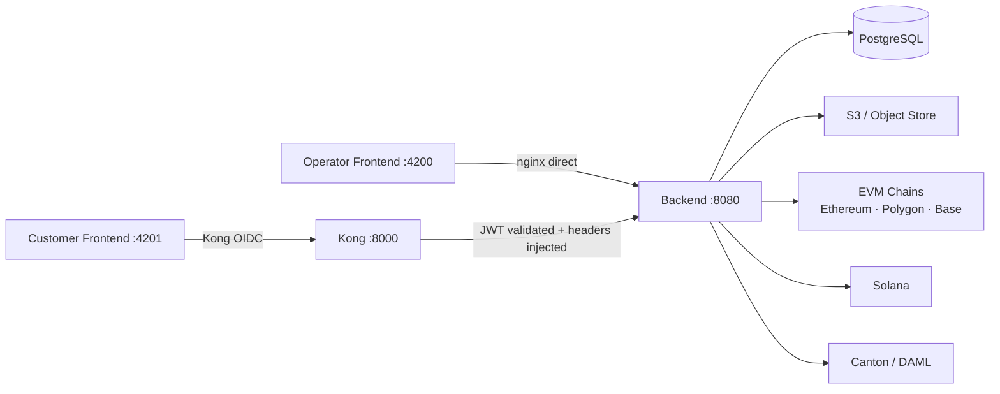

# Registerwerk — Technical & Regulatory Reference

Registerwerk is a reference implementation for modelling and administering electronic securities and tokenised assets across multiple blockchains. The repository contains technical control components and jurisdiction-oriented configuration, but it is not evidence of legal compliance, regulatory authorisation, certification, or legal effect in Germany, Luxembourg, France, Liechtenstein, or elsewhere. Those conclusions require an operator-, service-, instrument-, transaction-, and deployment-specific review.

---

## Who should read what

| I am… | Start here |
|---|---|
| A **compliance officer** or legal counsel evaluating the system | [Legal Frameworks](legal/index.md) |
| A **business analyst** onboarding issuers or investors | [User Roles](intro/user-roles.md), then [KYC & AML](compliance/kyc-aml.md) |
| A **developer** joining the project | [System Architecture](intro/architecture.md), then [Module Architecture](platform/modules.md) |
| A **blockchain engineer** integrating a new chain | [Supported Blockchains](blockchains/index.md) |
| An **operator** deploying the platform | [Security & Authentication](platform/security.md), [Audit Log](platform/audit-log.md) |
| A **regulator or auditor** | [Legal Frameworks](legal/index.md), [Audit Log](platform/audit-log.md), [Compliance Components](compliance/index.md) |

---

## Platform at a glance

**Key figures:**

| Dimension | Value |
|---|---|
| Supported jurisdictions | 4 (DE, LU, FR, LI) |
| Token standards | 21 (ERC-20 through ERC-7540, SPL-2022, DAML, StarkNet, Stellar, Confidential) |
| Blockchains | 8 chain types (Ethereum, Polygon, Base, Arbitrum, Solana, Canton, StarkNet, Stellar) + testnets |
| Spring Modulith modules | 22 bounded contexts |
| Regulatory frameworks | eWpG · GwG/AMLD6 · TFR · MiFIR RTS 22 · DAC8 · DORA · TVTG · CSSF · AMF |

---

## How to navigate this reference

Use the **left sidebar** to move between sections. The **right-side table of contents** shows headings within the current page. Use the **search bar** (top right) to find any term — regulatory, technical, or operational.

Pages are cross-linked extensively. Regulatory terms link to the legal framework that defines them; technical class names link to the module that implements them.

!!! note "Scope of this documentation"
    This reference covers the Registerwerk platform itself — its legal framework implementations, token standards, supported chains, and internal architecture. It does not cover Spring Boot framework internals, Angular framework internals, or generic blockchain concepts beyond what is relevant to Registerwerk's specific implementation choices.
