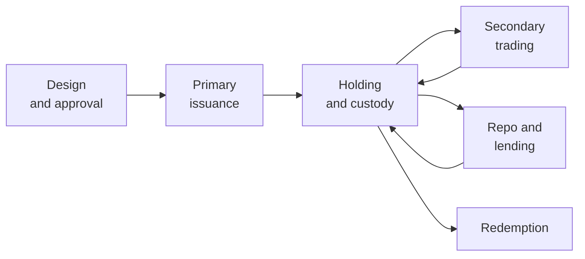
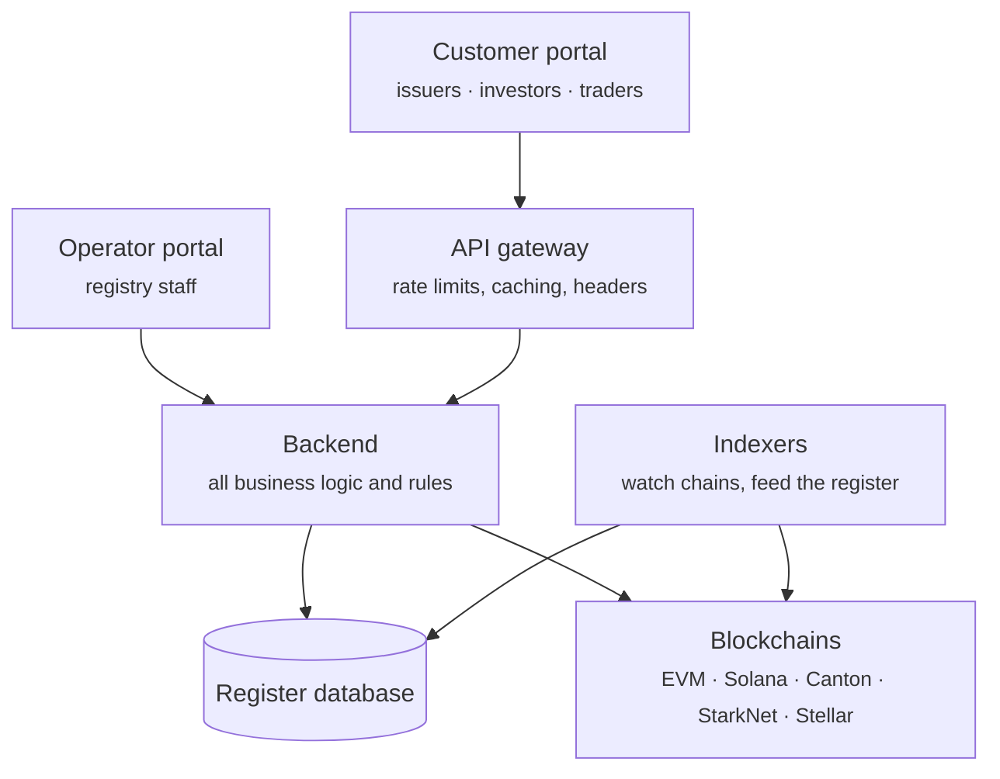

# Registerwerk

**A security used to be a piece of paper in a vault.** Somebody had to hold it, guard it, and hand it over when it was sold. Registerwerk is built for the world after that: one where the security is an entry in a register, and the register is kept partly in a database and partly on a blockchain.

That change sounds small. It is not. Once the certificate is gone, every question you used to answer by pointing at a piece of paper — *who owns this?*, *has it really been transferred?*, *can this buyer legally hold it?* — has to be answered by a system instead. This documentation is about that system.

---

## Pick your door

-   :material-account-tie:{ .lg .middle } **I use Registerwerk for my business**

    ---

    You issue securities, invest in them, trade them, or borrow against them. You want to know what the buttons do and why.

    [:octicons-arrow-right-24: For customers](customer/index.md)

-   :material-server-network:{ .lg .middle } **I run Registerwerk**

    ---

    You operate the registry: onboarding customers, approving issuances, keeping the platform alive, and helping people when something goes wrong.

    [:octicons-arrow-right-24: For operators](operator/index.md)

-   :material-scale-balance:{ .lg .middle } **I need to assess it**

    ---

    You are a compliance officer, auditor, regulator or lawyer, and you need to see exactly which control does what.

    [:octicons-arrow-right-24: Legal frameworks](legal/index.md) · [Compliance components](compliance/index.md)

-   :material-code-braces:{ .lg .middle } **I build on it**

    ---

    You are an engineer integrating a chain, writing a dApp, or reading the source.

    [:octicons-arrow-right-24: Architecture](intro/architecture.md) · [Modules](platform/modules.md) · [API](platform/api.md)

---

## If you read only one thing

Read **[The life of a security](customer/lifecycle/index.md)**. It follows a single fictional bond from the moment an issuer has the idea, through approval, issuance to investors, trading between them, being pledged for a loan, and finally being repaid and destroyed. Every stage links onward to the deeper material.

It assumes you know what a loan is and nothing else. Finance and blockchain specialists will find the precise mechanics folded into expandable sections, so nobody has to read past what they already know.

---

## What Registerwerk actually is

It is a **reference implementation**: working software that models how an electronic securities registry can be built, so that the design can be examined, criticised and reused.

It is deliberately honest about what that does and does not mean:

!!! warning "What this software does not give you"

    Running this code does not establish adherence to the eWpG or any other law, does not grant you regulatory authorisation, and does not give a token legal effect as a security. Those depend on your licence, your organisation, your instruments, your customers and your deployment — none of which a repository can supply.

    Where the documentation describes a control as implementing a legal requirement, it means *the code implements a mechanism intended to support that requirement*. Its legal adequacy in your case is a question for your counsel and your supervisor.

Everything in this documentation tries to hold that line. If a page tells you a check is advisory rather than enforcing, or that a status means "we transmitted it" rather than "the authority accepted it", that distinction is deliberate and load-bearing.

---

## The shape of the system

Two front doors, one brain, several ledgers.

The single most important thing to understand about this picture: **the backend decides everything.** The gateway shapes traffic; it does not decide who you are or what you may do. Both portals send a signed token, and the backend verifies that token itself on every request. There is no trusted header, no "the gateway already checked it" shortcut. [Security & authentication](platform/security.md) explains why that matters and how it is enforced.

---

## At a glance

| | |
|---|---|
| **Jurisdictions modelled** | Germany (eWpG), Luxembourg (CSSF), France (AMF), Liechtenstein (TVTG) |
| **Token standards** | ERC-20, ERC-721, ERC-1155, ERC-3525, ERC-3643, ERC-4626, ERC-7540, SPL-2022, DAML bonds, plus confidential variants |
| **Chains** | Ethereum, Polygon, Base, Arbitrum, Avalanche, Optimism, Solana, Canton, StarkNet, Stellar, Fhenix, Inco — mainnet and testnet |
| **Regulatory frameworks touched** | eWpG · GwG/AMLD6 · TFR · MiFIR RTS 22 · DAC8/CARF · DORA · MiCAR · TVTG · CSSF · AMF · GDPR |

---

## How to read this documentation

Pages are written to be read top to bottom by someone who has not read the previous page. Where a term first appears it is defined in the sentence that uses it. Abbreviations are underlined — hover over them for the definition.

Sections that go deeper than a general reader needs are folded away like this:

??? note "For the specialist: why fold sections at all?"

    Because the alternative is worse. Writing one document for a lawyer, a portfolio manager and a Solidity engineer usually produces a document that serves none of them: too vague to be useful, too dense to be readable. Folding lets the page stay short for the person who needs the concept and complete for the person who needs the mechanics.

    You can expand every one of these on a page and read it as a full technical specification.

Use the **search bar** for anything specific — it indexes every page, including the regulatory and API reference.
