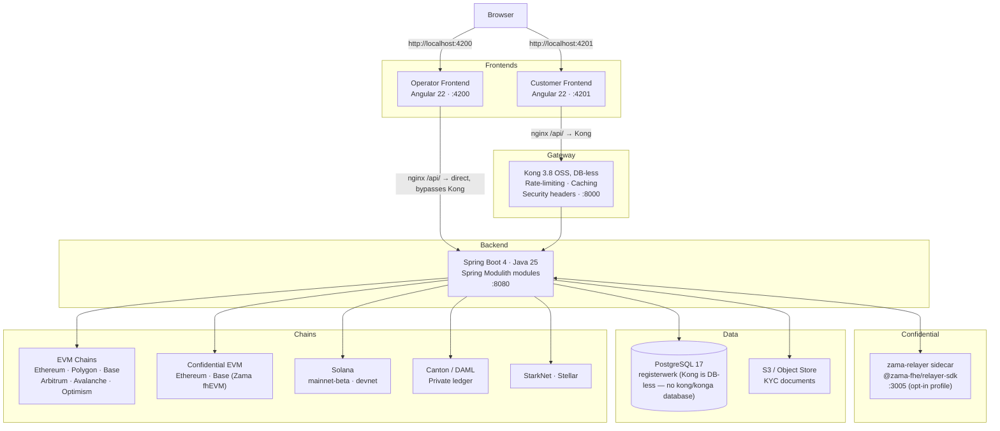
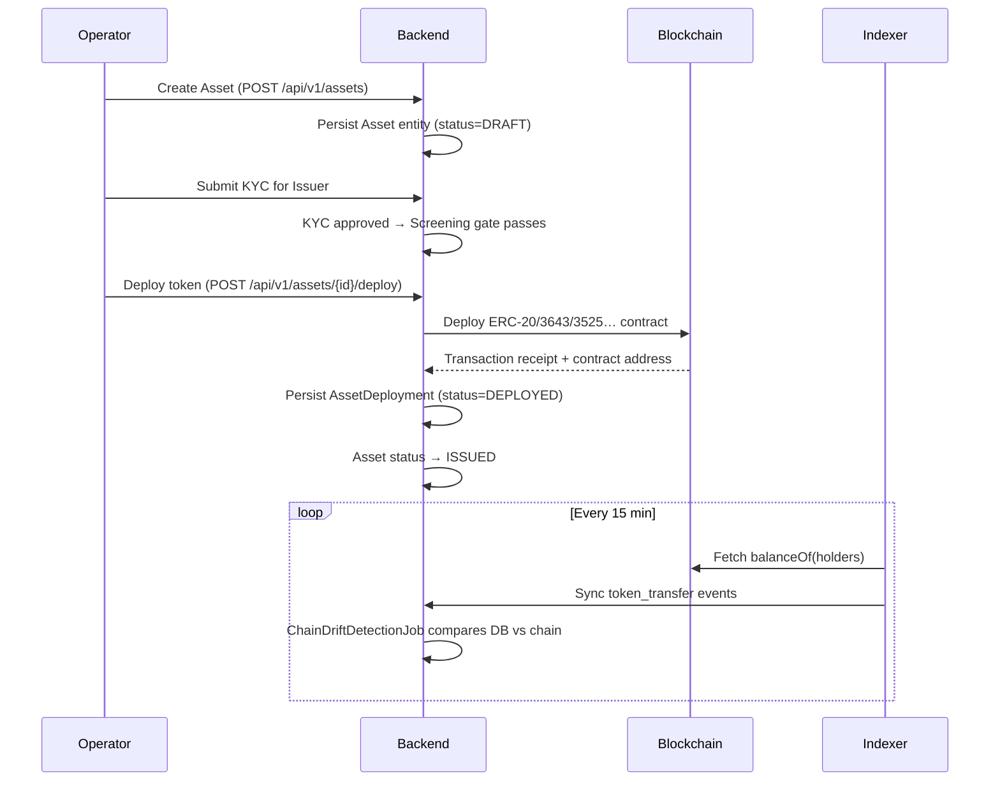

# Systemarchitektur

Registerwerk folgt dem **Modulith**-Muster: eine einzelne ausrollbare Backend-Anwendung, intern in lose gekoppelte fachliche Kontexte gegliedert. Zwei getrennte Angular-Frontends (Betreiber und Kunde) werden vom Browser stets unmittelbar geöffnet — `:4200` und `:4201` — und verbinden sich für API-Aufrufe über unterschiedliche Wege mit demselben Backend.

---

## Komponentenüberblick

### Warum zwei Wege zum Backend?

Beide Frontends werden vom Browser stets **unmittelbar** an ihrem eigenen Port geöffnet — Kong steht vor keiner der beiden Oberflächen, sondern nur vor dem Backend-API-Verkehr der Kundenanwendung, und auch das nur, weil das nginx des Kunden-Frontends `/api/` an Kong statt an das Backend weiterleitet.

Das **Betreiber-Frontend** verbindet seine API-Aufrufe unmittelbar (nginx-Proxy → `backend:8080`). Es nutzt eine eingebaute HS256-JWT-Anmeldung (`POST /api/v1/public/auth/login`) und läuft nie über Kong. So bleibt das Betreiberportal auch bei einem Kong-Ausfall funktionsfähig.

Die API-Aufrufe des **Kunden-Frontends** laufen über Kong, das dem Backend Ratenbegrenzung, Antwort-Zwischenspeicherung und Sicherheits-Header vorschaltet. Die JWT-Prüfung selbst geschieht stets im Spring-Backend (`SecurityConfig` liest den Claim `roles` direkt vom Token, `SecurityUtils.extractEntityId` den Entity-Claim) — der hier eingesetzte OSS-Build von Kong prüft keine JWTs und fügt keine Entity-Header ein. Ein `openid-connect`-Plugin existiert als optionale, nur für Enterprise/Konnect verfügbare Ergänzung (`gateway/plugins/oidc-entra.yml`) für Installationen, die die JWT-Terminierung zusätzlich am Gateway wünschen.

---

## Lebenszyklus eines Wertpapier-Tokens

---

## Spring Modulith — fachliche Kontexte

Das Backend ist in 34 Module gegliedert, deren jedes eine einzelne fachliche Verantwortung trägt — jedes Paket der obersten Ebene unter `de.makibytes.registerwerk` trägt `@ApplicationModule`. Die Module kommunizieren über [Spring-Modulith-Ereignisse](../platform/modules.md) (transaktionaler Outbox), nie über direkte modulübergreifende Serviceaufrufe in `internal/`-Pakete.

| Modul | Verantwortung |
|---|---|
| `shared` | Querschnittsausnahmen und Hilfsmittel |
| `auth` | JWT-Ausstellung, HS256-Entwicklungsanmeldung, Onboarding-Token, OIDC |
| `audit` | Manipulationssicher nachweisbares, nur anfügendes Audit-Log |
| `notification` | E-Mail-Versand (ereignisgesteuert) |
| `customer` | Rechtsträger, KYB, Unternehmensnutzer |
| `kyc` | Dokumentenverwaltung, Genehmigungen je Jurisdiktion, wirtschaftlich Berechtigte |
| `screening` | Sanktions-/PEP-Prüfung (austauschbarer Port) |
| `onboarding` | Onboarding-Ablauf für Kunden, Einlösung von Token |
| `stepup` | Step-up-MFA, Durchsetzung des Vier-Augen-Prinzips |
| `travelrule` | Travel Rule / IVMS-101 (TFR) |
| `asset` | Wertpapierinstrumente, Dokumente, Lebenszyklus |
| `deployment` | On-Chain-Zustand: Ausbringungen, Anleihekonditionen, Inhaber, Vault, Mint |
| `blockchain` | RPC-Client-Registry, Contract-Ausbringung, Verwaltungsoperationen |
| `chain` | Chain-/Netzkonfiguration, Gesundheit der RPC-Knoten |
| `wallet` | Schlüsselverwaltung der Betreiber-Wallets |
| `erc3643` | T-REX-Compliance-Suite (Identität, Claims, Compliance-Module) |
| `indexer` | Off-Chain-Ereignisabgleich (EVM, Solana, Canton) |
| `endpoint` | Konfiguration der RPC-Endpunkte |
| `trading` | Verkaufsangebote, Ausführungen, Handelsplatz-Anbindungen |
| `admin` | Verwaltung der Betreibernutzer, Identitätsübernahme |
| `corporateactions` | Dividenden, Kupons, Splits, Rückzahlungen |
| `regreporting` | Aufsichtsrechtliche Meldeexporte MiFIR/DAC8 |
| `dora` | DORA-IKT-Vorfälle und Drittdienstleisterregister |
| `externalref` | Abbildung externer System-IDs (LEI, Register-IDs) |
| `orgidentity` | On-Chain-Organisationsidentität (Wallet↔Org-Bindung), Delegation von Berechtigungen |
| `marketplace` | dApp-Marktplatz: Manifestprüfung, Genehmigung mit Step-up + Vier-Augen-Prinzip, On-Chain-Verankerung |
| `payment` | Vom Betreiber kuratierter Katalog der Zahlungswege mit Offenlegungs- und Bestätigungsfeldern für die LgZ-Geldseite; keine unabhängige MiCAR-Prüfung |
| `entra` | Microsoft-Graph-Adapter: 2FA-Status, Support-Konsole für Betreiber, Temporary Access Passes |
| `lending` | Isolierte besicherte Kreditmärkte, Sicherheitsfaktoren, Verwertung |
| `registerstatement` | Registerauszüge nach §19(2) eWpG — Erzeugung und Aufbewahrung |
| `registertransfer` | Registerseitige Übertragungen, einschließlich Zwangsübertragungen nach §24 |
| `support` | Werkzeuge für den Betreibersupport |
| `bootstrap` | Startverdrahtung, Anlage von Demodaten, Prüfungen der Produktionsreife |
| `infrastructure` | Querschnittskonfiguration für Web, Persistenz und Clients |

Den vollständigen Abhängigkeitsgraphen und die Entwurfsgründe finden Sie unter [Modularchitektur](../platform/modules.md).

---

## Datenhaltung

Sämtliche Anwendungsdaten liegen in einer einzigen **PostgreSQL-17**-Instanz mit einer Datenbank:

| Datenbank | Eigentümer | Inhalt |
|---|---|---|
| `registerwerk` | Nutzer `registerwerk` | Alle Anwendungstabellen, partitioniertes `audit_event`, Flyway-Migrationen |

Kong läuft **DB-less**: Seine deklarative Konfiguration (`gateway/kong.yml`) wird unmittelbar über
`KONG_DECLARATIVE_CONFIG` geladen, sodass es keine eigene Datenbank hat — es gibt in diesem Stack
weder eine Datenbank noch einen Dienst `kong` oder `konga`.

Flyway verwaltet das Schema `registerwerk`. Migrationen heißen `V{n}__description.sql` und werden nach dem Merge nie mehr bearbeitet.

Dokumente über 5 MB (KYC-Unterlagen, Auszüge, Berichte) liegen in einem **S3-kompatiblen Objektspeicher**; die Datenbank hält nur die Metadaten und den S3-Schlüssel.

---

## Konfiguration und Umgebung

Zur JWT- und OIDC-Konfiguration siehe [Sicherheit & Authentifizierung](../platform/security.md). Die `application.yml` steuert das Verhalten aller Module; umgebungsspezifische Übersteuerungen erfolgen über Spring-Profile (`prod`, `dev`, `test`).

!!! warning "JWT-Geheimnis in Produktion"
    Ist `JWT_ISSUER_URI` leer und entspricht `JWT_DEV_SECRET` dem im Repository ausgelieferten Standardwert, **startet das Backend im Profil `prod` nicht**. Das ist eine bewusste Fail-Fast-Sicherung dagegen, versehentlich mit dem Entwicklungsgeheimnis in Produktion zu laufen.
