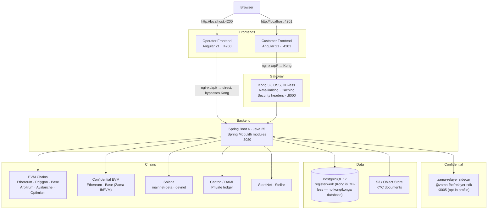
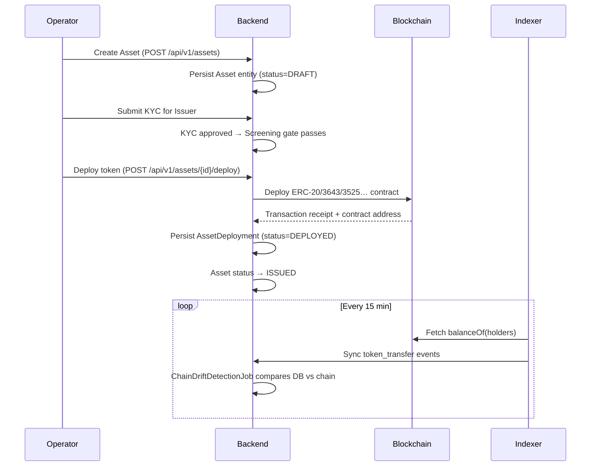

# Arquitectura del sistema

Registerwerk sigue el patrón **modulith**: una única aplicación de backend desplegable, estructurada internamente en contextos delimitados débilmente acoplados. Dos front ends de Angular distintos (operador y cliente) los abre siempre el navegador de forma directa — `:4200` y `:4201` — y se conectan al mismo backend por rutas diferentes, solo para las llamadas a la API.

---

## Panorámica de componentes

### ¿Por qué dos rutas hacia el backend?

Ambos front ends los abre siempre el navegador **directamente** en su propio puerto — Kong no se antepone a la interfaz de ninguna de las dos aplicaciones, solo al tráfico de API del backend de la aplicación cliente, y únicamente porque el nginx del front end del cliente reenvía `/api/` a Kong en lugar de al backend.

El **front end del operador** conecta sus llamadas a la API de forma directa (proxy de nginx → `backend:8080`). Usa un acceso JWT HS256 integrado (`POST /api/v1/public/auth/login`) y nunca pasa por Kong. Así el portal del operador sigue siendo utilizable aunque Kong esté caído.

Las llamadas a la API del **front end del cliente** pasan por Kong, que antepone al backend limitación de tasa, caché de respuestas y cabeceras de seguridad. La validación del JWT ocurre siempre en el backend de Spring (`SecurityConfig` lee la atestación `roles` directamente del token, y `SecurityUtils.extractEntityId` la atestación de entidad) — la compilación OSS de Kong aquí empleada no valida JWT ni inyecta cabeceras de entidad. Existe un complemento `openid-connect` como añadido opcional, disponible solo para Enterprise/Konnect (`gateway/plugins/oidc-entra.yml`), para instalaciones que además quieran terminar el JWT en la pasarela.

---

## Ciclo de vida de un token de valor

---

## Spring Modulith — contextos delimitados

El backend se organiza en 34 módulos, cada uno con una única responsabilidad de dominio — todo paquete de primer nivel bajo `de.makibytes.registerwerk` lleva `@ApplicationModule`. Los módulos se comunican mediante [eventos de Spring Modulith](../platform/modules.md) (buzón de salida transaccional), nunca mediante llamadas directas a servicios de los paquetes `internal/` de otros módulos.

| Módulo | Responsabilidad |
|---|---|
| `shared` | Excepciones y utilidades transversales |
| `auth` | Emisión de JWT, acceso HS256 de desarrollo, tokens de alta, OIDC |
| `audit` | Pista de auditoría a prueba de manipulación, solo de anexado |
| `notification` | Envío de correo (dirigido por eventos) |
| `customer` | Entidades jurídicas, KYB, usuarios de empresa |
| `kyc` | Gestión documental, aprobaciones por jurisdicción, titulares reales |
| `screening` | Filtrado de sanciones/PEP (puerto intercambiable) |
| `onboarding` | Flujo de alta del cliente, canje de tokens |
| `stepup` | MFA reforzada, aplicación del doble control |
| `travelrule` | Travel Rule / IVMS-101 (TFR) |
| `asset` | Instrumentos financieros, documentos, ciclo de vida |
| `deployment` | Estado on-chain: despliegues, condiciones del bono, titulares, bóveda, acuñación |
| `blockchain` | Registro de clientes RPC, despliegue de contratos, operaciones de administración |
| `chain` | Configuración de cadenas y redes, salud de los nodos RPC |
| `wallet` | Gestión de claves de los monederos del operador |
| `erc3643` | Suite de cumplimiento T-REX (identidad, atestaciones, módulos de cumplimiento) |
| `indexer` | Sincronización de eventos fuera de cadena (EVM, Solana, Canton) |
| `endpoint` | Configuración de los extremos RPC |
| `trading` | Ofertas de venta, ejecuciones, integraciones con centros de negociación |
| `admin` | Gestión de usuarios del operador, modo soporte |
| `corporateactions` | Dividendos, cupones, desdoblamientos, amortizaciones |
| `regreporting` | Exportaciones regulatorias MiFIR/DAC8 |
| `dora` | Incidentes tecnológicos DORA y registro de terceros |
| `externalref` | Correspondencia de identificadores de sistemas externos (LEI, identificadores registrales) |
| `orgidentity` | Identidad on-chain de la organización (vínculo monedero↔organización), delegación de permisos |
| `marketplace` | Mercado de dApps: revisión de manifiestos, aprobación con autenticación reforzada + doble control, anclaje on-chain |
| `payment` | Catálogo de vías de pago curado por el operador, con campos de divulgación y atestación para la pata de efectivo de entrega contra pago; sin verificación MiCAR independiente |
| `entra` | Adaptador de Microsoft Graph: estado 2FA, consola de soporte del operador, pases de acceso temporal |
| `lending` | Mercados de préstamo con garantía aislados, factores de salud, ejecución |
| `registerstatement` | Extractos registrales del §19(2) eWpG — generación y conservación |
| `registertransfer` | Transmisiones del lado del registro, incluidas las transferencias forzosas del §24 |
| `support` | Herramientas de asistencia para el operador |
| `bootstrap` | Cableado de arranque, siembra de datos de demostración, comprobaciones de madurez para producción |
| `infrastructure` | Configuración transversal de web, persistencia y clientes |

Véase [Arquitectura de módulos](../platform/modules.md) para el grafo completo de dependencias y las razones de diseño.

---

## Persistencia de datos

Todos los datos de la aplicación residen en una única instancia de **PostgreSQL 17** con una sola base de datos:

| Base de datos | Propietario | Contenido |
|---|---|---|
| `registerwerk` | usuario `registerwerk` | Todas las tablas de la aplicación, la tabla particionada `audit_event`, las migraciones de Flyway |

Kong funciona **sin base de datos**: su configuración declarativa (`gateway/kong.yml`) se carga
directamente mediante `KONG_DECLARATIVE_CONFIG`, así que no tiene base de datos propia — en esta pila
no existe ninguna base de datos ni servicio `kong` o `konga`.

Flyway gestiona el esquema `registerwerk`. Las migraciones se llaman `V{n}__description.sql` y nunca se editan tras la fusión.

Los documentos de más de 5 MB (documentos KYC, extractos, informes) se guardan en un **almacenamiento de objetos compatible con S3**; la base de datos solo conserva los metadatos y la clave de S3.

---

## Configuración y entorno

Véase [Seguridad y autenticación](../platform/security.md) para la configuración de JWT y OIDC. El archivo `application.yml` gobierna el comportamiento de todos los módulos; las sobrescrituras propias de cada entorno usan perfiles de Spring (`prod`, `dev`, `test`).

!!! warning "Secreto JWT en producción"
    Si `JWT_ISSUER_URI` está vacío y `JWT_DEV_SECRET` coincide con el valor por defecto que se distribuye en el repositorio, el backend **no arranca** con el perfil `prod`. Es una salvaguarda deliberada de fallo inmediato frente a ejecutar accidentalmente en producción con el secreto de desarrollo.
