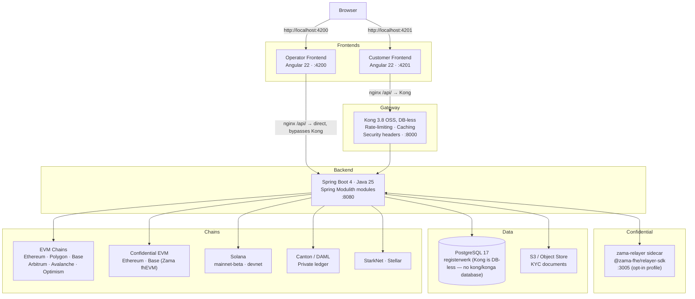
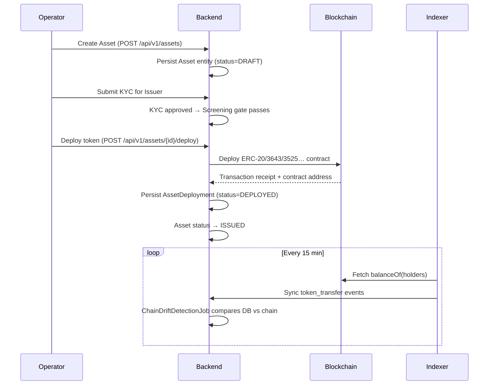

# Architecture du système

Registerwerk suit le modèle du **modulith** : une seule application backend déployable, structurée en interne en contextes délimités faiblement couplés. Deux interfaces Angular distinctes (opérateur et client) sont toujours ouvertes directement par le navigateur — `:4200` et `:4201` — et se connectent au même backend par des chemins différents, pour les seuls appels d'API.

---

## Vue d'ensemble des composants

### Pourquoi deux chemins vers le backend ?

Les deux interfaces sont toujours ouvertes **directement** par le navigateur sur leur propre port — Kong ne se trouve devant l'interface d'aucune des deux applications, seulement devant le trafic d'API backend de l'application cliente, et uniquement parce que le nginx du frontend client renvoie `/api/` vers Kong plutôt que vers le backend.

Le **frontend opérateur** connecte ses appels d'API directement (proxy nginx → `backend:8080`). Il utilise une connexion JWT HS256 intégrée (`POST /api/v1/public/auth/login`) et ne passe jamais par Kong. Le portail opérateur reste ainsi utilisable même si Kong est indisponible.

Les appels d'API du **frontend client** passent par Kong, qui ajoute devant le backend la limitation de débit, la mise en cache des réponses et les en-têtes de sécurité. La validation du JWT elle-même a toujours lieu dans le backend Spring (`SecurityConfig` lit la revendication `roles` directement sur le jeton, et `SecurityUtils.extractEntityId` la revendication d'entité) — la build OSS de Kong utilisée ici ne valide pas les JWT et n'injecte pas d'en-têtes d'entité. Un greffon `openid-connect` existe en option, réservé aux éditions Enterprise/Konnect (`gateway/plugins/oidc-entra.yml`), pour les installations souhaitant aussi terminer le JWT à la passerelle.

---

## Cycle de vie d'un jeton de titre

---

## Spring Modulith — contextes délimités

Le backend est organisé en 34 modules, chacun portant une responsabilité métier unique — chaque paquet de premier niveau sous `de.makibytes.registerwerk` porte `@ApplicationModule`. Les modules communiquent par [événements Spring Modulith](../platform/modules.md) (boîte d'envoi transactionnelle), jamais par des appels de service directs vers les paquets `internal/` d'autres modules.

| Module | Responsabilité |
|---|---|
| `shared` | Exceptions et utilitaires transverses |
| `auth` | Émission de JWT, connexion HS256 de développement, jetons d'intégration, OIDC |
| `audit` | Piste d'audit inviolable, en ajout seul |
| `notification` | Envoi de courriels (piloté par événements) |
| `customer` | Entités juridiques, KYB, utilisateurs d'entreprise |
| `kyc` | Gestion documentaire, approbations par juridiction, bénéficiaires effectifs |
| `screening` | Filtrage sanctions/PPE (port interchangeable) |
| `onboarding` | Parcours d'intégration client, utilisation des jetons |
| `stepup` | Authentification renforcée (step-up), application de la double validation |
| `travelrule` | Travel Rule / IVMS-101 (TFR) |
| `asset` | Instruments financiers, documents, cycle de vie |
| `deployment` | État on-chain : déploiements, conditions obligataires, titulaires, coffre, création |
| `blockchain` | Registre des clients RPC, déploiement de contrats, opérations d'administration |
| `chain` | Configuration des chaînes/réseaux, santé des nœuds RPC |
| `wallet` | Gestion des clés des portefeuilles de l'opérateur |
| `erc3643` | Suite de conformité T-REX (identité, attestations, modules de conformité) |
| `indexer` | Synchronisation des événements hors chaîne (EVM, Solana, Canton) |
| `endpoint` | Configuration des points d'accès RPC |
| `trading` | Offres de vente, exécutions, intégrations de plateformes |
| `admin` | Gestion des utilisateurs opérateur, mode support |
| `corporateactions` | Dividendes, coupons, divisions, remboursements |
| `regreporting` | Exports réglementaires MiFIR/DAC8 |
| `dora` | Incidents informatiques DORA et registre des tiers |
| `externalref` | Correspondance des identifiants de systèmes externes (LEI, identifiants de registre) |
| `orgidentity` | Identité on-chain de l'organisation (liaison portefeuille↔organisation), délégation de permissions |
| `marketplace` | Place de marché dApp : examen des manifestes, approbation avec authentification renforcée + double validation, ancrage on-chain |
| `payment` | Catalogue de dispositifs de paiement curé par l'opérateur, avec champs de divulgation et d'attestation pour la jambe espèces LCP ; aucune vérification MiCAR indépendante |
| `entra` | Adaptateur Microsoft Graph : statut 2FA, console d'assistance opérateur, laissez-passer temporaires |
| `lending` | Marchés de prêt garanti isolés, facteurs de santé, réalisation de la garantie |
| `registerstatement` | Relevés de registre au titre du §19(2) eWpG — génération et conservation |
| `registertransfer` | Transferts côté registre, y compris les transferts forcés du §24 |
| `support` | Outillage d'assistance pour l'opérateur |
| `bootstrap` | Câblage au démarrage, jeu de données de démonstration, contrôles de maturité pour la production |
| `infrastructure` | Configuration transverse web, persistance et clients |

Voir [Architecture modulaire](../platform/modules.md) pour le graphe complet des dépendances et les justifications de conception.

---

## Persistance des données

Toutes les données applicatives résident dans une unique instance **PostgreSQL 17** dotée d'une seule base :

| Base | Propriétaire | Contenu |
|---|---|---|
| `registerwerk` | utilisateur `registerwerk` | Toutes les tables applicatives, la table partitionnée `audit_event`, les migrations Flyway |

Kong fonctionne **sans base de données** : sa configuration déclarative (`gateway/kong.yml`) est chargée
directement via `KONG_DECLARATIVE_CONFIG`, il n'a donc pas de base à lui — il n'existe ni base ni service
`kong` ou `konga` dans cette pile.

Flyway gère le schéma `registerwerk`. Les migrations sont nommées `V{n}__description.sql` et ne sont jamais modifiées après fusion.

Les documents de plus de 5 Mo (documents KYC, relevés, rapports) sont stockés dans un **stockage objet compatible S3** ; la base ne conserve que les métadonnées et la clé S3.

---

## Configuration et environnement

Voir [Sécurité et authentification](../platform/security.md) pour la configuration JWT et OIDC. Le fichier `application.yml` pilote le comportement de tous les modules ; les surcharges propres à un environnement passent par les profils Spring (`prod`, `dev`, `test`).

!!! warning "Secret JWT en production"
    Si `JWT_ISSUER_URI` est vide et que `JWT_DEV_SECRET` est égal à la valeur par défaut livrée dans le dépôt, le backend **refuse de démarrer** sur le profil `prod`. C'est un garde-fou délibéré, en échec immédiat, contre l'exécution accidentelle en production avec le secret de développement.
