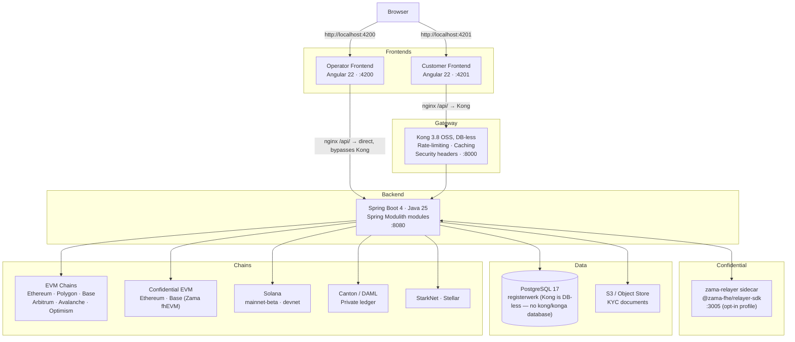
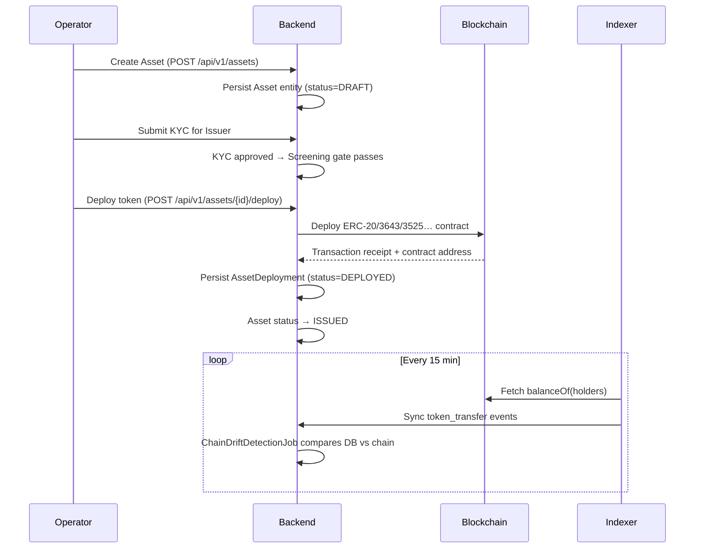

# Architettura di sistema

Registerwerk segue il modello **modulith**: una singola applicazione backend distribuibile, strutturata internamente in contesti delimitati debolmente accoppiati. Due frontend Angular distinti (operatore e cliente) sono sempre aperti direttamente dal browser — `:4200` e `:4201` — e si collegano allo stesso backend per percorsi diversi, per le sole chiamate API.

---

## Panoramica dei componenti

### Perché due percorsi verso il backend?

Entrambi i frontend sono sempre aperti **direttamente** dal browser sulla propria porta — Kong non sta davanti all'interfaccia di nessuna delle due applicazioni, ma solo davanti al traffico API di backend dell'applicazione cliente, e questo soltanto perché il nginx del frontend cliente inoltra `/api/` a Kong anziché al backend.

Il **frontend operatore** collega le proprie chiamate API direttamente (proxy nginx → `backend:8080`). Usa un accesso JWT HS256 integrato (`POST /api/v1/public/auth/login`) e non passa mai per Kong. Così il portale operatore resta utilizzabile anche quando Kong è fuori servizio.

Le chiamate API del **frontend cliente** passano per Kong, che antepone al backend limitazione di frequenza, cache delle risposte e header di sicurezza. La validazione del JWT avviene sempre nel backend Spring (`SecurityConfig` legge il claim `roles` direttamente dal token e `SecurityUtils.extractEntityId` il claim dell'entità) — la build OSS di Kong qui impiegata non valida i JWT e non inietta header di entità. Esiste un plugin `openid-connect` come estensione facoltativa, disponibile solo per Enterprise/Konnect (`gateway/plugins/oidc-entra.yml`), per le installazioni che vogliano terminare il JWT anche al gateway.

---

## Ciclo di vita di un token rappresentativo di strumento finanziario

---

## Spring Modulith — contesti delimitati

Il backend è organizzato in 34 moduli, ciascuno con una singola responsabilità di dominio — ogni package di primo livello sotto `de.makibytes.registerwerk` porta `@ApplicationModule`. I moduli comunicano tramite [eventi Spring Modulith](../platform/modules.md) (outbox transazionale), mai tramite chiamate dirette a servizi nei package `internal/` di altri moduli.

| Modulo | Responsabilità |
|---|---|
| `shared` | Eccezioni e utilità trasversali |
| `auth` | Emissione di JWT, accesso HS256 di sviluppo, token di onboarding, OIDC |
| `audit` | Pista di controllo a prova di manomissione, in sola aggiunta |
| `notification` | Invio di email (guidato da eventi) |
| `customer` | Soggetti giuridici, KYB, utenti aziendali |
| `kyc` | Gestione documentale, approvazioni per giurisdizione, titolari effettivi |
| `screening` | Screening sanzioni/PEP (porta sostituibile) |
| `onboarding` | Percorso di attivazione del cliente, utilizzo dei token |
| `stepup` | MFA rafforzata, applicazione dei quattro occhi |
| `travelrule` | Travel Rule / IVMS-101 (TFR) |
| `asset` | Strumenti finanziari, documenti, ciclo di vita |
| `deployment` | Stato on-chain: distribuzioni, condizioni obbligazionarie, titolari, vault, conio |
| `blockchain` | Registro dei client RPC, distribuzione dei contratti, operazioni di amministrazione |
| `chain` | Configurazione di chain e reti, salute dei nodi RPC |
| `wallet` | Gestione delle chiavi dei wallet dell'operatore |
| `erc3643` | Suite di conformità T-REX (identità, claim, moduli di conformità) |
| `indexer` | Sincronizzazione degli eventi off-chain (EVM, Solana, Canton) |
| `endpoint` | Configurazione degli endpoint RPC |
| `trading` | Proposte di vendita, esecuzioni, integrazioni con le sedi |
| `admin` | Gestione degli utenti operatore, modalità supporto |
| `corporateactions` | Dividendi, cedole, frazionamenti, rimborsi |
| `regreporting` | Esportazioni regolamentari MiFIR/DAC8 |
| `dora` | Incidenti informatici DORA e registro dei fornitori terzi |
| `externalref` | Mappatura degli identificativi di sistemi esterni (LEI, identificativi di registro) |
| `orgidentity` | Identità on-chain dell'organizzazione (vincolo wallet↔organizzazione), delega dei permessi |
| `marketplace` | Marketplace di dApp: esame dei manifesti, approvazione con autenticazione rafforzata + quattro occhi, ancoraggio on-chain |
| `payment` | Catalogo dei canali di pagamento curato dall'operatore, con campi di informativa e attestazione per la gamba contante consegna contro pagamento; nessuna verifica MiCAR indipendente |
| `entra` | Adattatore Microsoft Graph: stato 2FA, console di assistenza per l'operatore, permessi di accesso temporaneo |
| `lending` | Mercati di prestito garantito isolati, fattori di salute, escussione |
| `registerstatement` | Estratti di registro ai sensi del §19(2) eWpG — generazione e conservazione |
| `registertransfer` | Trasferimenti lato registro, compresi i trasferimenti coattivi del §24 |
| `support` | Strumenti di assistenza per l'operatore |
| `bootstrap` | Cablaggio all'avvio, popolamento dei dati dimostrativi, controlli di maturità per la produzione |
| `infrastructure` | Configurazione trasversale di web, persistenza e client |

Per il grafo completo delle dipendenze e le motivazioni progettuali vedi [Architettura modulare](../platform/modules.md).

---

## Persistenza dei dati

Tutti i dati applicativi risiedono in una singola istanza **PostgreSQL 17** con un solo database:

| Database | Proprietario | Contenuti |
|---|---|---|
| `registerwerk` | utente `registerwerk` | Tutte le tabelle applicative, la tabella partizionata `audit_event`, le migrazioni Flyway |

Kong gira **senza database**: la sua configurazione dichiarativa (`gateway/kong.yml`) è caricata
direttamente tramite `KONG_DECLARATIVE_CONFIG`, quindi non ha un database proprio — in questo stack
non esistono né un database né un servizio `kong` o `konga`.

Flyway gestisce lo schema `registerwerk`. Le migrazioni si chiamano `V{n}__description.sql` e non vengono mai modificate dopo il merge.

I documenti oltre 5 MB (documenti KYC, estratti, report) sono conservati in un **object storage compatibile S3**; il database contiene solo i metadati e la chiave S3.

---

## Configurazione e ambiente

Per la configurazione di JWT e OIDC vedi [Sicurezza e autenticazione](../platform/security.md). Il file `application.yml` guida il comportamento di tutti i moduli; le sovrascritture specifiche per ambiente usano i profili Spring (`prod`, `dev`, `test`).

!!! warning "Segreto JWT in produzione"
    Se `JWT_ISSUER_URI` è vuoto e `JWT_DEV_SECRET` coincide con il valore predefinito distribuito nel repository, il backend **non si avvia** con il profilo `prod`. È una protezione deliberata a fallimento immediato contro l'esecuzione accidentale in produzione con il segreto di sviluppo.
