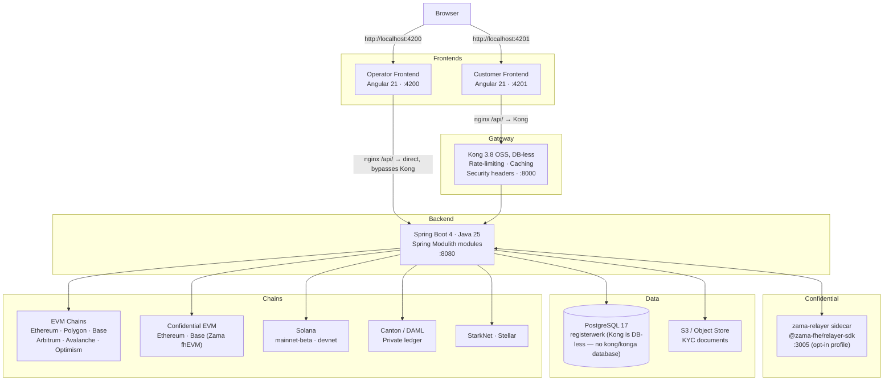
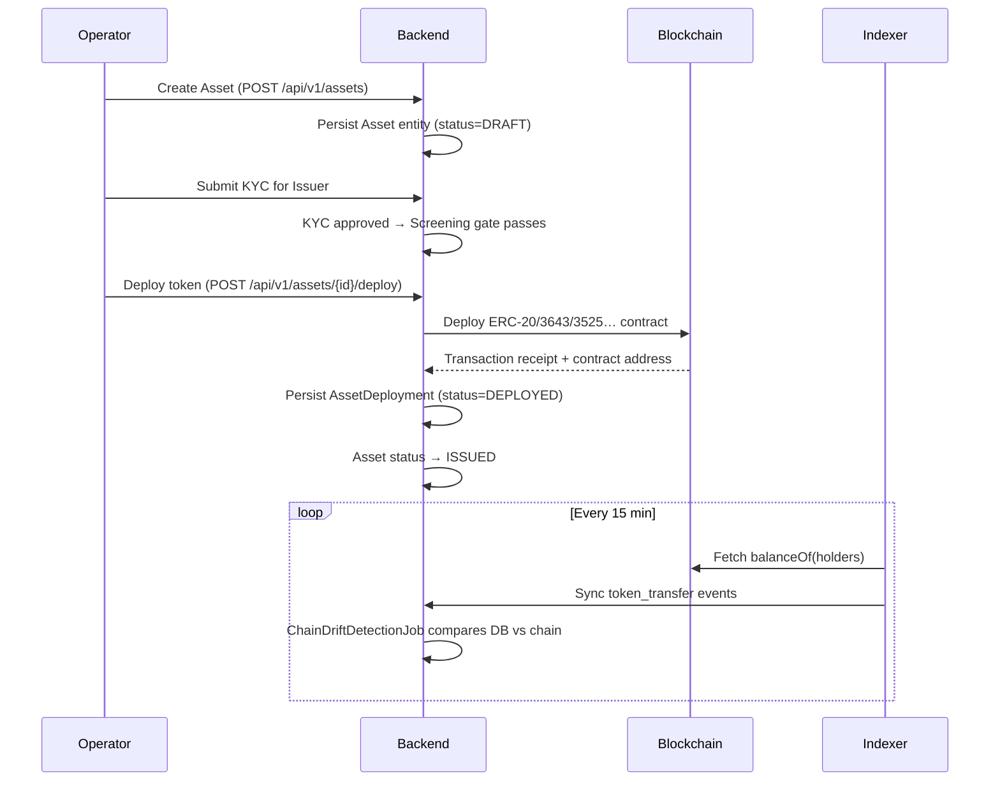

# System Architecture

Registerwerk follows a **modulith** pattern: a single deployable backend application internally structured into loosely-coupled bounded contexts. Two separate Angular frontends (operator and customer) are always opened directly by the browser — `:4200` and `:4201` — and connect through different paths to the same backend for API calls only.

---

## Component overview

### Why two paths to the backend?

Both frontends are always opened **directly** by the browser at their own port — Kong never fronts either app's UI, only the customer app's backend API traffic, and only because the customer frontend's own nginx forwards `/api/` to Kong rather than to the backend.

The **operator frontend** connects its API calls directly (nginx proxy → `backend:8080`). It uses a built-in HS256 JWT login (`POST /api/v1/public/auth/login`) and never passes through Kong. This keeps the operator portal functional even when Kong is down.

The **customer frontend**'s API calls go through Kong, which adds rate limiting, response caching, and security headers in front of the backend. JWT validation itself always happens in the Spring backend (`SecurityConfig` reads the `roles` claim straight off the token, and `SecurityUtils.extractEntityId` the entity claim) — Kong's OSS build here does not validate JWTs or inject entity headers. An `openid-connect` plugin exists as an optional, Enterprise/Konnect-only add-on (`gateway/plugins/oidc-entra.yml`) for deployments that want JWT termination at the gateway too.

---

## Security token lifecycle

---

## Spring Modulith — bounded contexts

The backend is organised into modules, each representing a single domain responsibility. Modules communicate through [Spring Modulith events](../platform/modules.md) (transactional outbox), never through direct inter-module service calls into `internal/` packages.

| Module | Responsibility |
|---|---|
| `shared` | Cross-cutting exceptions and utilities |
| `auth` | JWT minting, HS256 dev login, onboarding tokens, OIDC |
| `audit` | Tamper-evident append-only audit log |
| `notification` | Email delivery (event-driven) |
| `customer` | Legal entities, KYB, company users |
| `kyc` | Document management, jurisdiction approvals, beneficial owners |
| `screening` | Sanctions/PEP screening (pluggable port) |
| `onboarding` | Customer onboarding flow, token redemption |
| `stepup` | Step-up MFA, 4-eyes enforcement |
| `travelrule` | Travel Rule / IVMS-101 (TFR) |
| `asset` | Security instruments, documents, lifecycle |
| `deployment` | On-chain state: deployments, bond terms, holders, vault, mint |
| `blockchain` | RPC client registry, contract deployment, admin operations |
| `chain` | Chain/network configuration, RPC node health |
| `wallet` | Operator wallet key management |
| `erc3643` | T-REX compliance suite (identity, claims, compliance modules) |
| `indexer` | Off-chain event sync (EVM, Solana, Canton) |
| `endpoint` | RPC endpoint configuration |
| `trading` | Trade listings, executions, venue integrations |
| `admin` | Operator user management, impersonation |
| `corporateactions` | Dividends, coupons, splits, redemptions |
| `regreporting` | MiFIR/DAC8 regulatory reporting exports |
| `dora` | DORA ICT incidents and third-party register |
| `externalref` | External system ID mapping (LEI, registry IDs) |
| `orgidentity` | Onchain org identity (wallet↔org binding), permission delegation |
| `marketplace` | dApp marketplace: manifest review, step-up + 4-eyes approval, onchain anchoring |
| `payment` | Operator-curated payment rail catalog with disclosure and attestation fields for the DvP cash leg; no independent MiCAR verification |

See [Module Architecture](../platform/modules.md) for the full dependency graph and design rationale.

---

## Data persistence

All application data lives in a single **PostgreSQL 17** instance with one database:

| Database | Owner | Contents |
|---|---|---|
| `registerwerk` | `registerwerk` user | All application tables, partitioned `audit_event`, Flyway migrations |

Kong runs **DB-less**: its declarative config (`gateway/kong.yml`) is loaded directly via
`KONG_DECLARATIVE_CONFIG`, so it has no database of its own — there is no `kong` or `konga`
database or service in this stack.

Flyway manages the `registerwerk` schema. Migrations are named `V{n}__description.sql` and are never edited after merging.

Documents larger than 5 MB (KYC documents, statements, reports) are stored in **S3-compatible object storage**; the database holds only the metadata and S3 key.

---

## Configuration and environment

See [Security & Authentication](../platform/security.md) for JWT and OIDC configuration. The `application.yml` drives behaviour for all modules; environment-specific overrides use Spring profiles (`prod`, `dev`, `test`).

!!! warning "Production JWT secret"
    If `JWT_ISSUER_URI` is blank and `JWT_DEV_SECRET` equals the default shipped in the repository, the backend **fails to start** on the `prod` profile. This is a deliberate fail-fast guard against accidentally running with the development secret in production.
