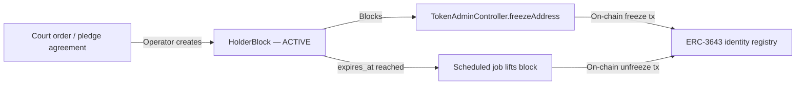

# Deutschland – Gesetz über elektronische Wertpapiere (eWpG) { #germany-electronic-securities-act-ewpg }

!!! warning "EXTERNAL_REVIEW_REQUIRED"
    Auf dieser Seite werden beabsichtigte Kontrollzuordnungen und konfigurierte Annahmen festgehalten. Sie stellt keine
    Rechtsberatung und keinen Nachweis der eWpG-Konformität, einer behördlichen Zulassung, Zertifizierung oder
    Rechtswirkung dar. Registermodell und Beweiswirkung jedes einzelnen Datensatzes erfordern eine instrumenten-,
    betreiber-, dienst-, transaktions- und einsatzspezifische Entscheidung, die von qualifizierten Rechtsberatern
    freigegeben wurde.

Das **Gesetz über elektronische Wertpapiere** (eWpG, BGBl. I 2021 S. 1423) schafft einen Rechtsrahmen für elektronische Wertpapiere. Registerwerk enthält technische Modelle, die den Einsatz eines zentralen Registers oder eines Kryptowertpapierregisters unterstützen können; das Repository stellt jedoch nicht sicher, dass eines der beiden Modelle für ein bestimmtes Instrument rechtlich implementiert ist.

---

## Wesentliche Pflichten und ihre Umsetzung { #key-obligations-and-their-implementations }

### §4 – Emittentenpflichten { #4-issuer-obligations }

Der Emittent eines elektronischen Wertpapiers muss identifizierbar sein und die rechtliche Verantwortung für den Registereintrag tragen.

**Repository-Verhalten:** Die Entität `Asset` speichert eine `issuerId`, die auf eine `LegalEntity` verweist. KYC-/KYB-Datensätze und Genehmigungsworkflows sind vorhanden, aber Emissions- und Deployment-Pfade erzwingen noch nicht einheitlich einen genehmigten KYC-Status. Siehe [KYC & AML](../compliance/kyc-aml.md).

---

### §15 – Integrität des zentralen Registers (Registerführung) { #15-central-register-integrity-registerfuhrung }

Die registerführende Stelle muss eine genaue, vollständige und manipulationssichere Aufzeichnung aller Registereinträge, Übertragungen und Belastungen führen. Aufzeichnungen müssen **10 Jahre** aufbewahrt werden.

**Implementierung:** Jede zustandsverändernde Operation in Registerwerk gibt ein `AuditEvent` an die Tabelle `audit_event` aus. Die Tabelle ist:

- Append-only (ein PostgreSQL-Trigger löst bei `UPDATE` oder `DELETE` eine Ausnahme aus)
- Hash-verkettet (jede Zeile speichert `entry_hash = SHA-256(prev_hash ‖ payload ‖ sequence_no)`)
- Monatlich partitioniert, wobei zukünftige Partitionen automatisch vorab angelegt werden

Siehe [Audit-Log](../platform/audit-log.md) für die vollständige Implementierung.

!!! info "10 Jahre Aufbewahrung"
    Das Zuständigkeitsprofil `DE_EWPG` legt `retentionYears = 10` fest. Geplante Jobs und das Betriebs-Runbook dokumentieren, wie Partitionsarchive nach Ablauf des aktiven Fensters, aber vor Ablauf der Aufbewahrungsfrist, in den Cold Storage verschoben werden.

---

### §16 – Kryptowertpapierregister und Sperrvermerk { #16-crypto-securities-register-and-sperrvermerk }

Für Token auf öffentlichen Blockchains verlangt §16 ein gesondertes "Kryptowertpapierregister", das:

1. Jede Token-Einheit, ihren Inhaber und etwaige Belastungen (Sperrvermerk) erfasst
2. Eine Beweiswirkung und Rechtswirkung besitzt, die für das gewählte Registermodell noch festgelegt werden muss
3. Gerichtlich angeordnete Sperren, Pfandrechte, Pfändungen und Nachlasssperren unterstützt

**Repository-Verhalten:** Registerwerk pflegt derzeit sowohl Datenbankdatensätze als auch ausgewählten On-Chain-Status:

- Die Tabelle `asset_holder` in PostgreSQL ist der aktuelle Anwendungs-Inhaberdatensatz; ob sie das gesetzliche Register darstellt, erfordert eine genehmigte, instrumentenspezifische Festlegung der Beweiswirkung
- Der `ChainDriftDetectionJob` läuft alle 15 Minuten und prüft, ob die On-Chain-Bestände mit der Datenbank übereinstimmen. Erkannte Abweichungen werden als `chain_drift_event`-Datensätze gespeichert und lösen `ChainDriftDetectedEvent`-Benachrichtigungen aus.
- Die Tabelle `holder_block` implementiert den Sperrvermerk mit den Blockarten: `PFANDRECHT`, `PFAENDUNG`, `GERICHTSBESCHLUSS`, `NACHLASSSPERRE`, `VERFUGUNGSVERBOT`, `TOD`, `INSOLVENZ`

Siehe [Sperrvermerk](../compliance/sperrvermerk.md) für die vollständige Implementierung.

---

### §17 – Übertragung von Kryptowertpapieren { #17-transfer-of-crypto-securities }

Übertragungen setzen voraus, dass beide Parteien die Identitätsprüfung abgeschlossen haben und dass für den Übertragenden kein aktiver `HolderBlock` besteht.

**Beabsichtigte Kontrollzuordnung:** Die folgenden Prüfungen erfordern eine Verifikation im Repository sowie eine instrumentenspezifische rechtliche Freigabe; diese Liste darf nicht als Nachweis dafür verstanden werden, dass jeder Übertragungspfad entsprechend abgesichert ist:

1. Sowohl Emittent als auch Zielinhaber verfügen über einen gültigen, nicht abgelaufenen KYC-Status (`KycStatus.APPROVED`)
2. Für den Quellinhaber besteht auf dem betreffenden Asset kein aktiver `HolderBlock`
3. Der Vorgang wird von einem `REGISTRY_ADMIN` mit [Step-up](../compliance/step-up-mfa.md) und Vier-Augen-Freigabe autorisiert

---

## KryptoFAV – Kryptowertpapier-Festlegungsverordnung { #kryptofav-crypto-securities-regulation }

Die **Kryptowertpapier-Festlegungsverordnung** (KryptoFAV) legt technische Anforderungen für Kryptowertpapierregister fest. Wesentliche Anforderungen und ihre Umsetzung:

| KryptoFAV-Anforderung | Implementierung |
|---|---|
| Eindeutige Blockchain-Adresse je Token | `AssetDeployment.contractAddress` – Unique-Constraint |
| Emittent identifiziert über LEI oder Registrierungsnummer | `LegalEntity.lei`, `LegalEntity.registrationNumber` |
| Hash der Emissionsbedingungen | `Asset.termsHash`, bei Emission gespeichert |
| Kryptografischer Nachweis des Registereintrags | Audit-Hash-Kette (`audit_event.entry_hash`) |
| Zugänglichkeit für die BaFin-Prüfung | Rolle `AUDITOR` mit vollem Lesezugriff; Audit-Export-Endpunkt |

---

## GwG – Geldwäscheprävention { #gwg-anti-money-laundering }

Das **Geldwäschegesetz** (GwG) erlegt allen Unternehmen, die Finanzdienstleistungen erbringen – einschließlich Betreibern von Wertpapierregistern –, AML-Pflichten auf.

| GwG-Vorschrift | Implementierung |
|---|---|
| §7 – Geldwäschebeauftragter | Rolle `COMPLIANCE_OFFICER` |
| §10 – Sorgfaltspflichten (Customer Due Diligence) | [KYC & AML](../compliance/kyc-aml.md) |
| §10(2) – Verstärkte Sorgfaltspflichten bei PEPs | `NaturalPerson.pepStatus`; verstärkter Wiederholungsrhythmus bei der Prüfung |
| §10 laufende Überwachung | `KycMonitoringJob` – tägliche Ablaufprüfung, jährliche Neu-Überprüfung |
| §11 – Wirtschaftlich Berechtigte | `BeneficialOwner` → `NaturalPerson` ab ≥25 % Beteiligung |
| §6(2) – Interne Sicherungsmaßnahmen / Vier-Augen-Prinzip | [Step-Up-MFA & Vier-Augen-Prinzip](../compliance/step-up-mfa.md) |
| §8 – Aufbewahrung von Aufzeichnungen | 6 Jahre für GwG-Aufzeichnungen; für eWpG-Zwecke durch 10 Jahre überschrieben |

!!! warning "GwG §10 laufende Überwachung"
    Eine KYC-Genehmigung ist standardmäßig 365 Tage gültig. Der `KycMonitoringJob` läuft täglich um 02:00 Uhr und wechselt den Status 30 Tage vor Ablauf von `APPROVED → EXPIRING` und am Ablaufdatum von `APPROVED → EXPIRED`. Ein abgelaufener KYC-Status blockiert weitere Token-Übertragungen dieses Inhabers. Siehe [KYC & AML](../compliance/kyc-aml.md).

---

## BaFin – Aufsichtsrechtliche Meldungen { #bafin-supervisory-reporting }

Die BaFin ist die zuständige Aufsichtsbehörde für das eWpG-Register. Die [DORA](../compliance/dora.md)-Vorfallmeldung von Registerwerk leitet schwerwiegende IKT-Vorfälle innerhalb von 24 Stunden (Erstmeldung) und 72 Stunden (Zwischenbericht) an die BaFin weiter. Die [MiFIR](../compliance/mifir.md)-Integration übermittelt tägliche Transaktionsmeldungen an das MeldewesenPortal der BaFin, sofern Token als MiFID-II-Finanzinstrumente gelten.
