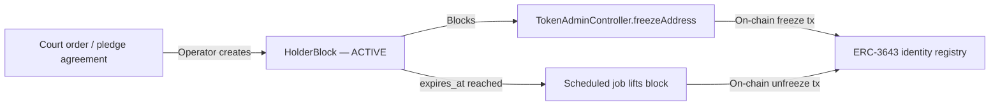

# Alemania — Ley de valores electrónicos (eWpG) { #germany-electronic-securities-act-ewpg }

!!! warning "EXTERNAL_REVIEW_REQUIRED"
    Esta página registra las asignaciones de control previstas y los supuestos configurados. No es asesoramiento legal
    ni evidencia de cumplimiento de eWpG, autorización regulatoria, certificación o efecto legal
    . El modelo de registro y la autoridad de cada registro requieren una decisión específica de instrumento, operador, servicio, transacción e implementación
    aprobada por un abogado calificado.

El **Gesetz über elektronische Wertpapiere** (eWpG, BGBl. I 2021 S. 1423) proporciona un marco legal para los valores electrónicos. Registerwerk contiene modelos técnicos que pueden admitir implementaciones de registro central o de registro de criptovalores, pero el repositorio no establece que ninguno de los modelos esté implementado legalmente para un instrumento en particular.

---

## Obligaciones clave y sus implementaciones { #key-obligations-and-their-implementations }

### §4 — Obligaciones del emisor { #4-issuer-obligations }

El emisor de un valor electrónico debe ser identificable y asumir la responsabilidad legal por la entrada del registro.

**Comportamiento del repositorio:** La entidad `Asset` almacena `issuerId` haciendo referencia a un `LegalEntity`. Existen registros KYC/KYB y flujos de trabajo de aprobación, pero las rutas de emisión e implementación aún no aplican de manera uniforme un estado KYC aprobado. Consulte [KYC & AML](../compliance/kyc-aml.md).

---

### §15 — Integridad del registro central (Registerführung) { #15-central-register-integrity-registerführung }

El encargado del registro debe mantener un registro preciso, completo y a prueba de manipulaciones de todas las entradas del registro, las transferencias y los gravámenes. Los registros deben conservarse durante **10 años**.

**Implementación:** Cada operación de mutación de estado en Registerwerk emite un `AuditEvent` a la tabla `audit_event`. La tabla es:

- Solo de adición (append-only) — un disparador de PostgreSQL genera una excepción ante `UPDATE` o `DELETE`
- Encadenada mediante hash — cada fila almacena `entry_hash = SHA-256(prev_hash ‖ payload ‖ sequence_no)`
- Particionada por mes, con particiones futuras creadas automáticamente de antemano

Consulte [Registro de auditoría](../platform/audit-log.md) para conocer la implementación completa.

!!! info "Retención de 10 años"
    El perfil de jurisdicción `DE_EWPG` establece `retentionYears = 10`. Los trabajos programados y el runbook operativo documentan cómo los archivos de partición se mueven al almacenamiento en frío después de la ventana activa pero antes de que expire el reloj de retención.

---

### §16 — Registro de valores criptográficos y Sperrvermerk { #16-crypto-securities-register-and-sperrvermerk }

Para tokens en cadenas de bloques públicas, §16 requiere un "registro de valores criptográficos" separado que:

1. Registra cada unidad de token, su titular y cualquier gravamen (Sperrvermerk)
2. Tiene una autoridad y efecto legal que debe ser determinado para el modelo de registro seleccionado
3. Admite congelaciones, promesas (Pfandrecht), embargos (Pfändung) y bloques de sucesión ordenados por el tribunal.

**Comportamiento del repositorio:** Registerwerk actualmente mantiene tanto los registros de la base de datos como el estado seleccionado en la cadena:

- La tabla `asset_holder` en PostgreSQL es el registro de titulares actual de la aplicación; si constituye el registro legal es algo que requiere una política de autoridad aprobada y específica del instrumento
- El `ChainDriftDetectionJob` se ejecuta cada 15 minutos para verificar que los saldos on-chain coincidan con la base de datos. Las discrepancias detectadas se almacenan como registros `chain_drift_event` y disparan notificaciones `ChainDriftDetectedEvent`
- La tabla `holder_block` implementa el Sperrvermerk con los tipos de bloque: `PFANDRECHT`, `PFAENDUNG`, `GERICHTSBESCHLUSS`, `NACHLASSSPERRE`, `VERFUGUNGSVERBOT`, `TOD`, `INSOLVENZ`

Consulte [Sperrvermerk](../compliance/sperrvermerk.md) para conocer la implementación completa.

---

### §17 — Transferencia de valores criptográficos { #17-transfer-of-crypto-securities }

Las transferencias requieren que ambas partes hayan completado la verificación de identidad, y que el transmitente no tenga un `HolderBlock` activo.

**Mapeo de control previsto:** Las siguientes verificaciones requieren verificación del repositorio y aprobación legal específica del instrumento; esta lista no debe considerarse prueba de que todas las rutas de transferencia estén controladas:

1. Tanto el emisor como el titular de destino tienen un KYC válido y no vencido (`KycStatus.APPROVED`)
2. No existe ningún `HolderBlock` activo para el titular de origen en el activo en cuestión
3. La operación está autorizada por un `REGISTRY_ADMIN` con [step-up](../compliance/step-up-mfa.md) + aprobación de doble control (4-eyes)

---

## KryptoFAV — Reglamento de Criptovalores { #kryptofav-crypto-securities-regulation }

La **Kryptowertpapier-Festlegungs-Verordnung** (KryptoFAV) especifica los requisitos técnicos para los registros de valores cripto. Requisitos e implementaciones clave:

| Requisito de la KryptoFAV | Implementación |
|---|---|
| Dirección blockchain única por token | `AssetDeployment.contractAddress` — restricción única |
| Emisor identificado por LEI o número de registro | `LegalEntity.lei`, `LegalEntity.registrationNumber` |
| Hash de los términos y condiciones | `Asset.termsHash` almacenado en el momento de la emisión |
| Prueba criptográfica de entrada registral | Auditoría de cadena hash (`audit_event.entry_hash`) |
| Accesibilidad para la inspección BaFin | Rol `AUDITOR` con acceso de lectura completo; punto final de exportación de auditoría |

---

## GwG — Anti-Lavado de Dinero { #gwg-anti-money-laundering }

El **Geldwäschegesetz** (GwG) impone obligaciones AML a todas las entidades que prestan servicios financieros, incluidos los operadores de registro de valores.

| Provisión de GwG | Implementación |
|---|---|
| §7 — Responsable de cumplimiento | Rol `COMPLIANCE_OFFICER` |
| §10 — CDD (Debida diligencia del cliente) | [KYC & AML](../compliance/kyc-aml.md) |
| §10(2) — DD mejorada para PEP | `NaturalPerson.pepStatus`; cadencia de reevaluación mejorada |
| §10 seguimiento continuo | `KycMonitoringJob` — control de vencimiento diario, reevaluación anual |
| §11 — Propietarios beneficiarios | `BeneficialOwner` → `NaturalPerson` con ≥25% de propiedad |
| §6(2) — Controles internos / doble control | [Step-up MFA y doble control (4-eyes)](../compliance/step-up-mfa.md) |
| §8 — Conservación de registros | 6 años para registros de GwG; anulado por 10 años para eWpG |

!!! warning "GwG §10 seguimiento continuo"
    La aprobación KYC es válida por 365 días de forma predeterminada. El `KycMonitoringJob` se ejecuta diariamente a las 02:00 y cambia a `APPROVED → EXPIRING` 30 días antes del vencimiento, luego a `APPROVED → EXPIRED` en la fecha de vencimiento. Un KYC vencido bloquea más transferencias de tokens de ese titular. Consulte [KYC & AML](../compliance/kyc-aml.md).

---

## BaFin — Informes de supervisión { #bafin-supervisory-reporting }

BaFin es la autoridad competente para la supervisión del registro conforme al eWpG. El informe de incidentes [DORA](../compliance/dora.md) de Registerwerk enruta los incidentes graves de TIC a BaFin en un plazo de 24 horas (notificación inicial) y 72 horas (informe intermedio). La integración con [MiFIR](../compliance/mifir.md) presenta informes diarios de transacciones al MeldewesenPortal de BaFin cuando los tokens califican como instrumentos financieros MiFID II.
