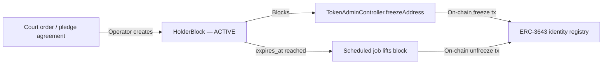

# Allemagne — Loi sur les titres électroniques (eWpG) {#germany-electronic-securities-act-ewpg}

!!! warning "EXTERNAL_REVIEW_REQUIRED"
    Cette page enregistre les mappages de contrôle prévus et les hypothèses configurées. Elle ne constitue pas
    un avis juridique ni une preuve de conformité à l'eWpG, d'autorisation réglementaire, de certification ou
    d'effet juridique. Le modèle de registre et l'autorité de chaque enregistrement nécessitent une décision
    spécifique à l'instrument, à l'opérateur, au service, à la transaction et au déploiement, approuvée par un
    conseiller juridique qualifié.

Le **Gesetz über elektronische Wertpapiere** (eWpG, BGBl. I 2021 S. 1423) fournit un cadre juridique pour les
titres électroniques. Registerwerk contient des modèles techniques susceptibles de prendre en charge des
déploiements de registre central ou de registre de titres cryptographiques, mais le référentiel n'établit pas
que l'un ou l'autre modèle est légalement mis en œuvre pour un instrument particulier.

---

## Principales obligations et leur mise en œuvre {#key-obligations-and-their-implementations}

### §4 — Obligations de l'émetteur {#4-issuer-obligations}

L'émetteur d'un titre électronique doit être identifiable et porter la responsabilité légale de l'inscription
au registre.

**Comportement du référentiel :** l'entité `Asset` stocke `issuerId`, qui référence une `LegalEntity`. Des
enregistrements et des flux d'approbation KYC/KYB existent, mais les chemins d'émission et de déploiement
n'appliquent pas encore uniformément un état KYC approuvé. Voir [KYC & AML](../compliance/kyc-aml.md).

---

### §15 — Intégrité du registre central (Registerführung) {#15-central-register-integrity-registerführung}

Le teneur de registre doit maintenir un enregistrement exact, complet et inviolable de toutes les inscriptions
au registre, transferts et charges. Les enregistrements doivent être conservés pendant **10 ans**.

**Mise en œuvre :** chaque opération de mutation d'état dans Registerwerk émet un `AuditEvent` vers la table
`audit_event`. Cette table est :

- Ajout uniquement (un déclencheur PostgreSQL lève une exception sur `UPDATE` ou `DELETE`)
- Chaînée par hachage (chaque ligne stocke `entry_hash = SHA-256(prev_hash ‖ payload ‖ sequence_no)`)
- Partitionnée par mois, avec des partitions futures pré-créées automatiquement

Voir [Journal d'audit](../platform/audit-log.md) pour la mise en œuvre complète.

!!! info "Conservation de 10 ans"
    Le profil de juridiction `DE_EWPG` définit `retentionYears = 10`. Les tâches planifiées et le runbook
    opérationnel documentent la manière dont les archives de partition sont déplacées vers un stockage froid
    après la fenêtre active, mais avant l'expiration du délai de conservation.

---

### §16 — Registre des titres cryptographiques et Sperrvermerk {#16-crypto-securities-register-and-sperrvermerk}

Pour les jetons sur des blockchains publiques, le §16 impose un « registre des titres cryptographiques »
distinct qui :

1. enregistre chaque unité de jeton, son détenteur et toute charge (Sperrvermerk) ;
2. a une autorité et un effet juridique qui doivent être déterminés selon le modèle de registre retenu ;
3. prend en charge les gels ordonnés par un tribunal, les gages (Pfandrecht), les saisies (Pfändung) et les
   blocages successoraux.

**Comportement du référentiel :** Registerwerk maintient actuellement à la fois des enregistrements en base de
données et un état on-chain sélectionné :

- la table `asset_holder` dans PostgreSQL est l'enregistrement applicatif actuel du détenteur ; le fait qu'il
  s'agisse ou non du registre légal nécessite une politique d'autorité approuvée, spécifique à l'instrument ;
- le `ChainDriftDetectionJob` s'exécute toutes les 15 minutes pour vérifier que les soldes on-chain
  correspondent à la base de données. Les écarts détectés sont stockés sous forme d'enregistrements
  `chain_drift_event` et déclenchent des notifications `ChainDriftDetectedEvent` ;
- la table `holder_block` met en œuvre le Sperrvermerk avec les types de blocage suivants : `PFANDRECHT`,
  `PFAENDUNG`, `GERICHTSBESCHLUSS`, `NACHLASSSPERRE`, `VERFUGUNGSVERBOT`, `TOD`, `INSOLVENZ`.

Voir [Sperrvermerk](../compliance/sperrvermerk.md) pour la mise en œuvre complète.

---

### §17 — Transfert de titres cryptographiques {#17-transfer-of-crypto-securities}

Les transferts exigent que les deux parties aient achevé leur vérification d'identité, et que le cédant ne
dispose d'aucun `HolderBlock` actif.

**Mappage de contrôle prévu :** les vérifications suivantes nécessitent une confirmation dans le référentiel et
une approbation juridique spécifique à l'instrument ; cette liste ne doit pas être considérée comme une preuve
que chaque chemin de transfert est effectivement contrôlé :

1. l'émetteur et le détenteur cible disposent tous deux d'un KYC valide et non expiré (`KycStatus.APPROVED`) ;
2. aucun `HolderBlock` actif n'existe pour le détenteur source sur l'actif concerné ;
3. l'opération est autorisée par un `REGISTRY_ADMIN` avec approbation [step-up](../compliance/step-up-mfa.md) +
   4 yeux.

---

## KryptoFAV — Réglementation sur les titres cryptographiques {#kryptofav-crypto-securities-regulation}

La **Kryptowertpapier-Festlegungs-Verordnung** (KryptoFAV) précise les exigences techniques applicables aux
registres de titres cryptographiques. Principales exigences et mises en œuvre :

| Exigence KryptoFAV | Mise en œuvre |
|---|---|
| Adresse blockchain unique par jeton | `AssetDeployment.contractAddress` — contrainte d'unicité |
| Émetteur identifié par LEI ou numéro d'enregistrement | `LegalEntity.lei`, `LegalEntity.registrationNumber` |
| Hachage des conditions générales | `Asset.termsHash` stocké lors de l'émission |
| Preuve cryptographique de l'inscription au registre | Chaîne de hachage d'audit (`audit_event.entry_hash`) |
| Accessibilité pour inspection par la BaFin | Rôle `AUDITOR` avec accès complet en lecture ; point de terminaison d'export d'audit |

---

## GwG — Lutte contre le blanchiment d'argent {#gwg-anti-money-laundering}

La **Geldwäschegesetz** (GwG) impose des obligations AML à toutes les entités qui fournissent des services
financiers, y compris les opérateurs de registre de valeurs mobilières.

| Disposition GwG | Mise en œuvre |
|---|---|
| §7 — Responsable de la conformité | Rôle `COMPLIANCE_OFFICER` |
| §10 — CDD (diligence raisonnable à l'égard du client) | [KYC & AML](../compliance/kyc-aml.md) |
| §10(2) — Diligence renforcée pour les PPE | `NaturalPerson.pepStatus` ; cadence de refiltrage renforcée |
| §10 — Surveillance continue | `KycMonitoringJob` — vérification quotidienne d'expiration, refiltrage annuel |
| §11 — Bénéficiaires effectifs | `BeneficialOwner` → `NaturalPerson` à partir de ≥25 % de participation |
| §6(2) — Contrôles internes / 4 yeux | [Step-Up MFA et 4 yeux](../compliance/step-up-mfa.md) |
| §8 — Conservation des enregistrements | 6 ans pour les enregistrements GwG ; porté à 10 ans par l'eWpG |

!!! warning "GwG §10 — surveillance continue"
    L'approbation KYC est valable 365 jours par défaut. Le `KycMonitoringJob` s'exécute quotidiennement à
    02h00 et fait passer le statut d'`APPROVED` à `EXPIRING` 30 jours avant l'expiration, puis d'`APPROVED` à
    `EXPIRED` à la date d'expiration. Un KYC expiré bloque tout nouveau transfert de jetons depuis ce
    détenteur. Voir [KYC & AML](../compliance/kyc-aml.md).

---

## BaFin — Déclaration aux fins de surveillance {#bafin-supervisory-reporting}

La BaFin est l'autorité compétente pour la surveillance du registre au titre de l'eWpG. Le module de
déclaration d'incidents [DORA](../compliance/dora.md) de Registerwerk achemine les incidents ICT majeurs vers
la BaFin dans un délai de 24 heures (notification initiale) et de 72 heures (rapport intermédiaire).
L'intégration [MiFIR](../compliance/mifir.md) dépose des rapports de transactions quotidiens sur le
MeldewesenPortal de la BaFin lorsque les jetons sont qualifiés d'instruments financiers au sens de MiFID II.
