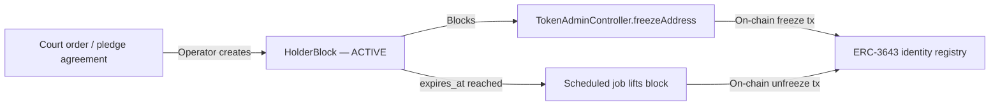

# Germania — Legge sui titoli elettronici (eWpG) { #germany-electronic-securities-act-ewpg }

!!! warning "EXTERNAL_REVIEW_REQUIRED"
    Questa pagina registra le mappature dei controlli previste e le ipotesi configurate. Non si tratta di una consulenza legale o di una prova di conformità eWpG, di un'autorizzazione normativa, di una certificazione o di un effetto legale. Il modello di registro e l'autorità di ciascun record richiedono una decisione specifica per strumento, operatore, servizio, transazione e implementazione approvata da un consulente qualificato.

Il **Gesetz über elektronische Wertpapiere** (eWpG, BGBl. I 2021 S. 1423) fornisce un quadro giuridico per i titoli elettronici. Registerwerk contiene modelli tecnici che possono supportare l'implementazione di registri centrali o registri di criptovalute, ma il repository non stabilisce che nessuno dei due modelli sia legalmente implementato per un particolare strumento.

---

## Obblighi chiave e loro implementazioni { #key-obligations-and-their-implementations }

### §4 — Obblighi dell'emittente { #4-issuer-obligations }

L'emittente di un titolo elettronico deve essere identificabile e assumersi la responsabilità legale per la voce di registro.

**Comportamento del repository:** L'entità `Asset` memorizza `issuerId` facendo riferimento a `LegalEntity`. Esistono record KYC/KYB e flussi di lavoro di approvazione, ma i percorsi di emissione e distribuzione non applicano ancora in modo uniforme uno stato KYC approvato. Vedere [KYC & AML](../compliance/kyc-aml.md).

---

### §15 — Integrità del registro centrale (Registerführung) { #15-central-register-integrity-registerführung }

Il detentore del registro deve mantenere una registrazione accurata, completa e a prova di manomissione di tutte le voci del registro, trasferimenti e gravami. I record devono essere conservati per **10 anni**.

**Implementazione:** ogni operazione di modifica dello stato in Registerwerk emette un `AuditEvent` nella tabella `audit_event`. La tabella è:

- Solo accodamento (un trigger PostgreSQL solleva un'eccezione su `UPDATE` o `DELETE`)
- Concatenato con hash (ogni riga memorizza `entry_hash = SHA-256(prev_hash ‖ payload ‖ sequence_no)`)
- Partizionato per mese, con partizioni future precreate automaticamente

Vedere [Log di controllo](../platform/audit-log.md) per l'implementazione completa.

!!! info "Conservazione di 10 anni"
    Il profilo della giurisdizione `DE_EWPG` imposta `retentionYears = 10`. I processi pianificati e il runbook operativo documentano il modo in cui gli archivi delle partizioni vengono spostati nello storage a freddo dopo la finestra attiva ma prima della scadenza dell'orologio di conservazione.

---

### §16 — Registro dei titoli crittografici e Sperrvermerk { #16-crypto-securities-register-and-sperrvermerk }

Per i token su blockchain pubbliche, il §16 richiede un "registro dei titoli crittografici" separato che:

1. Registra ogni unità di token, il suo titolare ed eventuali gravami (Sperrvermerk)
2. Ha un'autorità e un effetto legale che devono essere determinati per il modello di registro selezionato
3. Supporta blocchi ordinati dal tribunale, pegni (Pfandrecht), pignoramenti (Pfändung) e blocchi successori (Nachlasssperre)

**Comportamento del repository:** Registerwerk attualmente mantiene sia i record del database che lo stato on-chain selezionato:

- La tabella `asset_holder` in PostgreSQL è l'attuale record del titolare dell'applicazione; se si tratta del registro legale richiede una politica di autorità approvata specifica dello strumento
- `ChainDriftDetectionJob` viene eseguito ogni 15 minuti per verificare che i saldi sulla catena corrispondano al DB. Le discrepanze rilevate vengono memorizzate come record `chain_drift_event` e attivano le notifiche `ChainDriftDetectedEvent`.
- La tabella `holder_block` implementa Sperrvermerk con i tipi di blocco: `PFANDRECHT`, `PFAENDUNG`, `GERICHTSBESCHLUSS`, `NACHLASSSPERRE`, `VERFUGUNGSVERBOT`, `TOD`, `INSOLVENZ`

Vedere [Sperrvermerk](../compliance/sperrvermerk.md) per l'implementazione completa.

---

### §17 — Trasferimento di titoli crittografici { #17-transfer-of-crypto-securities }

I trasferimenti richiedono che entrambe le parti abbiano completato la verifica dell'identità e che il trasferente non deve avere un `HolderBlock`.

**Mappatura dei controlli prevista:** I seguenti controlli richiedono la verifica del repository e l'approvazione legale specifica dello strumento; questo elenco non deve essere considerato come prova che ogni percorso di trasferimento sia recintato:

1. Sia l'emittente che il detentore di destinazione dispongono di un KYC valido e non scaduto (`KycStatus.APPROVED`)
2. Non esiste alcun `HolderBlock` attivo per il titolare di origine sull'asset in questione
3. L'operazione è autorizzata da un `REGISTRY_ADMIN` con [step-up](../compliance/step-up-mfa.md) + approvazione a quattro occhi

---

## KryptoFAV — Regolamento sui titoli crittografici { #kryptofav-crypto-securities-regulation }

La **Kryptowertpapier-Festlegungs-Verordnung** (KryptoFAV) specifica i requisiti tecnici per i registri dei titoli crittografici. Requisiti chiave e relative implementazioni:

| Requisito KryptoFAV | Implementazione |
|---|---|
| Indirizzo blockchain univoco per token | `AssetDeployment.contractAddress` — vincolo di unicità |
| Emittente identificato tramite LEI o numero di registrazione | `LegalEntity.lei`, `LegalEntity.registrationNumber` |
| Hash dei termini e delle condizioni | `Asset.termsHash` memorizzato all'emissione |
| Prova crittografica della voce di registro | Catena di hash di controllo (`audit_event.entry_hash`) |
| Accessibilità per l'ispezione BaFin | Ruolo `AUDITOR` con accesso completo in lettura; endpoint di esportazione dell'audit |

---

## GwG — Antiriciclaggio { #gwg-anti-money-laundering }

Il **Geldwäschegesetz** (GwG) impone obblighi AML a tutti gli enti che prestano servizi finanziari, compresi gli operatori di registri titoli.

| Disposizione GwG | Implementazione |
|---|---|
| §7 — Responsabile della conformità | Ruolo `COMPLIANCE_OFFICER` |
| §10 — CDD (adeguata verifica della clientela) | [KYC & AML](../compliance/kyc-aml.md) |
| §10(2) — Adeguata verifica rafforzata per i PEP | `NaturalPerson.pepStatus`; cadenza di ri-screening rafforzata |
| §10 — monitoraggio continuo | `KycMonitoringJob` — controllo scadenza giornaliero, ri-screening annuale |
| §11 — Titolari effettivi | `BeneficialOwner` → `NaturalPerson` con proprietà ≥25% |
| §6(2) — Controlli interni / principio dei quattro occhi | [Step-Up MFA e 4 occhi](../compliance/step-up-mfa.md) |
| §8 — Conservazione dei documenti | 6 anni per i registri GwG; sostituiti dai 10 anni previsti per l'eWpG |

!!! warning "GwG §10 monitoraggio continuo"
    Per impostazione predefinita, l'approvazione KYC è valida per 365 giorni. `KycMonitoringJob` viene eseguito tutti i giorni alle 02:00 e fa passare lo stato da `APPROVED` a `EXPIRING` 30 giorni prima della scadenza, quindi da `APPROVED` a `EXPIRED` alla data di scadenza. Un KYC scaduto blocca ulteriori trasferimenti di token da quel titolare. Vedi [KYC & AML](../compliance/kyc-aml.md).

---

## BaFin — Segnalazioni di vigilanza { #bafin-supervisory-reporting }

BaFin è l'autorità competente per la supervisione del registro eWpG. La segnalazione degli incidenti [DORA](../compliance/dora.md) di Registerwerk instrada gli incidenti ICT gravi (`MAJOR`) a BaFin entro 24 ore (notifica iniziale) e 72 ore (rapporto intermedio). L'integrazione [MiFIR](../compliance/mifir.md) presenta i rapporti giornalieri sulle transazioni al MeldewesenPortal di BaFin quando i token si qualificano come strumenti finanziari ai sensi della MiFID II.
