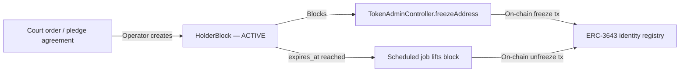

# Germany — Electronic Securities Act (eWpG)

!!! warning "EXTERNAL_REVIEW_REQUIRED"
    This page records intended control mappings and configured assumptions. It is not legal
    advice or evidence of eWpG compliance, regulatory authorisation, certification, or legal
    effect. The register model and authority of each record require an instrument-, operator-,
    service-, transaction-, and deployment-specific decision approved by qualified counsel.

The **Gesetz über elektronische Wertpapiere** (eWpG, BGBl. I 2021 S. 1423) provides a legal framework for electronic securities. Registerwerk contains technical models that may support central-register or crypto-securities-register deployments, but the repository does not establish that either model is legally implemented for a particular instrument.

---

## Key obligations and their implementations

### §4 — Issuer obligations

The issuer of an electronic security must be identifiable and bear legal responsibility for the register entry.

**Repository behavior:** The `Asset` entity stores `issuerId` referencing a `LegalEntity`. KYC/KYB records and approval workflows exist, but issuance and deployment paths do not yet uniformly enforce an approved KYC state. See [KYC & AML](../compliance/kyc-aml.md).

---

### §15 — Central register integrity (Registerführung)

The registry keeper must maintain an accurate, complete, and tamper-proof record of all register entries, transfers, and encumbrances. Records must be retained for **10 years**.

**Implementation:** Every state-mutating operation in Registerwerk emits an `AuditEvent` to the `audit_event` table. The table is:

- Append-only (a PostgreSQL trigger raises an exception on `UPDATE` or `DELETE`)
- Hash-chained (each row stores `entry_hash = SHA-256(prev_hash ‖ payload ‖ sequence_no)`)
- Partitioned by month, with future partitions pre-created automatically

See [Audit Log](../platform/audit-log.md) for the full implementation.

!!! info "10-year retention"
    The `DE_EWPG` jurisdiction profile sets `retentionYears = 10`. Scheduled jobs and the operational runbook document how partition archives are moved to cold storage after the active window but before the retention clock expires.

---

### §16 — Crypto securities register and Sperrvermerk

For tokens on public blockchains, §16 requires a separate "crypto securities register" that:

1. Records each token unit, its holder, and any encumbrances (Sperrvermerk)
2. Has an authority and legal effect that must be determined for the selected register model
3. Supports court-ordered freezes, pledges (Pfandrecht), liens (Pfändung), and succession blocks

**Repository behavior:** Registerwerk currently maintains both database records and selected on-chain state:

- The `asset_holder` table in PostgreSQL is the current application holder record; whether it is the legal register requires an approved instrument-specific authority policy
- The `ChainDriftDetectionJob` runs every 15 minutes to verify on-chain balances match the DB. Detected discrepancies are stored as `chain_drift_event` records and trigger `ChainDriftDetectedEvent` notifications.
- The `holder_block` table implements the Sperrvermerk with block types: `PFANDRECHT`, `PFAENDUNG`, `GERICHTSBESCHLUSS`, `NACHLASSSPERRE`, `VERFUGUNGSVERBOT`, `TOD`, `INSOLVENZ`

See [Sperrvermerk](../compliance/sperrvermerk.md) for the full implementation.

---

### §17 — Transfer of crypto securities

Transfers require both parties to have completed identity verification and the transferor must not have an active `HolderBlock`.

**Intended control mapping:** The following checks require repository verification and instrument-specific legal approval; this list must not be treated as proof that every transfer path is gated:

1. Both issuer and target holder have valid, non-expired KYC (`KycStatus.APPROVED`)
2. No active `HolderBlock` exists for the source holder on the asset in question
3. The operation is authorised by a `REGISTRY_ADMIN` with [step-up](../compliance/step-up-mfa.md) + 4-eyes approval

---

## KryptoFAV — Crypto Securities Regulation

The **Kryptowertpapier-Festlegungs-Verordnung** (KryptoFAV) specifies technical requirements for crypto securities registers. Key requirements and implementations:

| KryptoFAV requirement | Implementation |
|---|---|
| Unique blockchain address per token | `AssetDeployment.contractAddress` — unique constraint |
| Issuer identified by LEI or registration number | `LegalEntity.lei`, `LegalEntity.registrationNumber` |
| Hash of the terms and conditions | `Asset.termsHash` stored at issuance |
| Cryptographic proof of registry entry | Audit hash chain (`audit_event.entry_hash`) |
| Accessibility for BaFin inspection | `AUDITOR` role with full read access; audit export endpoint |

---

## GwG — Anti-Money Laundering

The **Geldwäschegesetz** (GwG) imposes AML obligations on all entities that perform financial services, including securities register operators.

| GwG Provision | Implementation |
|---|---|
| §7 — Compliance officer | `COMPLIANCE_OFFICER` role |
| §10 — CDD (Customer Due Diligence) | [KYC & AML](../compliance/kyc-aml.md) |
| §10(2) — Enhanced DD for PEPs | `NaturalPerson.pepStatus`; enhanced re-screening cadence |
| §10 ongoing monitoring | `KycMonitoringJob` — daily expiry check, annual re-screening |
| §11 — Beneficial owners | `BeneficialOwner` → `NaturalPerson` at ≥25% ownership |
| §6(2) — Internal controls / 4-eyes | [Step-Up MFA & 4-Eyes](../compliance/step-up-mfa.md) |
| §8 — Records retention | 6 years for GwG records; overridden by 10 years for eWpG |

!!! warning "GwG §10 ongoing monitoring"
    KYC approval is valid for 365 days by default. The `KycMonitoringJob` runs daily at 02:00 and flips `APPROVED → EXPIRING` 30 days before expiry, then `APPROVED → EXPIRED` on the expiry date. An expired KYC blocks further token transfers from that holder. See [KYC & AML](../compliance/kyc-aml.md).

---

## BaFin — Supervisory reporting

BaFin is the competent authority for eWpG registry oversight. Registerwerk's [DORA](../compliance/dora.md) incident reporting routes major ICT incidents to BaFin within 24 hours (initial notification) and 72 hours (intermediate report). The [MiFIR](../compliance/mifir.md) integration files daily transaction reports to BaFin's MeldewesenPortal when tokens qualify as MiFID II financial instruments.
