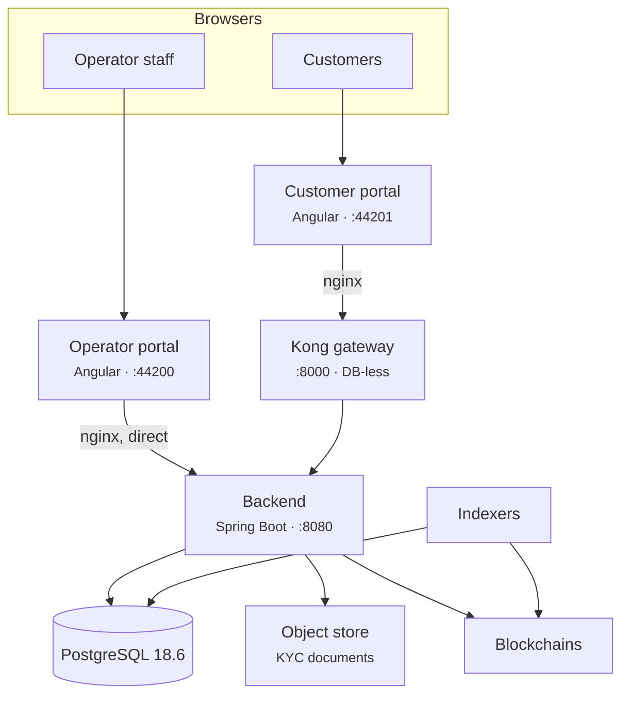
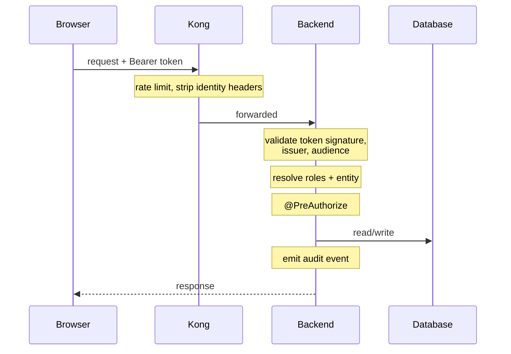

# Wie Registerwerk aufgebaut ist

Sie müssen den Quellcode nicht lesen, um dies zu betreiben. Sie brauchen aber ein mentales Modell, das genau genug ist, dass Sie erraten können, wo Sie nachsehen müssen, wenn etwas kaputtgeht – und wenn ein Kunde ein Symptom beschreibt, können Sie erraten, was es verursacht hat.

Diese Seite ist dieses Modell. [Systemarchitektur](../intro/architecture.md) und [Modularchitektur](../platform/modules.md) sind die technischen Referenzen darunter.

---

## Das Ganze in einem Bild

Sechs Dinge, die man daraus mitnehmen sollte.

### 1. Das Backend entscheidet alles

Jede Regel — wer Sie sind, was Sie tun dürfen, ob eine Übertragung zulässig ist — wird im Backend ausgewertet. Keiner anderen Komponente wird zugetraut, irgendetwas entschieden zu haben.

!!! warning "Das Gateway authentifiziert niemanden"
    Kong bietet Ratenbegrenzung, Antwort-Caching, Sicherheitsheader und CORS. Es **validiert keine Token** und teilt dem Backend nicht mit, wer der Aufrufer ist. Kongs OIDC-Plugin ist eine Enterprise-Funktion und in diesem Stack nicht aktiv.

    Kong *entfernt* außerdem vom Client mitgelieferte Identitätsheader, genau damit niemand einen fälschen kann.

    Sollten Sie Dokumentation gelesen haben, die das Gateway als den Validator beschreibt, der Identitätsheader einfügt, denen das Backend vertraut — diese Beschreibung war falsch und wurde korrigiert. Sie würde Sie zu der Annahme verleiten, dass Datenverkehr, der Kong umgeht, unauthentifiziert ist. Das ist nicht der Fall — das Backend validiert jede Anfrage unabhängig.

### 2. Das Operator-Portal umgeht das Gateway vollständig

Sein nginx leitet `/api/` direkt an das Backend weiter. Das Bedienpersonal nutzt die integrierte Benutzername/Passwort-Anmeldung mit lokalem TOTP für den Step-up, in jeder Konfiguration — auch in Bereitstellungen, in denen sich Kunden mit Microsoft Entra ID anmelden.

**Betriebliche Konsequenz:** Fällt Kong aus, hält das Operatoren nicht von der Arbeit ab. Es stoppt Kunden.

### 3. Ein Backend, eine Datenbank

Das Backend ist ein *Modulith* — ein einsetzbares Artefakt, intern in streng getrennte Module unterteilt, die über Domänenereignisse kommunizieren. Sie erhalten die betriebliche Einfachheit eines Prozesses mit einem Großteil der strukturellen Disziplin von Diensten.

Es gibt genau eine PostgreSQL-Instanz, die eine Datenbank hostet. Kong läuft DB-los, gespeist aus einer deklarativen Konfigurationsdatei.

!!! info "Es gibt keine `kong`- oder `konga`-Datenbank"
    Eine häufige Annahme — und sie ist falsch. Ein Backup von `registerwerk` sichert den gesamten persistenten Zustand außer dem Objektspeicher.

### 4. Das Register und die Chain sind getrennte Aufzeichnungen

Die Datenbank ist maßgeblich für den Bestand. Die Blockchain ist das, was ausführt und was jeder unabhängig überprüfen kann. **Indexer** beobachten die Chains und schreiben zurück, was sie sehen.

**Betriebliche Konsequenz — und das Nützlichste auf dieser Seite:** Wenn ein Kunde sagt „mein Bestand ist falsch", lautet die erste Frage nicht *was ist richtig*, sondern *hinkt ein Indexer hinterher?* Ein nachlaufender Indexer erzeugt genau dieses Symptom und löst sich von selbst, sobald er aufholt. [Indexer-Resilienz](indexers/resilience.md).

### 5. Dokumente liegen außerhalb der Datenbank

KYC-Dokumente gehen an S3-kompatiblen Objektspeicher. Ein Backup der Datenbank sichert nicht die Dokumente. [Backups](maintenance/backups.md).

### 6. Alles, was den Zustand ändert, wird protokolliert

In eine hash-verkettete, zeitpartitionierte `audit_event`-Tabelle. [Audit-Log](../platform/audit-log.md).

!!! danger "Partitionen entstehen nicht von selbst, unbegrenzt"
    Die Audit-Tabelle ist zeitlich partitioniert, und Partitionen werden im Voraus angelegt. Gehen sie aus, **schlagen Schreibvorgänge fehl — was bedeutet, dass zustandsändernde Operationen fehlschlagen**, weil der Audit-Schreibvorgang Teil der Transaktion ist.

    Das ist ein geplanter Ausfall, der nur darauf wartet einzutreten, und er ist unsichtbar, bis er auftritt. Nehmen Sie den Partitionsspielraum in Ihr Monitoring auf. [Monitoring](maintenance/monitoring.md).

---

## Wie eine Kundenanfrage tatsächlich abläuft

Erhält ein Kunde einen **401**, ist der Token fehlerhaft — abgelaufen, falscher Aussteller, falsche Zielgruppe (Audience). Erhält er einen **403**, ist der Token in Ordnung, aber die Rolle nicht. Diese eine Unterscheidung löst einen Großteil der Support-Tickets, bevor Sie sich sonst etwas ansehen.

---

## Authentifizierung, und ihre Weiche

Es gibt einen Schalter mit weitreichenden Folgen: `ENTRA_ENABLED`.

=== "`false` — lokaler Modus"

    Alle nutzen die integrierte Benutzername/Passwort-Anmeldung. Das Backend stellt eigene HS256-Token aus. Kein Zwei-Faktor bei der Anmeldung.

    Das ist die Standardeinstellung und das, was `docker compose up` liefert. Identitätsübernahme (Impersonation) funktioniert.

=== "`true` — Entra-Modus"

    **Kunden** melden sich mit Microsoft Entra ID an, wobei Zwei-Faktor durch Conditional Access erzwungen wird. **Operatoren behalten die integrierte Anmeldung und lokales TOTP.**

    Identitätsübernahme (Impersonation) ist **nicht verfügbar** — das Backend verweigert sie. Siehe [Identitätsübernahme](customers/impersonation.md).

??? note "Für den Spezialisten: wie beide Token-Typen koexistieren"

    Beide Portale erreichen dieselben URLs, sodass pfadbezogene Filterketten sie nicht trennen können. Der Decoder routet stattdessen anhand des JWS-`alg`-Headers: `HS256` geht an den lokalen Decoder, alles andere an den JWKS-Decoder.

    Beide Zweige sind Issuer-gepinnt. Lokale Token tragen `iss: registerwerk-local` und werden ohne dieses Feld abgelehnt — sonst würde jeder mit dem Dev-Secret signierte HS256-Token überall gültig sein. Der Entra-Zweig ist zusätzlich **Audience-gepinnt**, was nicht optional ist: Entra signiert jeden Token eines Mandanten mit denselben Schlüsseln, sodass ohne Audience-Prüfung ein Token, der für *jede andere Anwendung in Ihrem Mandanten* ausgestellt wurde, hier als Registerwerk-Sitzung akzeptiert würde.

    Im Entra-Modus schreibt ein Normalisierungsfilter das `sub`-Feld des Tokens auf die lokale `app_user.id` um, sodass die rund hundert Stellen, die eine Benutzer-ID lesen, korrekt bleiben. Ohne ihn sind `app_user.id` und `sub` unabhängige Werte, und jede `actorId` im Audit-Log ist falsch.

    [:octicons-arrow-right-24: Sicherheit & Authentifizierung](../platform/security.md) · [:octicons-arrow-right-24: Entra-Einrichtung](../platform/entra-setup.md)

---

## Die Kontrollen, nach denen Sie gefragt werden

| Kontrolle | Was es ist | Wo |
|---|---|---|
| **Step-up-Authentifizierung** | Sensible Aktionen verlangen einen erneuten Identitätsnachweis über die Sitzung hinaus. | [Step-up MFA](../compliance/step-up-mfa.md) |
| **Vier-Augen-Prinzip** | Die schärfsten Aktionen benötigen zwei verschiedene Personen. Verwendet in beiden Auth-Modi immer ein lokales Token. | [Step-up MFA](../compliance/step-up-mfa.md) |
| **Fail-Closed-Gates** | Sanktionsprüfung und Berechtigungsprüfungen verweigern, wenn nicht verfügbar. | [Sanktionsprüfung](../compliance/sanctions-screening.md) |
| **Optimistisches Sperren** | Gleichzeitige Bearbeitungen desselben Datensatzes erzeugen einen `409`, kein stilles verlorenes Update. | |
| **Soft Deletes** | Registereinträge werden geschlossen, nie entfernt. | [Audit-Log](../platform/audit-log.md) |

!!! info "Fail-Closed bedeutet: Ausfälle sehen aus wie Ablehnungen"
    Ist der Screening-Anbieter nicht erreichbar, werden Übertragungen **abgelehnt**, nicht ungeprüft durchgelassen. Kunden werden das als Fehler melden. Es ist das System, das funktioniert.

    Zu wissen, welche Komponenten fail-closed sind, macht aus einem verwirrenden Vorfall eine einzeilige Erklärung.

---

## Worauf Sie achten sollten

| | Weil |
|---|---|
| **Audit-Partitionsspielraum** | Erschöpfung stoppt alle Zustandsänderungen. |
| **Indexer-Verzögerung** | Auseinanderlaufende Register- und Chain-Ansichten. |
| **Chain-RPC-Gesundheit** | Bereitstellungen und Übertragungen schlagen ohne sie fehl. |
| **Screening-Verfügbarkeit** | Fail-closed: nicht verfügbar bedeutet, Übertragungen werden abgelehnt. |
| **Datenbankverbindungen** | Das Backend verschiebt seine erste Verbindung bis zur ersten Abfrage, sodass eine defekte Datenbank bis zur ersten Nutzung verborgen bleiben kann. |
| **Zertifikats- und Secret-Ablauf** | Still, bis er es nicht mehr ist. |

[:octicons-arrow-right-24: Monitoring](maintenance/monitoring.md) · [:octicons-arrow-right-24: Service-Level](slo.md) · [:octicons-arrow-right-24: DR-Runbook](dr/runbook.md)

---

## Wo weiter

- [Was ein Operator tut](getting-started.md)
- [Systemarchitektur](../intro/architecture.md) — die technische Referenz
- [Modularchitektur](../platform/modules.md) — interne Struktur
