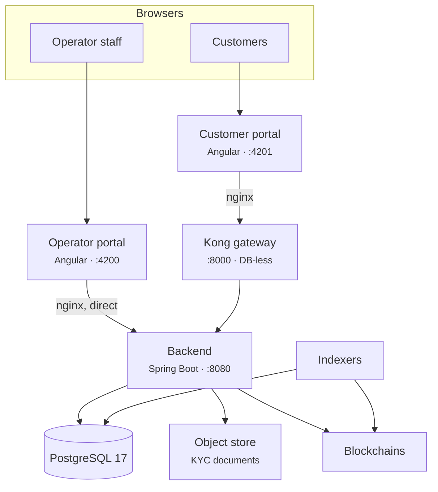
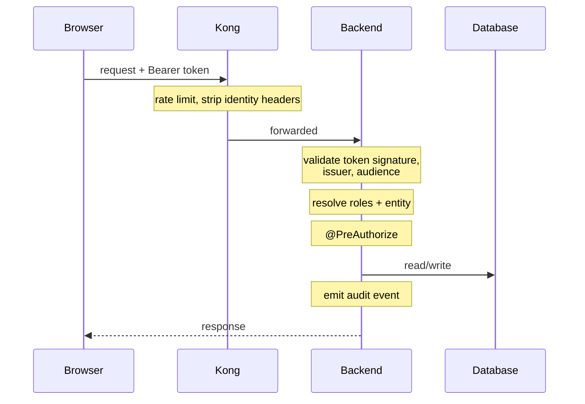

# Cómo se construye Registerwerk { #how-registerwerk-is-built }

No es necesario leer el código fuente para ejecutar esto. Necesita un modelo mental lo suficientemente preciso como para que cuando algo se rompa pueda adivinar dónde buscar y cuando un cliente describa un síntoma pueda adivinar qué lo causó.

Esta página es ese modelo. [Arquitectura del sistema](../intro/architecture.md) y [Arquitectura del módulo](../platform/modules.md) son las referencias de ingeniería que se encuentran debajo.

---

## Todo en una imagen { #the-whole-thing-in-one-picture }

Seis cosas que aprender de esto.

### 1. El backend decide todo { #1-the-backend-decides-everything }

Todas las reglas (quién es usted, qué puede hacer, si se permite una transferencia) se evalúan en el backend. No se confía en que nadie más haya decidido nada.

!!! warning "La puerta de enlace no autentica a nadie"
    Kong proporciona limitación de velocidad, almacenamiento en caché de respuestas, encabezados de seguridad y CORS. **No valida tokens** y no le dice al servidor quién es la persona que llama. El complemento OIDC de Kong es una característica empresarial y no está activo en esta pila.

    Kong también *quita* los encabezados de identidad proporcionados por el cliente, precisamente para que nadie pueda falsificar uno.

    Si ha leído la documentación que describe la puerta de enlace como el validador que inyecta encabezados de identidad en los que confía el backend, esa descripción era incorrecta y se ha corregido. Suponer eso le llevaría a pensar que el tráfico que evita Kong no está autenticado. No lo está: el backend valida de forma independiente, en cada solicitud.

### 2. El portal del operador omite la puerta de enlace por completo { #2-the-operator-portal-bypasses-the-gateway-entirely }

Sus servidores proxy nginx `/api/` van directamente al backend. El personal del operador utiliza el inicio de sesión integrado con nombre de usuario y contraseña con TOTP local para la autenticación reforzada (step-up), en cada configuración, incluidas las implementaciones en las que los clientes inician sesión con Microsoft Entra ID.

**Consecuencia operativa:** La caída de Kong no impide que los operadores trabajen. Detiene a los clientes.

### 3. Un backend, una base de datos { #3-one-backend-one-database }

El backend es un *modulith*: un artefacto implementable, dividido internamente en módulos estrictamente separados que hablan a través de eventos de dominio. Obtiene la simplicidad operativa de un proceso con gran parte de la disciplina estructural de los servicios.

Hay exactamente una instancia de PostgreSQL que aloja una base de datos. Kong ejecuta sin base de datos desde un archivo de configuración declarativo.

!!! info "No existe ninguna base de datos `kong` o `konga`"
    Una suposición frecuente y errónea. Al realizar una copia de seguridad de `registerwerk` se realiza una copia de seguridad de todos los estados persistentes excepto el almacén de objetos.

### 4. El registro y la cadena son registros separados { #4-the-register-and-the-chain-are-separate-records }

La base de datos tiene autoridad para la propiedad. La cadena de bloques es lo que se ejecuta y lo que cualquiera puede verificar de forma independiente. **Los indexadores** observan las cadenas y escriben lo que ven.

**Consecuencia operativa y lo más útil de esta página:** cuando un cliente dice "mi saldo es incorrecto", la primera pregunta no es *cuál es la correcta* sino *¿hay un indexador detrás?* Un indexador rezagado produce exactamente este síntoma y se resuelve solo una vez que se pone al día. [Resiliencia del indexador](indexers/resilience.md).

### 5. Los documentos que se encuentran fuera de la base de datos { #5-documents-live-outside-the-database }

Los documentos KYC van al almacenamiento de objetos compatible con S3. Hacer una copia de seguridad de la base de datos no hace una copia de seguridad de los documentos. [Copias de seguridad](maintenance/backups.md).

### 6. Todo lo que cambia de estado se registra { #6-everything-that-changes-state-is-logged }

En una tabla `audit_event` con cadena hash y partición de tiempo. [Registro de auditoría](../platform/audit-log.md).

!!! danger "Las particiones no se crean indefinidamente"
    La tabla de auditoría se divide por tiempo y las particiones se crean con antelación. Si se agotan, **las escrituras fallan, lo que significa que las operaciones de cambio de estado fallan**, porque la escritura de auditoría es parte de la transacción.

    Esta es una interrupción programada que espera ocurrir y es invisible hasta que se activa. Añada el margen de partición a su monitoreo. [Monitoreo](maintenance/monitoring.md).

---

## Cómo fluye realmente la solicitud de un cliente { #how-a-customer-request-actually-flows }

Si un cliente recibe un **401**, el token es incorrecto: vencido, emisor incorrecto, audiencia incorrecta. Si obtienen un **403**, el token está bien y el rol no. Esa única distinción resuelve una gran cantidad de tickets de soporte antes de mirar cualquier otra cosa.

---

## Autenticación y su bifurcación { #authentication-and-the-fork-in-it }

Hay un cambio con amplias consecuencias: `ENTRA_ENABLED`.

=== "`false` — modo local"

    Todo el mundo utiliza el inicio de sesión integrado con nombre de usuario y contraseña. El backend acuña sus propios tokens HS256. No hay segundo factor al iniciar sesión.

    Este es el valor predeterminado y lo que le ofrece `docker compose up`. La suplantación funciona.

=== "`true` — modo Entra"

    **Los clientes** inician sesión con Microsoft Entra ID, con doble factor exigido por acceso condicional. **Los operadores mantienen el inicio de sesión integrado y el TOTP local.**

    La suplantación **no está disponible**: el backend la rechaza. Ver [Suplantación](customers/impersonation.md).

??? note "Para el especialista: cómo coexisten ambos tipos de tokens"

    Ambos portales acceden a las mismas URL, por lo que las cadenas de filtros con alcance de ruta no pueden separarlos. En su lugar, el decodificador se enruta según el encabezado JWS `alg`: `HS256` va al decodificador local, cualquier otra cosa al decodificador JWKS.

    Ambas ramas están fijadas por el emisor. Los tokens locales llevan `iss: registerwerk-local` y se rechazan sin él; de lo contrario, cualquier token HS256 firmado con el secreto de desarrollo se validaría en cualquier lugar. La rama de Entra además está **fijada por audiencia**, lo cual no es opcional: Entra firma cada token de un inquilino con las mismas claves, por lo que sin una verificación de audiencia, un token emitido para *cualquier otra aplicación de su inquilino* sería aceptado aquí como una sesión de Registerwerk.

    En modo Entra, un filtro de normalización reescribe el `sub` del token con el `app_user.id` local, de modo que el centenar largo de lugares que leen un id de usuario siguen siendo correctos. Sin él, `app_user.id` y `sub` son valores no relacionados y cada `actorId` de auditoría es incorrecto.

    [:octicons-arrow-right-24: Seguridad y autenticación](../platform/security.md) · [:octicons-arrow-right-24: Configuración de Entra](../platform/entra-setup.md)

---

## Los controles sobre los que se le preguntará { #the-controls-you-will-be-asked-about }

| Control | Qué es | Dónde |
|---|---|---|
| **Autenticación reforzada** | Las acciones sensibles exigen nuevas pruebas de identidad más allá de la sesión. | [Step-up MFA](../compliance/step-up-mfa.md) |
| **Cuatro ojos** | Las acciones más delicadas necesitan a dos personas distintas. Siempre usa un token local, en ambos modos de autenticación. | [Step-up MFA](../compliance/step-up-mfa.md) |
| **Denegación por defecto (fail closed)** | La evaluación de sanciones y las verificaciones de permisos se rechazan cuando no están disponibles. | [Detección de sanciones](../compliance/sanctions-screening.md) |
| **Bloqueo optimista** | Las ediciones simultáneas en el mismo registro producen un `409`, no una actualización perdida silenciosa. | |
| **Eliminaciones lógicas** | Las entradas del registro se cierran, nunca se eliminan. | [Registro de auditoría](../platform/audit-log.md) |

!!! info "La denegación por defecto hace que las caídas parezcan rechazos"
    Cuando no se puede localizar al proveedor de evaluación, las transferencias se **rechazan**, no se permiten sin evaluar. Los clientes informarán esto como un error. Es el sistema funcionando correctamente.

    Saber qué componentes deniegan por defecto convierte un incidente confuso en una explicación de una sola línea.

---

## Qué mirar { #what-to-watch }

| | Porque |
|---|---|
| **Margen de partición de auditoría** | El agotamiento detiene todos los cambios de estado. |
| **Retraso del indexador** | Vistas divergentes de registros y cadenas. |
| **Salud de la cadena RPC** | Las implementaciones y transferencias fracasan sin él. |
| **Disponibilidad de la evaluación de sanciones** | Denegación por defecto: no disponible significa transferencias rechazadas. |
| **Conexiones de base de datos** | El backend pospone su primera conexión hasta la primera consulta, por lo que una base de datos rota puede ocultarse hasta el primer uso. |
| **Caducidad de certificados y secretos** | Silencio hasta que ya no lo sea. |

[:octicons-arrow-right-24: Monitoreo](maintenance/monitoring.md) · [:octicons-arrow-right-24: Niveles de servicio](slo.md) · [:octicons-arrow-right-24: DR runbook](dr/runbook.md)

---

## Dónde siguiente { #where-next }

- [Qué hace un operador](getting-started.md)
- [Arquitectura del sistema](../intro/architecture.md) — la referencia de ingeniería
- [Arquitectura del módulo](../platform/modules.md) — estructura interna
