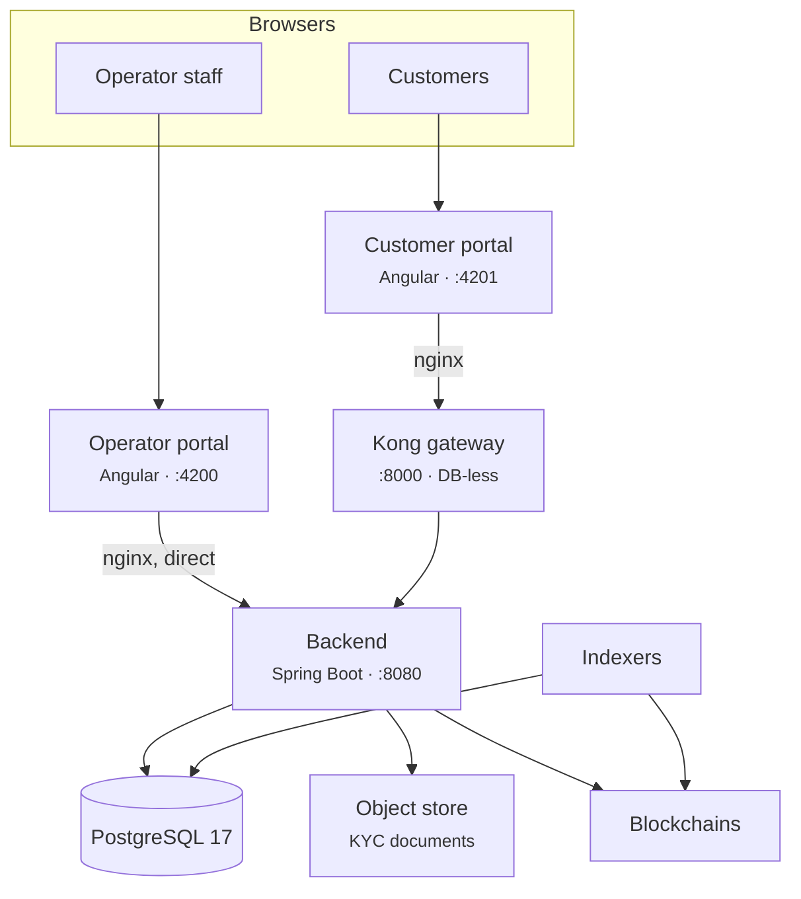
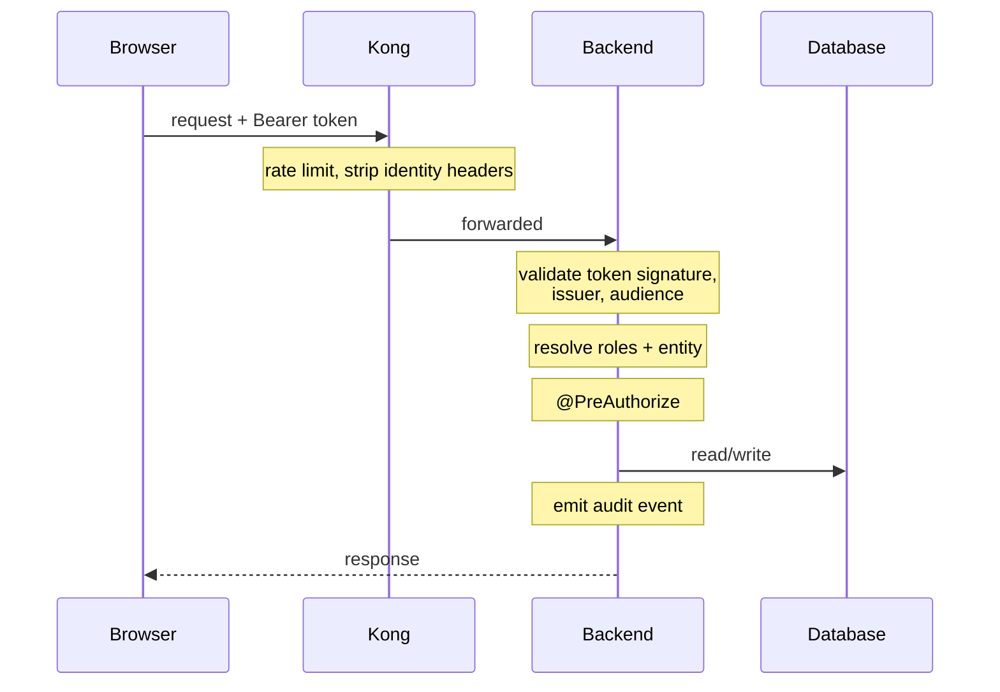

# Comment Registerwerk est construit

Vous n'avez pas besoin de lire la source pour l'exécuter. Vous avez besoin d'un modèle mental suffisamment précis pour que, lorsque quelque chose se brise, vous puissiez deviner où chercher, et lorsqu'un client décrit un symptôme, vous puissiez en deviner la cause.

Cette page est ce modèle. [Architecture du système](../intro/architecture.md) et [Architecture du module](../platform/modules.md) sont les références d'ingénierie en dessous.

---

## Le tout dans une seule image

Six choses à en tirer.

### 1. Le backend décide de tout

Chaque règle – qui vous êtes, ce que vous pouvez faire, si un transfert est autorisé – est évaluée dans le backend. On ne peut faire confiance à rien d'autre pour décider quoi que ce soit.

!!! warning "La passerelle n'authentifie personne"
    Kong fournit une limitation de débit, une mise en cache des réponses, des en-têtes de sécurité et CORS. Il **ne valide pas les jetons** et n'indique pas au backend qui est l'appelant. Le plugin OIDC de Kong est une fonctionnalité Enterprise et n'est pas actif dans cette pile.

    Kong *supprime également* les en-têtes d'identité fournis par le client, précisément pour que personne ne puisse en forger un.

    Si vous avez lu de la documentation décrivant la passerelle comme le validateur qui injecte des en-têtes d'identité auxquels le backend fait confiance, cette description était fausse et a été corrigée. Le supposer vous amènerait à penser que le trafic contournant Kong n'est pas authentifié. Ce n'est pas le cas — le backend valide indépendamment, à chaque requête.

### 2. Le portail de l'opérateur contourne entièrement la passerelle

Son nginx redirige `/api/` directement vers le backend. Le personnel de l'opérateur utilise la connexion intégrée par nom d'utilisateur/mot de passe avec TOTP local pour l'authentification renforcée (step-up), dans chaque configuration, y compris les déploiements où les clients se connectent avec Microsoft Entra ID.

**Conséquence opérationnelle :** L'arrêt de Kong n'empêche pas les opérateurs de travailler. Il arrête les clients.

### 3. Un backend, une base de données

Le backend est un *modulith* — un artefact déployable, divisé en interne en modules strictement séparés qui communiquent à travers les événements de domaine. Vous obtenez la simplicité opérationnelle d'un processus avec une grande partie de la discipline structurelle des services.

Il existe exactement une instance PostgreSQL, hébergeant une base de données. Kong fonctionne sans base de données (DB-less) à partir d'un fichier de configuration déclaratif.

!!! info "Il n'existe pas de base de données `kong` ou `konga`"
    Une hypothèse fréquente, et elle est fausse. La sauvegarde de `registerwerk` sauvegarde tous les états persistants à l'exception du magasin d'objets.

### 4. Le registre et la chaîne sont des enregistrements distincts

La base de données fait autorité en matière de propriété. La blockchain est ce qui s'exécute et ce que chacun peut vérifier de manière indépendante. Les **indexeurs** surveillent les chaînes et écrivent ce qu'ils voient en retour.

**Conséquence opérationnelle, et la chose la plus utile sur cette page :** lorsqu'un client dit "mon solde est erroné", la première question n'est pas *qu'est-ce qui est juste* mais *un indexeur est-il derrière ?* Un indexeur en retard produit exactement ce symptôme et se résout une fois qu'il rattrape son retard. [Résilience de l'indexeur](indexers/resilience.md).

### 5. Les documents vivent en dehors de la base de données

Les documents KYC vont dans un espace de stockage d'objets compatible S3. La sauvegarde de la base de données ne sauvegarde pas les documents. [Sauvegardes](maintenance/backups.md).

### 6. Tout ce qui change d'état est enregistré

Dans une table `audit_event` chaînée par hachage et partitionnée dans le temps. [Journal d'audit](../platform/audit-log.md).

!!! danger "Les partitions ne se créent pas indéfiniment elles-mêmes"
    La table d'audit est partitionnée dans le temps et les partitions sont créées à l'avance. S'ils sont épuisés, **les écritures échouent — ce qui signifie que les opérations de changement d'état échouent**, car l'écriture d'audit fait partie de la transaction.

    Il s'agit d'une panne planifiée qui vous attend, invisible jusqu'à ce qu'elle se déclenche. Prévoyez une marge de partitions dans votre surveillance. [Monitoring](maintenance/monitoring.md).

---

## Comment circule réellement une demande client

Si un client obtient un **401**, le jeton est mauvais : expiré, mauvais émetteur, mauvaise audience. S'ils obtiennent un **403**, le jeton est correct et le rôle ne l'est pas. Cette seule distinction résout une grande partie des tickets d'assistance avant de regarder quoi que ce soit d'autre.

---

## L'authentification et le fork qu'elle contient

Il existe un commutateur aux conséquences considérables : `ENTRA_ENABLED`.

=== "`false` — mode local"

    Tout le monde utilise l'identifiant/mot de passe intégré. Le backend crée ses propres jetons HS256. Pas d'authentification à deux facteurs (2FA) à la connexion.

    Il s'agit de la valeur par défaut, celle que vous obtenez avec `docker compose up`. Le mode support (impersonation) fonctionne.

=== "`true` — Mode Entra"

    **Les clients** se connectent avec Microsoft Entra ID, avec l'authentification à deux facteurs imposée par l'accès conditionnel. **Les opérateurs conservent la connexion intégrée et le TOTP local.**

    Le mode support est **indisponible** — le backend le refuse. Voir [Mode support](customers/impersonation.md).

??? note "Pour le spécialiste : comment les deux types de jetons coexistent"

    Les deux portails accèdent aux mêmes URL, de sorte que les chaînes de filtres à portée de chemin ne peuvent pas les séparer. Le décodeur s'appuie plutôt sur l'en-tête JWS `alg` : `HS256` va au décodeur local, tout le reste au décodeur JWKS.

    Les deux branches sont épinglées par l'émetteur (issuer-pinned). Les jetons locaux portent `iss: registerwerk-local` et sont rejetés sans cela — sinon tout jeton HS256 signé avec le secret de développement serait validé n'importe où. La branche Entra est en outre **épinglée par l'audience**, ce qui n'est pas facultatif : Entra signe chaque jeton d'un tenant avec les mêmes clés, donc sans contrôle d'audience, un jeton émis à *toute autre application de votre tenant* serait accepté ici comme une session Registerwerk.

    En mode Entra, un filtre de normalisation réécrit le `sub` du jeton vers l'`app_user.id` local, de sorte que la centaine d'endroits qui lisent un identifiant utilisateur restent corrects. Sans cela, `app_user.id` et `sub` sont des valeurs sans rapport et chaque `actorId` d'audit est erroné.

[:octicons-arrow-right-24: Sécurité et authentification](../platform/security.md) · [:octicons-arrow-right-24: Configuration Entra](../platform/entra-setup.md)

---

## Les commandes qui vous seront demandées

| Contrôle | Qu'est-ce que c'est | Où |
|---|---|---|
| **Authentification renforcée** | Les actions sensibles nécessitent une nouvelle preuve d'identité au-delà de la session. | [Authentification renforcée (MFA)](../compliance/step-up-mfa.md) |
| **Quatre yeux** | Les actions les plus pointues nécessitent deux personnes différentes. Utilise toujours un jeton local, dans les deux modes d'authentification. | [Authentification renforcée (MFA)](../compliance/step-up-mfa.md) |
| **Rejet par défaut (fail closed)** | Le contrôle des sanctions et les vérifications de permissions sont refusés lorsqu'ils ne sont pas disponibles. | [Contrôle des sanctions](../compliance/sanctions-screening.md) |
| **Verrouillage optimiste** | Les modifications simultanées du même enregistrement produisent un `409`, et non une mise à jour silencieuse perdue. | |
| **Suppressions logicielles** | Les inscriptions au registre sont fermées, jamais supprimées. | [Journal d'audit](../platform/audit-log.md) |

!!! info "Le rejet par défaut fait qu'une panne ressemble à un refus"
    Lorsque le prestataire de filtrage est injoignable, les transferts sont **refusés**, pas autorisés sans contrôle. Les clients signaleront cela comme un bug. C'est le système qui fonctionne comme prévu.

    Savoir quels composants fonctionnent en rejet par défaut transforme un incident déroutant en une explication en une seule ligne.

---

## Que surveiller

| | Parce que |
|---|---|
| **Marge de partition d'audit** | L'épuisement arrête tous les changements d'état. |
| **Décalage de l'indexeur** | Vues divergentes du registre et de la chaîne. |
| **Santé du RPC de la chaîne** | Les déploiements et les transferts échouent sans cela. |
| **Disponibilité du filtrage des sanctions** | Fail-closed : indisponible signifie transferts refusés. |
| **Connexions à la base de données** | Le backend diffère sa première connexion jusqu'à la première requête, afin qu'une base de données cassée puisse se cacher jusqu'à la première utilisation. |
| **Certificat et expiration du secret** | Silencieux jusqu'à ce que ce ne soit plus le cas. |

[:octicons-arrow-right-24: Monitoring](maintenance/monitoring.md) · [:octicons-arrow-right-24: Niveaux de service](slo.md) · [:octicons-arrow-right-24: Runbook DR](dr/runbook.md)

---

## Où suivant

- [Ce que fait un opérateur](getting-started.md)
- [Architecture du système](../intro/architecture.md) — la référence d'ingénierie
- [Architecture du module](../platform/modules.md) — structure interne
