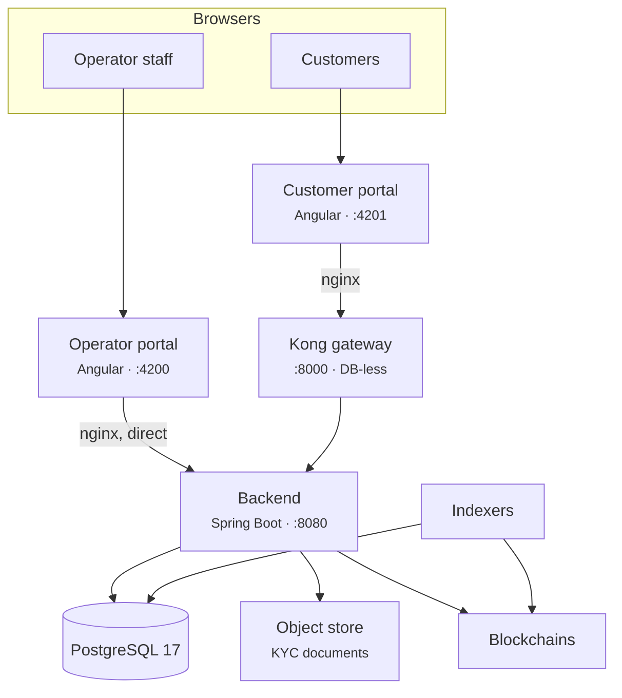
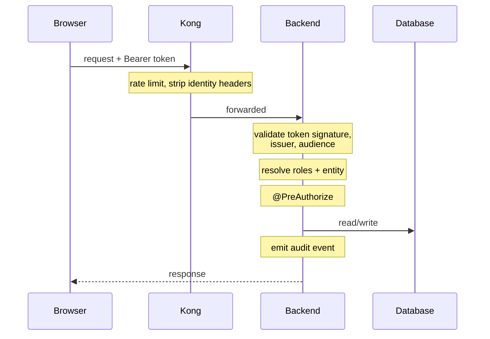

# Come è costruito Registerwerk { #how-registerwerk-is-built }

Non è necessario leggere il sorgente per eseguirlo. Hai bisogno di un modello mentale sufficientemente accurato in modo che quando qualcosa si rompe tu possa indovinare dove guardare e quando un cliente descrive un sintomo puoi indovinare cosa lo ha causato.

Questa pagina è quel modello. [Architettura del sistema](../intro/architecture.md) e [Architettura del modulo](../platform/modules.md) sono i riferimenti tecnici sottostanti.

---

## Tutto in un'immagine { #the-whole-thing-in-one-picture }

Sei cose da imparare.

### 1. Il backend decide tutto { #1-the-backend-decides-everything }

Ogni regola (chi sei, cosa puoi fare, se un trasferimento è consentito) viene valutata nel backend. Non si ritiene che nient'altro abbia deciso nulla.

!!! warning "Il gateway non autentica nessuno"
    Kong fornisce limitazione della velocità, memorizzazione nella cache delle risposte, intestazioni di sicurezza e CORS. **Non convalida i token** e non dice al backend chi è il chiamante. Il plugin OIDC di Kong è una funzionalità Enterprise e non è attivo in questo stack.

    Kong inoltre *rimuove* le intestazioni di identità fornite dal client, proprio in modo che nessuno possa falsificarne una.

    Se hai letto documentazione che descrive il gateway come il validatore che inietta le intestazioni di identità di cui il backend si fida, quella descrizione era sbagliata ed è stata corretta. Darla per buona ti porterebbe a pensare che il traffico che aggira Kong non sia autenticato. Non è così: il backend convalida in modo indipendente ogni singola richiesta.

### 2. Il portale dell'operatore bypassa completamente il gateway { #2-the-operator-portal-bypasses-the-gateway-entirely }

Il suo nginx inoltra `/api/` direttamente al backend. Il personale dell'operatore utilizza il login integrato con nome utente/password e TOTP locale per lo step-up, in ogni configurazione — comprese le distribuzioni in cui i clienti accedono con Microsoft Entra ID.

**Conseguenza operativa:** L'inattività di Kong non impedisce agli operatori di lavorare. Ferma i clienti.

### 3. Un backend, un database { #3-one-backend-one-database }

Il backend è un *modulith*: un artefatto distribuibile, suddiviso internamente in moduli rigorosamente separati che comunicano attraverso gli eventi del dominio. Ottieni la semplicità operativa di un processo con gran parte della disciplina strutturale dei servizi.

Esiste esattamente un'istanza PostgreSQL che ospita un database. Kong esegue DB-less da un file di configurazione dichiarativo.

!!! info "Non esiste un database `kong` o `konga`"
    Un'ipotesi frequente, ed è sbagliata. Il backup di `registerwerk` esegue il backup di tutto lo stato persistente tranne l'archivio oggetti.

### 4. Il registro e la catena sono record separati { #4-the-register-and-the-chain-are-separate-records }

Il database è autorevole per la proprietà. La blockchain è ciò che esegue e ciò che chiunque può verificare in modo indipendente. **Gli indicizzatori** osservano le catene e scrivono ciò che vedono.

**Conseguenza operativa e la cosa più utile in questa pagina:** quando un cliente dice "il mio saldo è sbagliato", la prima domanda non è *quale è giusto* ma *c'è un indicizzatore indietro?* Un indicizzatore in ritardo produce esattamente questo sintomo e si risolve da solo una volta recuperato. [Resilienza dell'indicizzatore](indexers/resilience.md).

### 5. I documenti risiedono all'esterno del database { #5-documents-live-outside-the-database }

I documenti KYC vanno in uno storage di oggetti compatibile con S3. Il backup del database non esegue il backup dei documenti. [Backup](maintenance/backups.md).

### 6. Tutto ciò che cambia stato viene registrato { #6-everything-that-changes-state-is-logged }

In una tabella `audit_event` concatenata tramite hash e partizionata nel tempo. [Pista di controllo](../platform/audit-log.md).

!!! danger "Le partizioni non si creano da sole all'infinito"
    La tabella di controllo è partizionata in base al tempo e le partizioni vengono create in anticipo. Se si esauriscono, **le scritture falliscono, il che significa che le operazioni di modifica dello stato falliscono**, perché la scrittura sulla pista di controllo fa parte della transazione.

    Si tratta di un'interruzione pianificata in attesa di verificarsi, invisibile finché non si attiva. Tieni sotto monitoraggio il margine di partizioni disponibili. [Monitoraggio](maintenance/monitoring.md).

---

## Come scorre effettivamente la richiesta di un cliente { #how-a-customer-request-actually-flows }

Se un cliente riceve un **401**, il token non è valido — scaduto, emittente errato, audience errata. Se ottiene un **403**, il token va bene, il ruolo no. Questa singola distinzione risolve gran parte dei ticket di supporto prima ancora di guardare qualsiasi altra cosa.

---

## Autenticazione e il suo fork { #authentication-and-the-fork-in-it }

Esiste un interruttore con ampie conseguenze: `ENTRA_ENABLED`.

=== "`false` — modalità locale"

    Tutti utilizzano il login integrato con nome utente/password. Il backend conia i propri token HS256. Nessuna autenticazione a due fattori all'accesso.

    È l'impostazione predefinita, quella che ottieni con `docker compose up`. La modalità supporto (impersonation) funziona.

=== "`true` — modalità Entra"

    **I clienti** accedono con Microsoft Entra ID, con l'autenticazione a due fattori imposta da Conditional Access. **Gli operatori mantengono il login integrato e il TOTP locale.**

    La modalità supporto (impersonation) **non è disponibile**: il backend la rifiuta. Vedi [Modalità supporto](customers/impersonation.md).

??? note "Per lo specialista: come coesistono entrambi i tipi di token"

    Entrambi i portali chiamano gli stessi URL, quindi le catene di filtri con ambito sul percorso non possono separarli. Il decodificatore si instrada invece in base all'intestazione JWS `alg`: `HS256` va al decodificatore locale, qualsiasi altro valore al decodificatore JWKS.

    Entrambi i rami sono ancorati all'emittente (issuer-pinned). I token locali portano `iss: registerwerk-local` e vengono rifiutati senza di esso — altrimenti qualsiasi token HS256 firmato con il segreto di sviluppo verrebbe convalidato ovunque. Il ramo Entra è inoltre **ancorato all'audience**, il che non è facoltativo: Entra firma ogni token per un tenant con le stesse chiavi, quindi senza un controllo dell'audience un token rilasciato a *qualsiasi altra applicazione del tuo tenant* verrebbe accettato qui come sessione Registerwerk.

    In modalità Entra un filtro di normalizzazione riscrive lo `sub` del token nell'`app_user.id` locale, così i circa cento punti che leggono un id utente restano corretti. Senza di esso, `app_user.id` e `sub` sono valori scorrelati e ogni `actorId` della pista di controllo risulta sbagliato.

    [:octicons-arrow-right-24: Sicurezza e autenticazione](../platform/security.md) · [:octicons-arrow-right-24: Configurazione di Entra](../platform/entra-setup.md)

---

## I controlli che ti verranno chiesti { #the-controls-you-will-be-asked-about }

| Controllo | Cos'è | Dove |
|---|---|---|
| **Autenticazione rafforzata (step-up)** | Le azioni sensibili richiedono una nuova prova di identità al di là della sessione. | [Step-up MFA](../compliance/step-up-mfa.md) |
| **Quattro occhi** | Le azioni più delicate richiedono due persone diverse. Usa sempre un token locale, in entrambe le modalità di autenticazione. | [Step-up MFA](../compliance/step-up-mfa.md) |
| **Rifiuto in caso di errore (fail closed)** | Lo screening sanzioni e i controlli dei permessi rifiutano quando non sono disponibili. | [Screening sanzioni](../compliance/sanctions-screening.md) |
| **Blocco ottimistico** | Le modifiche simultanee allo stesso record producono un `409`, non un aggiornamento perso in silenzio. | |
| **Eliminazioni soft** | Le voci di registro vengono chiuse, mai rimosse. | [Pista di controllo](../platform/audit-log.md) |

!!! info "Fail closed significa che le interruzioni sembrano rifiuti"
    Quando il fornitore dello screening non è raggiungibile, i trasferimenti vengono **rifiutati**, non lasciati passare senza controllo. I clienti lo segnaleranno come un bug. È il sistema che funziona correttamente.

    Sapere quali componenti adottano il fail closed trasforma un incidente confuso in una spiegazione di una sola riga.

---

## Cosa monitorare { #what-to-watch }

| | Perché |
|---|---|
| **Margine delle partizioni della pista di controllo** | L'esaurimento blocca tutte le modifiche di stato. |
| **Ritardo dell'indicizzatore** | Registro e vista sulla catena che divergono. |
| **Salute dell'RPC della catena** | Distribuzioni e trasferimenti falliscono senza di essa. |
| **Disponibilità dello screening** | Fail-closed: non disponibile significa trasferimenti rifiutati. |
| **Connessioni al database** | Il backend rinvia la sua prima connessione fino alla prima query, quindi un database danneggiato può nascondersi fino al primo utilizzo. |
| **Scadenza di certificati e segreti** | Silenzioso finché non lo è più. |

[:octicons-arrow-right-24: Monitoraggio](maintenance/monitoring.md) · [:octicons-arrow-right-24: Livelli di servizio](slo.md) · [:octicons-arrow-right-24: DR runbook](dr/runbook.md)

---

## Passi successivi { #where-next }

- [Cosa fa un operatore](getting-started.md)
- [Architettura del sistema](../intro/architecture.md) — il riferimento tecnico
- [Architettura del modulo](../platform/modules.md) — struttura interna
