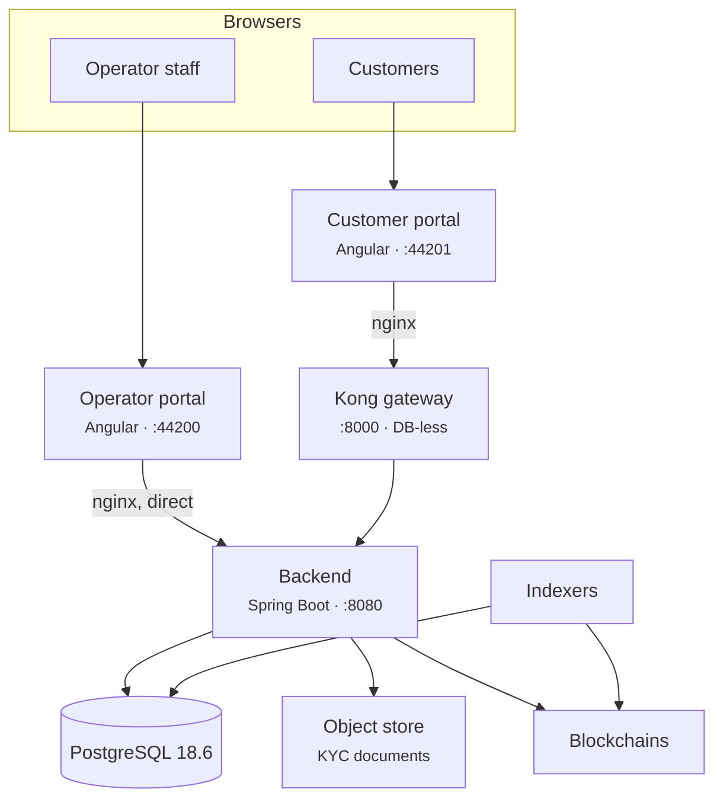
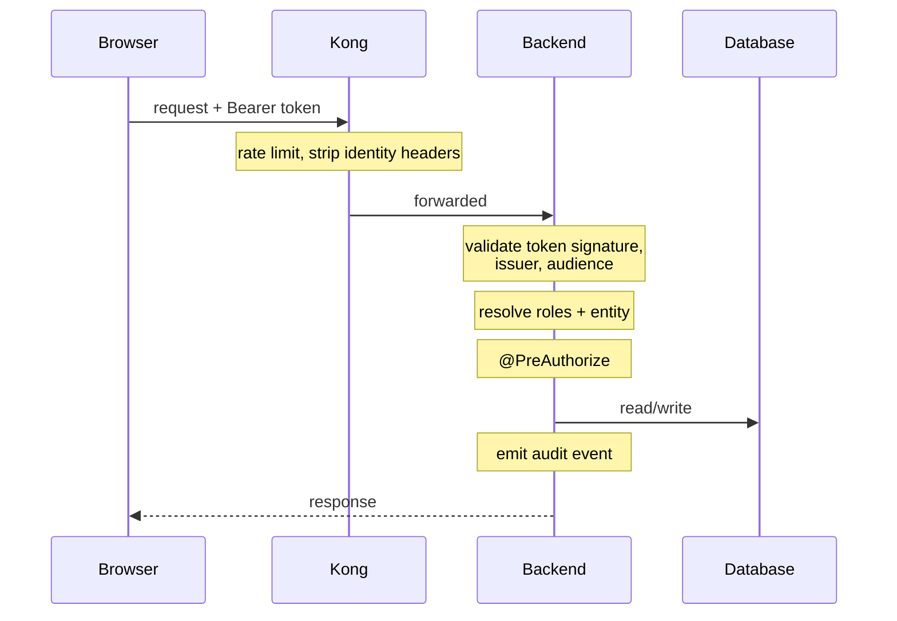

# How Registerwerk is built

You do not need to read the source to run this. You do need a mental model accurate enough that when something breaks you can guess where to look, and when a customer describes a symptom you can guess what caused it.

This page is that model. [System architecture](../intro/architecture.md) and [Module architecture](../platform/modules.md) are the engineering references beneath it.

---

## The whole thing in one picture

Six things to take from it.

### 1. The backend decides everything

Every rule — who you are, what you may do, whether a transfer is allowed — is evaluated in the backend. Nothing else is trusted to have decided anything.

!!! warning "The gateway does not authenticate anyone"
    Kong provides rate limiting, response caching, security headers and CORS. It **does not validate tokens** and it does not tell the backend who the caller is. Kong's OIDC plugin is an Enterprise feature and is not active in this stack.

    Kong also *strips* client-supplied identity headers, precisely so nobody can forge one.

    If you have read documentation describing the gateway as the validator that injects identity headers the backend trusts, that description was wrong and has been corrected. Assuming it would lead you to think traffic bypassing Kong is unauthenticated. It is not — the backend validates independently, every request.

### 2. The operator portal bypasses the gateway entirely

Its nginx proxies `/api/` straight to the backend. Operator staff use built-in username/password login with local TOTP for step-up, in every configuration — including deployments where customers sign in with Microsoft Entra ID.

**Operational consequence:** Kong being down does not stop operators working. It stops customers.

### 3. One backend, one database

The backend is a *modulith* — one deployable artefact, internally divided into strictly separated modules that talk through domain events. You get the operational simplicity of one process with much of the structural discipline of services.

There is exactly one PostgreSQL instance, hosting one database. Kong runs DB-less from a declarative config file.

!!! info "There is no `kong` or `konga` database"
    A frequent assumption, and it is wrong. Backing up `registerwerk` backs up all persistent state except the object store.

### 4. The register and the chain are separate records

The database is authoritative for ownership. The blockchain is what executes and what anyone can independently verify. **Indexers** watch the chains and write what they see back.

**Operational consequence, and the single most useful thing on this page:** when a customer says "my balance is wrong", the first question is not *which is right* but *is an indexer behind?* A lagging indexer produces exactly this symptom and resolves itself once it catches up. [Indexer resilience](indexers/resilience.md).

### 5. Documents live outside the database

KYC documents go to S3-compatible object storage. Backing up the database does not back up the documents. [Backups](maintenance/backups.md).

### 6. Everything that changes state is logged

Into a hash-chained, time-partitioned `audit_event` table. [Audit log](../platform/audit-log.md).

!!! danger "Partitions do not create themselves indefinitely"
    The audit table is partitioned by time and partitions are created ahead. If they run out, **writes fail — which means state-changing operations fail**, because the audit write is part of the transaction.

    This is a scheduled outage waiting to happen and it is invisible until it fires. Put partition headroom on your monitoring. [Monitoring](maintenance/monitoring.md).

---

## How a customer request actually flows

If a customer gets a **401**, the token is bad — expired, wrong issuer, wrong audience. If they get a **403**, the token is fine and the role is not. That single distinction resolves a large share of support tickets before you look at anything else.

---

## Authentication, and the fork in it

There is one switch with wide consequences: `ENTRA_ENABLED`.

=== "`false` — local mode"

    Everyone uses built-in username/password login. The backend mints its own HS256 tokens. No two-factor at sign-in.

    This is the default, and what `docker compose up` gives you. Impersonation works.

=== "`true` — Entra mode"

    **Customers** sign in with Microsoft Entra ID, with two-factor enforced by Conditional Access. **Operators keep built-in login and local TOTP.**

    Impersonation is **unavailable** — the backend refuses it. See [Impersonation](customers/impersonation.md).

??? note "For the specialist: how both token types coexist"

    Both portals hit the same URLs, so path-scoped filter chains cannot separate them. The decoder routes on the JWS `alg` header instead: `HS256` goes to the local decoder, anything else to the JWKS decoder.

    Both branches are issuer-pinned. Local tokens carry `iss: registerwerk-local` and are rejected without it — otherwise any HS256 token signed with the dev secret would validate anywhere. The Entra branch is additionally **audience-pinned**, which is not optional: Entra signs every token for a tenant with the same keys, so without an audience check a token issued to *any other application in your tenant* would be accepted here as a Registerwerk session.

    In Entra mode a normalisation filter rewrites the token's `sub` to the local `app_user.id`, so the roughly one hundred places that read a user id stay correct. Without it, `app_user.id` and `sub` are unrelated values and every audit `actorId` is wrong.

    [:octicons-arrow-right-24: Security & authentication](../platform/security.md) · [:octicons-arrow-right-24: Entra setup](../platform/entra-setup.md)

---

## The controls you will be asked about

| Control | What it is | Where |
|---|---|---|
| **Step-up authentication** | Sensitive actions demand fresh proof of identity beyond the session. | [Step-up MFA](../compliance/step-up-mfa.md) |
| **Four eyes** | The sharpest actions need two different people. Always uses a local token, in both auth modes. | [Step-up MFA](../compliance/step-up-mfa.md) |
| **Fail-closed gates** | Sanctions screening and permission checks refuse when unavailable. | [Sanctions screening](../compliance/sanctions-screening.md) |
| **Optimistic locking** | Concurrent edits to the same record produce a `409`, not a silent lost update. | |
| **Soft deletes** | Register entries are closed, never removed. | [Audit log](../platform/audit-log.md) |

!!! info "Fail-closed means outages look like refusals"
    When the screening provider is unreachable, transfers are **refused**, not allowed through unscreened. Customers will report this as a bug. It is the system working.

    Knowing which components fail closed turns a confusing incident into a one-line explanation.

---

## What to watch

| | Because |
|---|---|
| **Audit partition headroom** | Exhaustion stops all state changes. |
| **Indexer lag** | Diverging register and chain views. |
| **Chain RPC health** | Deployments and transfers fail without it. |
| **Screening availability** | Fail-closed: unavailable means transfers refused. |
| **Database connections** | The backend defers its first connection until the first query, so a broken database can hide until first use. |
| **Certificate and secret expiry** | Silent until it is not. |

[:octicons-arrow-right-24: Monitoring](maintenance/monitoring.md) · [:octicons-arrow-right-24: Service levels](slo.md) · [:octicons-arrow-right-24: DR runbook](dr/runbook.md)

---

## Where next

- [What an operator does](getting-started.md)
- [System architecture](../intro/architecture.md) — the engineering reference
- [Module architecture](../platform/modules.md) — internal structure
