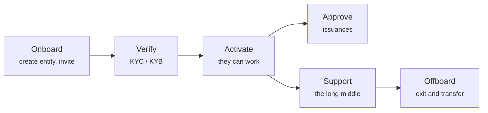

# Kunden betreuen

Der größte Teil der Arbeit eines Betreibers ist keine Infrastruktur. Es sind Menschen: sie hereinlassen, prüfen, wer sie sind, genehmigen, was sie vorhaben, und helfen, wenn etwas schiefgeht.

---

## Der Bogen

-   **[Einen Kunden aufnehmen](onboarding-flow.md)**

    ---

    Den Rechtsträger anlegen, eine einmalige Einladung ausstellen und was geschieht, wenn er sie einlöst.

-   **[KYC prüfen](kyc-process.md)**

    ---

    Feststellen, mit wem Sie es zu tun haben. Das Tor, hinter dem alles andere wartet.

-   **[Eine Emission genehmigen](approving-issuances.md)**

    ---

    Die Entscheidung, die ein Wertpapier ins Dasein bringt.

-   **[Identitätsübernahme](impersonation.md)**

    ---

    Genau sehen, was ein Kunde sieht — bei voller Zurechnung jeder Handlung an Sie.

-   **[Zwei-Faktor-Support](two-factor-support.md)**

    ---

    Das Handbuch für den Fall „Telefon verloren" — und warum Sie nicht einfach einen neuen QR-Code schicken können.

-   **[Offboarding](offboarding.md)**

    ---

    Ordentlich ausscheiden: Registerübertragung, Portfolio-Migration und was aufbewahrt werden muss.

-   **[Rollen und Berechtigungen](roles.md)**

    ---

    Wer was darf — und woher Rollen tatsächlich kommen.

---

## Drei Grundsätze, die Ärger ersparen

!!! tip "Immer erst verifizieren, dann aktivieren"
    Die Versuchung, einen Kunden schon einrichten zu lassen, während das KYC noch läuft, ist groß — besonders, wenn ein großer Kunde wartet.

    Widerstehen Sie ihr. Ein nicht verifizierter Rechtsträger, der bereits Emissionen angelegt und Anleger zugelassen hat, ist weit schwerer rückabzuwickeln als einer, der gewartet hat. Das Tor besteht genau deshalb, damit die teuren Dinge nach der billigen Prüfung geschehen.

!!! tip "Halten Sie das Warum fest, nicht nur das Was"
    Die Plattform hält fest, was Sie getan haben und wann. Selten hält sie fest, *warum*. Genehmigungen, Ablehnungen und Registerberichtigungen profitieren allesamt von einer Notiz oder einer Ticket-Referenz — und Sie werden sie in dem Moment wollen, in dem jemand Sie bittet, eine zwei Jahre alte Entscheidung zu erklären.

!!! tip "Das Problem des Kunden ist meist eines von dreien"
    Bevor Sie etwas Exotisches untersuchen:

    1. **KYC abgelaufen.** Übertragungen stoppen; alles andere sieht normal aus.
    2. **Wallet nicht registriert oder nicht zugelassen.** Übertragungen scheitern on-chain, statt hängen zu bleiben.
    3. **Rolle fehlt.** Der Kunde bekommt ein `403` und beschreibt es als „die Seite ist kaputt".

    Das deckt die große Mehrheit der Tickets ab. [Identitätsübernahme](impersonation.md) klärt in unter einer Minute, welches es ist.

---

## Was Sie nicht für sie tun können

- **Einen verlorenen Wallet-Schlüssel wiederherstellen.** Das kann niemand. Eine Zwangsübertragung nach §24 eWpG bringt den Bestand auf eine neue Wallet — eine förmliche Berichtigung im Vier-Augen-Prinzip, kein Reset.
- **Entscheiden, ob ihr Instrument rechtmäßig ist.** Sie genehmigen nach Ihren Kriterien. Ob das Wertpapier den Pflichten des Kunden genügt, ist Sache des Kunden und seiner Rechtsberatung.
- **Irgendetwas bewerten.** Das Register hält Nennbeträge, keine Preise.
- **Ihren Authenticator-QR-Code erzeugen.** Siehe [Zwei-Faktor-Support](two-factor-support.md) — Microsoft besitzt das Geheimnis und bietet keinen Weg, eines anzulegen.
