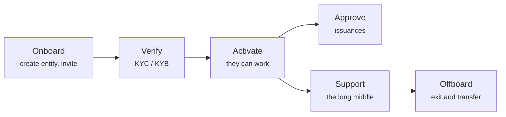

# Atender a los clientes

La mayor parte del trabajo de un operador no es infraestructura. Son personas: hacerlas entrar, comprobar quiénes son, aprobar lo que quieren hacer y ayudar cuando algo va mal.

---

## El arco

-   **[Dar de alta a un cliente](onboarding-flow.md)**

    ---

    Crear la entidad jurídica, emitir una invitación de un solo uso, y qué pasa cuando la canjea.

-   **[Revisar el KYC](kyc-process.md)**

    ---

    Verificar con quién está tratando. La puerta detrás de la cual espera todo lo demás.

-   **[Aprobar una emisión](approving-issuances.md)**

    ---

    La decisión que trae un valor a la existencia.

-   **[Modo soporte](impersonation.md)**

    ---

    Ver exactamente lo que ve un cliente, con cada actuación atribuida a usted.

-   **[Soporte de doble factor](two-factor-support.md)**

    ---

    El procedimiento del teléfono perdido, y por qué no puede sencillamente enviar un código QR nuevo.

-   **[Baja](offboarding.md)**

    ---

    Salir como es debido: traspaso registral, migración de cartera y lo que debe conservarse.

-   **[Funciones y permisos](roles.md)**

    ---

    Quién puede hacer qué, y de dónde vienen realmente las funciones.

---

## Tres principios que ahorran problemas

!!! tip "Verifique antes de activar, siempre"
    La tentación de dejar que un cliente empiece a configurarse mientras el KYC está en curso es fuerte, sobre todo con un cliente grande esperando.

    Resístala. Una entidad no verificada que ya ha creado emisiones y admitido inversores es mucho más difícil de deshacer que otra que esperó. La puerta existe precisamente para que lo caro ocurra después de la comprobación barata.

!!! tip "Deje constancia del porqué, no solo del qué"
    La plataforma registra qué hizo usted y cuándo. Rara vez registra *por qué*. Aprobaciones, denegaciones y rectificaciones registrales se benefician todas de una nota o una referencia de ticket, y las querrá el día en que alguien le pida explicar una decisión de hace dos años.

!!! tip "El problema del cliente suele ser una de tres cosas"
    Antes de investigar nada exótico:

    1. **KYC caducado.** Las transferencias se detienen; todo lo demás parece normal.
    2. **Monedero no registrado o no admitido.** Las transferencias fallan on-chain en lugar de quedar pendientes.
    3. **Falta una función.** El cliente recibe un `403` y lo describe como «la página está rota».

    Eso cubre la gran mayoría de las incidencias. El [modo soporte](impersonation.md) determina cuál en menos de un minuto.

---

## Qué no puede hacer por ellos

- **Recuperar una clave de monedero perdida.** Nadie puede. Una transferencia forzosa del §24 eWpG traslada la posición a un monedero nuevo — una rectificación formal bajo doble control, no un restablecimiento.
- **Decidir si su instrumento es lícito.** Usted aprueba según sus criterios. Si su valor cumple las obligaciones que les incumben es asunto suyo y de sus abogados.
- **Valorar nada.** El registro guarda importes nominales, no precios.
- **Crear su código QR de autenticador.** Véase [Soporte de doble factor](two-factor-support.md) — el secreto es de Microsoft, que no expone forma alguna de crear uno.
