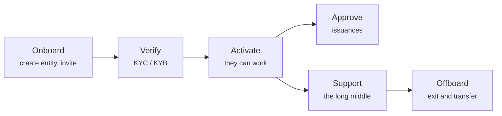

# Servir les clients

L'essentiel du travail d'un opérateur n'est pas de l'infrastructure. Ce sont des personnes : les faire entrer, vérifier qui elles sont, approuver ce qu'elles veulent faire, et aider quand quelque chose tourne mal.

---

## L'arc

-   **[Intégrer un client](onboarding-flow.md)**

    ---

    Créer l'entité juridique, émettre une invitation à usage unique, et ce qui se passe quand il l'utilise.

-   **[Examiner le KYC](kyc-process.md)**

    ---

    Vérifier à qui vous avez affaire. La porte derrière laquelle tout le reste attend.

-   **[Approuver une émission](approving-issuances.md)**

    ---

    La décision qui fait exister un titre financier.

-   **[Mode support](impersonation.md)**

    ---

    Voir exactement ce que voit un client, chaque action vous étant imputée.

-   **[Assistance deux facteurs](two-factor-support.md)**

    ---

    La procédure « téléphone perdu », et pourquoi vous ne pouvez pas simplement envoyer un nouveau QR code.

-   **[Résiliation](offboarding.md)**

    ---

    Partir proprement : transfert de registre, migration du portefeuille, et ce qui doit être conservé.

-   **[Rôles et permissions](roles.md)**

    ---

    Qui peut faire quoi, et d'où viennent réellement les rôles.

---

## Trois principes qui évitent des ennuis

!!! tip "Vérifiez avant d'activer, toujours"
    La tentation de laisser un client commencer à s'installer pendant que le KYC est en cours est forte, surtout quand un gros client attend.

    Résistez-y. Une entité non vérifiée qui a déjà créé des émissions et admis des investisseurs est bien plus difficile à défaire qu'une entité qui a patienté. La porte existe précisément pour que les choses coûteuses arrivent après le contrôle bon marché.

!!! tip "Consignez le pourquoi, pas seulement le quoi"
    La plateforme enregistre ce que vous avez fait et quand. Elle enregistre rarement *pourquoi*. Approbations, refus et corrections de registre gagnent tous à s'accompagner d'une note ou d'une référence de ticket, et vous les voudrez le jour où l'on vous demandera d'expliquer une décision d'il y a deux ans.

!!! tip "Le problème du client est en général l'un de ces trois"
    Avant d'enquêter sur quoi que ce soit d'exotique :

    1. **KYC expiré.** Les transferts s'arrêtent ; tout le reste paraît normal.
    2. **Portefeuille non enregistré ou non admis.** Les transferts échouent on-chain au lieu de rester en attente.
    3. **Rôle manquant.** Le client reçoit un `403` et le décrit comme « la page est cassée ».

    Cela couvre une large majorité des tickets. Le [mode support](impersonation.md) permet de trancher en moins d'une minute.

---

## Ce que vous ne pouvez pas faire pour eux

- **Récupérer une clé de portefeuille perdue.** Personne ne le peut. Un transfert forcé au titre du §24 eWpG déplace la position vers un nouveau portefeuille — une correction formelle en double validation, pas une réinitialisation.
- **Décider si leur instrument est licite.** Vous approuvez selon vos critères. Savoir si leur titre respecte leurs obligations relève d'eux et de leur conseil.
- **Valoriser quoi que ce soit.** Le registre contient des montants nominaux, pas des prix.
- **Créer leur QR code d'authentificateur.** Voir [Assistance deux facteurs](two-factor-support.md) — Microsoft détient le secret et n'expose aucun moyen d'en créer un.
