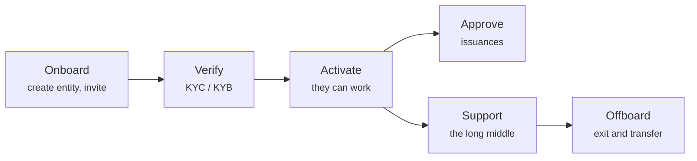

# Servire i clienti

Gran parte del lavoro di un operatore non è infrastruttura. Sono persone: farle entrare, controllare chi sono, approvare ciò che vogliono fare e aiutarle quando qualcosa va storto.

---

## L'arco

-   **[Onboarding di un cliente](onboarding-flow.md)**

    ---

    Creare il soggetto giuridico, emettere un invito monouso e che cosa succede quando lo utilizza.

-   **[Esaminare il KYC](kyc-process.md)**

    ---

    Verificare con chi hai a che fare. Il passaggio obbligato dietro cui tutto il resto aspetta.

-   **[Approvare un'emissione](approving-issuances.md)**

    ---

    La decisione che porta in vita uno strumento finanziario.

-   **[Modalità supporto (impersonation)](impersonation.md)**

    ---

    Vedere esattamente ciò che vede un cliente, con ogni azione attribuita a te.

-   **[Assistenza due fattori](two-factor-support.md)**

    ---

    La procedura per il telefono perso, e perché non puoi semplicemente inviare un nuovo QR code.

-   **[Cessazione](offboarding.md)**

    ---

    Uscire per bene: trasferimento del registro, migrazione del portafoglio e ciò che va conservato.

-   **[Ruoli e permessi](roles.md)**

    ---

    Chi può fare che cosa, e da dove vengono davvero i ruoli.

---

## Tre principi che risparmiano guai

!!! tip "Verifica prima di attivare, sempre"
    La tentazione di lasciare che un cliente inizi a configurarsi mentre il KYC è in corso è forte, soprattutto con un grande cliente in attesa.

    Resisti. Un soggetto non verificato che ha già creato emissioni e ammesso investitori è molto più difficile da smontare di uno che ha aspettato. Questo passaggio obbligato esiste proprio perché le cose costose avvengano dopo il controllo economico.

!!! tip "Registra il perché, non solo il che cosa"
    La piattaforma registra che cosa hai fatto e quando. Raramente registra *perché*. Approvazioni, rigetti e rettifiche di registro traggono tutti beneficio da una nota o da un riferimento a un ticket, e li vorrai nel momento in cui qualcuno ti chiederà di spiegare una decisione di due anni fa.

!!! tip "Il problema del cliente di solito è una di tre cose"
    Prima di indagare su qualcosa di esotico:

    1. **KYC scaduto.** I trasferimenti si fermano; tutto il resto sembra normale.
    2. **Wallet non registrato o non ammesso.** I trasferimenti falliscono on-chain anziché restare in sospeso.
    3. **Ruolo mancante.** Il cliente riceve un `403` e lo descrive come «la pagina è rotta».

    Questo copre la grande maggioranza dei ticket. La [modalità supporto](impersonation.md) chiarisce quale in meno di un minuto.

---

## Che cosa non puoi fare per loro

- **Recuperare una chiave di wallet perduta.** Nessuno può. Un trasferimento coattivo ai sensi del §24 eWpG sposta la posizione su un nuovo wallet — una rettifica formale a quattro occhi, non un reset.
- **Decidere se il loro strumento sia lecito.** Tu approvi secondo i tuoi criteri. Se il loro strumento rispetti i loro obblighi è affare loro e del loro legale.
- **Valutare alcunché.** Il registro contiene valori nominali, non prezzi.
- **Creare il loro QR code dell'authenticator.** Vedi [Assistenza due fattori](two-factor-support.md) — il segreto è di Microsoft, che non espone alcun modo per crearne uno.
