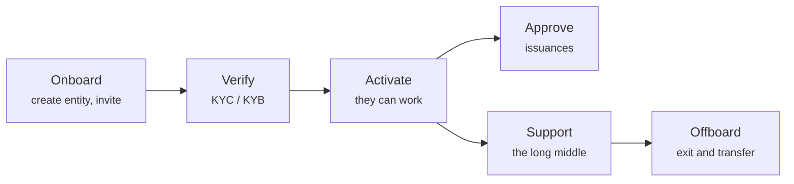

# Serving customers

Most of an operator's work is not infrastructure. It is people: getting them in, checking who they are, approving what they want to do, and helping when something goes wrong.

---

## The arc

-   **[Onboarding a customer](onboarding-flow.md)**

    ---

    Creating the legal entity, issuing a one-time invitation, and what happens when they redeem it.

-   **[Reviewing KYC](kyc-process.md)**

    ---

    Verifying who you are dealing with. The gate everything else waits behind.

-   **[Approving an issuance](approving-issuances.md)**

    ---

    The decision that brings a security into existence.

-   **[Impersonation](impersonation.md)**

    ---

    Seeing exactly what a customer sees, with every action attributed to you.

-   **[Two-factor support](two-factor-support.md)**

    ---

    The lost-phone runbook, and why you cannot simply send a new QR code.

-   **[Offboarding](offboarding.md)**

    ---

    Leaving properly: register transfer, portfolio migration, and what must be retained.

-   **[Roles and permissions](roles.md)**

    ---

    Who can do what, and where roles actually come from.

---

## Three principles that save trouble

!!! tip "Verify before you activate, always"
    The temptation to let a customer start setting up while KYC is pending is strong, especially with a large client waiting.

    Resist it. An unverified entity that has already created issuances and admitted investors is far harder to unwind than one that waited. The gate exists precisely so that the expensive things happen after the cheap check.

!!! tip "Record why, not just what"
    The platform records what you did and when. It rarely records *why*. Approvals, rejections and register corrections all benefit from a note or a ticket reference, and you will want them at the moment somebody asks you to explain a decision from two years ago.

!!! tip "The customer's problem is usually one of three things"
    Before investigating anything exotic:

    1. **KYC lapsed.** Transfers stop; everything else looks normal.
    2. **Wallet not registered or not admitted.** Transfers fail on-chain rather than pending.
    3. **Role missing.** They get a `403` and describe it as "the page is broken".

    These cover a large majority of tickets. [Impersonation](impersonation.md) confirms which in under a minute.

---

## What you cannot do for them

- **Recover a lost wallet key.** Nobody can. A §24 eWpG forced transfer moves the holding to a new wallet — a formal correction under four eyes, not a reset.
- **Decide whether their instrument is lawful.** You approve against your criteria. Whether their security complies with their obligations is theirs and their counsel's.
- **Value anything.** The register holds nominal amounts, not prices.
- **Create their Authenticator QR code.** See [Two-factor support](two-factor-support.md) — Microsoft owns the secret and does not expose a way to create one.
