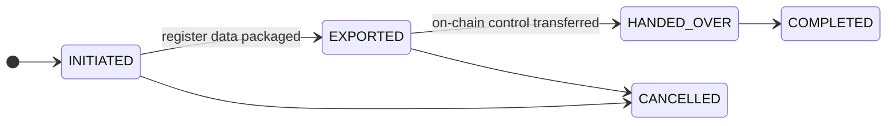

# Offboarding und Registerübertragung

Ein Kunde möchte gehen. Vielleicht wechselt er zu einem Mitbewerber, vielleicht wird abgewickelt, vielleicht beenden Sie die Geschäftsbeziehung.

**Das Verlassen muss ordentlich funktionieren, und es darf nicht Ihre Entscheidung sein, ob es das tut.** Ein Register, das ein Kunde nicht verlassen kann, ist ein Register, in das niemand Umsichtiges eintreten sollte, und Lock-in durch operative Reibung ist für sich genommen ein aufsichtsrechtliches Anliegen.

---

## Drei unterschiedliche Abgänge

Sie werden häufig verwechselt und funktionieren nach unterschiedlichen Mechanismen.

-   **Registerübertragung**

    ---

    Ein **Emittent** verschiebt ein gesamtes Wertpapier zu einem Nachfolge-Registerführer. Das Asset verlässt das Register, alle Inhaber mit ihm.

    §§21–22 eWpG.

-   **Portfolio-Migration**

    ---

    Ein **Anleger** verschiebt einen Bestand zu einem anderen Registerführer. Alle anderen bleiben.

    Das Gegenstück auf Inhaberseite.

-   **Kunden-Offboarding**

    ---

    Eine Organisation nutzt das Register nicht mehr. Konten deaktiviert, Verkaufsangebote zurückgezogen.

    Verschiebt für sich genommen keine Wertpapiere.

!!! warning "Das Offboarding eines Kunden verschiebt nicht seine Wertpapiere"
    Die Deaktivierung einer Entität schließt Konten und zieht Verkaufsangebote zurück. Sie überträgt Bestände **nicht** an einen anderen Registerführer.

    Ein Emittent, der ohne Registerübertragung offboardet, hinterlässt ein aktives Wertpapier in einem Register, das er nicht mehr nutzt. Reihenfolge einhalten: erst übertragen, dann offboarden.

---

## Registerübertragung

Verschieben eines Wertpapiers zu einem Nachfolge-Registerführer, nach §§21–22 eWpG.

**Initiate** – den Ziel-Registerführer und den Grund aufzeichnen.

**Export** – den vollständigen Registerinhalt verpacken: jeden Inhaber, jeden Eintrag, Beschränkungen, den Verlauf der Registerauszüge. Der Export wird **gehasht**, und der Hash wird aufbewahrt. Der Nachfolger kann prüfen, ob er genau das erhalten hat, was gesendet wurde, und keine der Parteien kann später über den Inhalt streiten.

**Hand over on-chain control** – hat das Asset On-Chain-Admin-Rollen, gehen sie an den Nachfolger über. Aufgezeichnet mit dem Transaktions-Hash.

**Complete.**

!!! danger "Die beiden Teilschritte lassen sich nicht atomar machen"
    Der Export des Registers und die Übertragung der On-Chain-Kontrolle laufen auf unterschiedlichen Systemen. Es gibt keine Transaktion, die beides umfasst.

    Dazwischen liegt ein Fenster, in dem der Nachfolger die Daten hält und Sie noch die On-Chain-Kontrolle haben, oder umgekehrt. Vereinbaren Sie die Reihenfolge vorab mit dem Nachfolger, halten Sie das Fenster kurz, und zeichnen Sie die Zeitstempel jedes Teilschritts auf.

!!! info "Sie behalten Ihre Kopie"
    Eine Registerübertragung löscht Ihre Unterlagen nicht. Aufbewahrungspflichten überdauern die Kundenbeziehung, und ein §16-Registereintrag, der verschwindet, kann die Anforderungen an den Manipulationsnachweis nicht erfüllen.

    Inhaberzeilen werden auf der gesamten Plattform **soft-deleted, nie entfernt**. Alles bleibt abfragbar und wird als geschlossen markiert.

---

## Portfolio-Migration

Ein Anleger, ein Bestand, zu einem anderen Registerführer. Gleicher Ablauf – initiieren, Ziel festlegen, mit Hash exportieren, die On-Chain-Übertragung aufzeichnen, abschließen – beschränkt auf einen einzelnen Inhaber statt das gesamte Asset.

Das gibt es, weil ein Anleger ohne diese Möglichkeit nur durch Verkauf aus einem Register aussteigen könnte. Einen Bestand ohne Verkauf verschieben zu können, ist ein echter Teil des Anlegerschutzes, keine Annehmlichkeit.

---

## Kunden-Offboarding

Wenn eine Organisation das Register nicht mehr nutzt:

1. **Offene Positionen prüfen.** Bestände, Verkaufsangebote, Darlehen, ausstehende Geschäfte. Alles Offene muss zuerst aufgelöst oder migriert werden.
2. **Verkaufsangebote zurückziehen.** Wird automatisch erledigt – die Verkaufsangebote eines offboardenden Kunden werden storniert, statt verwaist liegen zu bleiben, bis jemand darauf zugreift.
3. **Nutzer deaktivieren.** Sofort, umkehrbar, löscht nichts.
4. **Status der Entität setzen.** Je nach Lage ausgesetzt oder aufgelöst.
5. **Grund festhalten**, mit Datum und Referenz.

!!! warning "Emittenten mit einem laufenden Wertpapier nicht offboarden"
    Ein emittiertes, noch nicht zurückgezahltes Wertpapier, dessen Emittent offgeboardet wurde, hat weiterhin Inhaber mit Ansprüchen, fällig werdende Kupons und irgendwann eine Rückzahlung.

    Zahlen Sie es zurück, oder übertragen Sie es an einen Nachfolge-Registerführer, bevor Sie den Emittenten offboarden. Andernfalls laufen Verpflichtungen über ein Register, das niemand mehr verwaltet.

---

## Was aufbewahrt werden muss

Offboarding ist keine Löschung, und beides darf nicht vermengt werden – insbesondere wenn ein ausscheidender Kunde um Löschung bittet.

| | |
|---|---|
| **Registereinträge** | Aufbewahrt. Soft-deleted, nie entfernt. |
| **Audit-Log** | Aufbewahrt. Hash-verkettet – das Entfernen von Einträgen bricht die Kette. |
| **Registerauszüge** | Als Registeraufzeichnungen aufbewahrt. |
| **Aufzeichnungen zu Kapitalmaßnahmen** | Aufbewahrt. |
| **KYC-Dokumente** | Für die gesetzliche Frist aufbewahrt, danach löschbar. |

!!! danger "Ein Antrag auf Löschung hebelt die Aufbewahrungspflicht nicht aus"
    Ein ausscheidender Kunde kann sich auf Art. 17 DSGVO berufen. Das berechtigt ihn nicht dazu, Registereinträge oder Audit-Aufzeichnungen löschen zu lassen: Diese werden aufgrund einer gesetzlichen Verpflichtung aufbewahrt, was eine ausdrückliche Ausnahme darstellt.

    Worauf er aber Anspruch hat, ist eine ordentliche Antwort, eine sorgfältige Prüfung und die Löschung von allem, was tatsächlich nicht erfasst ist. Leiten Sie das über Ihren [Datenschutz](../../compliance/data-protection.md)-Prozess, statt an der Konsole zu antworten – und lassen Sie nicht zu, dass ein wohlmeinender Administrator Audit-Zeilen löscht, um zu helfen. Die Kette wird es zeigen.

    [:octicons-arrow-right-24: Datenschutz](../../compliance/data-protection.md) · [:octicons-arrow-right-24: Verzeichnis von Verarbeitungstätigkeiten](../../compliance/ropa.md)

---

## Wohin als Nächstes

- [Einen Kunden aufnehmen](onboarding-flow.md) – das andere Ende
- [Audit-Log](../../platform/audit-log.md)
- [Datenschutz](../../compliance/data-protection.md)
