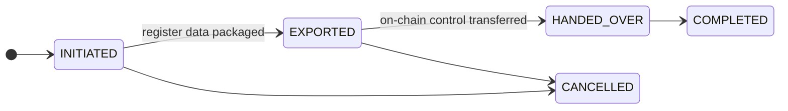

# Offboarding und Registerübertragung

Ein Kunde möchte gehen. Vielleicht wechselt er zu einem Mitbewerber, vielleicht wird abgewickelt, vielleicht beenden Sie die Geschäftsbeziehung.

**Das Verlassen muss ordentlich funktionieren, und es darf nicht Ihre Entscheidung sein, ob es das tut.** Ein Register, das ein Kunde nicht verlassen kann, ist ein Register, in das niemand Umsichtiges eintreten sollte, und Lock-in durch operative Reibung ist für sich genommen ein aufsichtsrechtliches Anliegen.

---

## Drei unterschiedliche Abgänge

Sie werden häufig verwechselt und funktionieren nach unterschiedlichen Mechanismen.

-   **Registerübertragung**

    ---

    Ein **Emittent** verschiebt ein gesamtes Wertpapier zu einem Nachfolge-Registerführer. Das Asset verlässt das Register, alle Inhaber mit ihm.

    §§21–22 eWpG.

-   **Portfolio-Migration**

    ---

    Ein **Anleger** verschiebt einen Bestand zu einem anderen Registerführer. Alle anderen bleiben.

    Das Gegenstück auf Inhaberseite.

-   **Kunden-Offboarding**

    ---

    Eine Organisation nutzt das Register nicht mehr. Konten deaktiviert, Verkaufsangebote zurückgezogen.

    Verschiebt für sich genommen keine Wertpapiere.

!!! warning "Das Offboarding eines Kunden verschiebt nicht seine Wertpapiere"
    Die Deaktivierung einer Entität schließt Konten und zieht Verkaufsangebote zurück. Sie überträgt Bestände **nicht** an einen anderen Registerführer.

    Ein Emittent, der ohne Registerübertragung offboardet, hinterlässt ein aktives Wertpapier in einem Register, das er nicht mehr nutzt. Reihenfolge einhalten: erst übertragen, dann offboarden.

---

## Registerübertragung

Verschieben eines Wertpapiers zu einem Nachfolge-Registerführer, nach §§21–22 eWpG.

```mermaid
stateDiagram-v2
    direction LR
    [*] --> INITIATED
    INITIATED --> EXPORTED: register data packaged
    EXPORTED --> HANDED_OVER: on-chain control transferred
    HANDED_OVER --> COMPLETED
    INITIATED --> CANCELLED
    EXPORTED --> CANCELLED
```

**Initiate** – den Ziel-Registerführer und den Grund aufzeichnen.

**Export** – den vollständigen Registerinhalt verpacken: jeden Inhaber, jeden Eintrag, Beschränkungen, den Verlauf der Registerauszüge. Der Export wird **gehasht**, und der Hash wird aufbewahrt. Der Nachfolger kann prüfen, ob er genau das erhalten hat, was gesendet wurde, und keine der Parteien kann später über den Inhalt streiten.

**Hand over on-chain control** – hat das Asset On-Chain-Admin-Rollen, gehen sie an den Nachfolger über. Aufgezeichnet mit dem Transaktions-Hash.

**Complete.**

!!! warning "Zwischen Export und Abschluss ist das Register eingefroren"
    Der erste **Export** setzt das Asset auf `TRANSFER_PENDING` (der bisherige Status wird gemerkt). Bis die Übertragung abgeschlossen oder abgebrochen ist, werden Handel, Mint/Burn und erzwungene Operationen, die Verarbeitung von Kapitalmaßnahmen (auch der Tagesjobs), Primärzeichnungen und Registeränderungen abgelehnt; der Holder-Sync läuft weiter, damit Abweichungen auffallen. Ein **Abbruch** stellt den bisherigen Status wieder her. Kapitalmaßnahmen mit Zahltag heute oder später müssen *vor* dem Export abgewickelt oder storniert werden. Der Export (und jeder erneute Export) wird außerdem abgelehnt, solange das Asset in einem offenen Repo-Geschäft verpfändet, durch eine offene Lending-Position gebunden ist oder ein Sekundärmarkt-Trade in Bearbeitung ist (reserviert, Zahlung erklärt oder ungeklärt); auf einem eingefrorenen Register werden weder neue Repo-Geschäfte noch Eröffnungsabwicklungen angenommen. Diese zuerst schließen, abwickeln oder auflösen.

    Der Export enthält einen **Registerinhalts-Hash**, der nur das Register umfasst (Assetdaten, Inhaber mit ihren §17(2)-Merkmalen, aktive Inhabersperren, Anleihebedingungen und Kuponplan, Hash des Term Sheets, offene Kapitalmaßnahmen und Zeichnungsaufträge) — nicht den Export-Zeitstempel. Der **Abschluss** berechnet ihn neu und wird abgelehnt, wenn sich seit dem Export etwas geändert hat; die geänderten Bereiche werden genannt, dann erneut exportieren. Das Paket identifiziert Inhaber über die interne Entitätsnummer und die LEI; Klarnamen und Adressen sind nicht enthalten (offene Grundsatzentscheidung).

    Die On-Chain-Kontrolle wird **je Deployment** erfasst. Bei EVM-Deployments liest die Plattform `registry()`/`owner()` und verlangt die bei der Einleitung angegebene Nachfolger-Adresse; andere Chains erfordern vorerst eine ausdrückliche Bestätigung durch den Betreiber (Chain-Verifikation folgt). Die Übertragung gilt erst als *übergeben*, wenn jedes Deployment erfasst ist. Nach dem Abschluss ist das Asset `TRANSFERRED_OUT`: Registerauszüge, Einsichten und Downloads werden mit „Register übertragen an …“ abgelehnt.

!!! danger "Die beiden Teilschritte lassen sich nicht atomar machen"
    Der Export des Registers und die Übertragung der On-Chain-Kontrolle laufen auf unterschiedlichen Systemen. Es gibt keine Transaktion, die beides umfasst.

    Dazwischen liegt ein Fenster, in dem der Nachfolger die Daten hält und Sie noch die On-Chain-Kontrolle haben, oder umgekehrt. Vereinbaren Sie die Reihenfolge vorab mit dem Nachfolger, halten Sie das Fenster kurz, und zeichnen Sie die Zeitstempel jedes Teilschritts auf.

!!! info "Sie behalten Ihre Kopie"
    Eine Registerübertragung löscht Ihre Unterlagen nicht. Aufbewahrungspflichten überdauern die Kundenbeziehung, und ein §16-Registereintrag, der verschwindet, kann die Anforderungen an den Manipulationsnachweis nicht erfüllen.

    Inhaberzeilen werden auf der gesamten Plattform **soft-deleted, nie entfernt**. Alles bleibt abfragbar und wird als geschlossen markiert.

---

## Portfolio-Migration

Ein Anleger, ein Bestand, zu einem anderen Registerführer. Gleicher Ablauf – initiieren, Ziel festlegen, mit Hash exportieren, die On-Chain-Übertragung aufzeichnen, abschließen – beschränkt auf einen einzelnen Inhaber statt das gesamte Asset.

Das gibt es, weil ein Anleger ohne diese Möglichkeit nur durch Verkauf aus einem Register aussteigen könnte. Einen Bestand ohne Verkauf verschieben zu können, ist ein echter Teil des Anlegerschutzes, keine Annehmlichkeit.

!!! note "Die Übergabe wird geprüft, nicht vorausgesetzt"
    - Das **Ziel** kann nur im Status *eingeleitet* gesetzt werden; nach dem Export beschreiben Paket und Hash dieses Ziel. Zum Ändern abbrechen und neu beginnen.
    - Die **On-Chain-Übertragung** wird gegen den indexierten, finalisierten Transfer geprüft: Die Transaktion muss genau den Nominalbetrag des Inhabers von dessen Wallet an die Zielwallet auf einem Deployment des Wertpapiers bewegen. Ist der Transfer noch nicht indexiert, wird der Schritt abgelehnt; nach Finalisierung erneut versuchen. Hat das Wertpapier kein indexiertes Deployment (Off-Chain-Register, derzeit Solana und Canton), ist stattdessen eine **Operator-Bestätigung** erforderlich.
    - Zum **Abschließen** braucht die Zielwallet einen aktiven Registereintrag (z. B. einen Nominee-Pool-Eintrag der Nachfolgeregisterführung). Sonst blockiert der nächste Holder-Sync das gesamte Wertpapier.
    - Das Exportpaket enthält die Inhalte des Eintrags nach § 17 Abs. 2 eWpG (Eintragsart, Inhaberreferenz, Verbraucherkennzeichen, Rechte Dritter, Verfügungsbeschränkungen, Hinweis zur Geschäftsfähigkeit) und die aktiven rechtlichen Sperren. Ein Eintrag mit Rechten Dritter oder Verfügungsbeschränkungen wird nur mit einer **Zustimmungsreferenz des Berechtigten** migriert.

---

## Kunden-Offboarding

Wenn eine Organisation das Register nicht mehr nutzt:

1. **Offene Positionen prüfen.** Bestände, Verkaufsangebote, Darlehen, ausstehende Geschäfte. Alles Offene muss zuerst aufgelöst oder migriert werden.
2. **Verkaufsangebote zurückziehen.** Wird automatisch erledigt – die Verkaufsangebote eines offboardenden Kunden werden storniert, statt verwaist liegen zu bleiben, bis jemand darauf zugreift. Laufende Geschäfte werden ebenfalls behandelt: ein unbezahltes Geschäft wird abgebrochen, ein Geschäft mit gemeldeter Zahlung kommt in die Warteschlange für ungeklärte Zahlungen (`GET /api/v1/admin/trading/unresolved`) zur Entscheidung im Vier-Augen-Prinzip — es wird nie automatisch verworfen.
3. **Nutzer deaktivieren.** Sofort, umkehrbar, löscht nichts.
4. **Status der Entität setzen.** Je nach Lage ausgesetzt oder aufgelöst.
5. **Grund festhalten**, mit Datum und Referenz.

!!! warning "Emittenten mit einem laufenden Wertpapier nicht offboarden"
    Ein emittiertes, noch nicht zurückgezahltes Wertpapier, dessen Emittent offgeboardet wurde, hat weiterhin Inhaber mit Ansprüchen, fällig werdende Kupons und irgendwann eine Rückzahlung.

    Zahlen Sie es zurück, oder übertragen Sie es an einen Nachfolge-Registerführer, bevor Sie den Emittenten offboarden. Andernfalls laufen Verpflichtungen über ein Register, das niemand mehr verwaltet.

---

## Was aufbewahrt werden muss

Offboarding ist keine Löschung, und beides darf nicht vermengt werden – insbesondere wenn ein ausscheidender Kunde um Löschung bittet.

| | |
|---|---|
| **Registereinträge** | Aufbewahrt. Soft-deleted, nie entfernt. |
| **Audit-Log** | Aufbewahrt. Hash-verkettet – das Entfernen von Einträgen bricht die Kette. |
| **Registerauszüge** | Als Registeraufzeichnungen aufbewahrt. |
| **Aufzeichnungen zu Kapitalmaßnahmen** | Aufbewahrt. |
| **KYC-Dokumente** | Für die gesetzliche Frist aufbewahrt, danach löschbar. |

!!! danger "Ein Antrag auf Löschung hebelt die Aufbewahrungspflicht nicht aus"
    Ein ausscheidender Kunde kann sich auf Art. 17 DSGVO berufen. Das berechtigt ihn nicht dazu, Registereinträge oder Audit-Aufzeichnungen löschen zu lassen: Diese werden aufgrund einer gesetzlichen Verpflichtung aufbewahrt, was eine ausdrückliche Ausnahme darstellt.

    Worauf er aber Anspruch hat, ist eine ordentliche Antwort, eine sorgfältige Prüfung und die Löschung von allem, was tatsächlich nicht erfasst ist. Leiten Sie das über Ihren [Datenschutz](../../compliance/data-protection.md)-Prozess, statt an der Konsole zu antworten – und lassen Sie nicht zu, dass ein wohlmeinender Administrator Audit-Zeilen löscht, um zu helfen. Die Kette wird es zeigen.

    [:octicons-arrow-right-24: Datenschutz](../../compliance/data-protection.md) · [:octicons-arrow-right-24: Verzeichnis von Verarbeitungstätigkeiten](../../compliance/ropa.md)

---

## Wohin als Nächstes

- [Einen Kunden aufnehmen](onboarding-flow.md) – das andere Ende
- [Audit-Log](../../platform/audit-log.md)
- [Datenschutz](../../compliance/data-protection.md)
