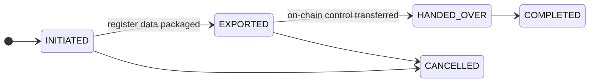

# Baja y transferencia de registro { #offboarding-and-register-transfer }

Un cliente quiere irse. Tal vez se estén mudando a un competidor, tal vez estén cerrando actividad, tal vez sea usted quien esté terminando la relación.

**Salir debe funcionar correctamente y no debe ser su elección si lo hace.** Un registro del que un cliente no puede salir es un registro al que nadie prudente debería ingresar, y el bloqueo a través de fricciones operativas es una preocupación de supervisión en sí misma.

---

## Tres diferentes salidas { #three-different-departures }

Con frecuencia se confunden y tienen diferentes mecánicas.

-   **Transferencia de registro**

    ---

    Un **emisor** mueve un valor completo a un registrador sucesor. El activo se va, todos los titulares con él.

    §§21–22 eWpG.

-   **Migración de cartera**

    ---

    Un **inversor** mueve una tenencia a otro registrador. Todos los demás se quedan.

    La contraparte del lado del titular.

-   **Baja de cliente**

    ---

    Una organización deja de usar el registro. Cuentas desactivadas, listados retirados.

    Por sí sola no mueve valores a ninguna parte.

!!! warning "La baja de un cliente no mueve sus valores"
    Al desactivar una entidad se cierran cuentas y se retiran listados. **No** transfiere tenencias a otro registrador.

    Un emisor que se da de baja sin una transferencia de registro deja un valor activo en un registro que ya no utiliza. Secuéncielo: primero la transferencia, después la baja.

---

## Transferencia de registro { #register-transfer }

Mover un valor a un registrador sucesor, según §§21–22 eWpG.

**Iniciar**: registre el registrador de destino y el motivo.

**Exportar**: empaqueta el contenido completo del registro: cada titular, cada entrada, restricciones, historial de extractos registrales. La exportación se **hashea**, y el hash se conserva. El sucesor puede verificar que recibió exactamente lo que se envió, y ninguna de las partes puede discutir posteriormente sobre el contenido.

**Entregar el control en la cadena**: si el activo tiene funciones de administrador en la cadena, se transfiere al sucesor. Registrado con el hash de transacción.

**Completo.**

!!! danger "Los dos tramos no pueden hacerse atómicos"
    La exportación del registro y la transferencia del control en cadena se realizan en diferentes sistemas. No hay ninguna transacción que abarque ambos.

    Entre ellos hay una ventana en la que el sucesor mantiene los datos y usted aún mantiene el control en cadena, o al revés. Acuerde la secuencia con el sucesor de antemano, mantenga la ventana breve y registre las marcas de tiempo de cada tramo.

!!! info "Usted conserva su copia"
    Una transferencia de registro no elimina sus registros. Las obligaciones de retención sobreviven a la relación con el cliente, y una inscripción registral §16 que desaparece no puede satisfacer los requisitos de evidencia frente a manipulación.

    Las filas de titulares se **marcan como eliminadas, nunca se suprimen**, en toda la plataforma. Todo permanece consultable y está marcado como cerrado.

---

## Migración de cartera { #portfolio-migration }

Un inversor, una tenencia, a otro registrador. Misma forma: iniciar, establecer destino, exportar con hash, registrar la transferencia en cadena, completar, con alcance a un solo titular en lugar de a todo el activo.

Esto existe porque, sin ello, la única salida de un inversor de un registro es vender. Poder transferir una tenencia sin realizar una venta es una parte genuina de la protección del inversor, no una conveniencia.

---

## Baja de clientes { #customer-offboarding }

Cuando una organización deja de utilizar el registro:

1. **Consulte posiciones abiertas.** Tenencias, listados, préstamos, operaciones pendientes. Cualquier cosa abierta debe resolverse o migrarse primero.
2. **Retire los listados de negociación.** Se maneja automáticamente: los listados de un cliente que causa baja se cancelan en lugar de quedar huérfanos para que alguien tropiece con ellos.
3. **Desactive usuarios.** Inmediato, reversible, no elimina nada.
4. **Establezca el estado de la entidad.** Suspendido o disuelto según corresponda.
5. **Anote el motivo**, con una fecha y una referencia.

!!! warning "No dé de baja a un emisor con un título activo"
    Un valor emitido y no canjeado cuyo emisor ha causado baja todavía tiene titulares con reclamaciones, cupones vencidos y, eventualmente, un reembolso.

    Amortícelo o transfiéralo a un registrador sucesor antes de dar de baja al emisor. De lo contrario, tendrá obligaciones que se ejecutan a través de un registro que nadie está administrando.

---

## Lo que debe conservarse { #what-must-be-retained }

La baja no es una eliminación, y ambas cosas no deben combinarse, especialmente cuando un cliente saliente solicita el borrado.

| | |
|---|---|
| **Inscripciones registrales** | Retenidas. Marcadas como eliminadas, nunca suprimidas. |
| **Registro de auditoría** | Retenido. Encadenado mediante hash: eliminar entradas rompe la cadena. |
| **Extractos registrales** | Se conservan como registros del registro. |
| **Registros de operaciones societarias** | Retenidos. |
| **Documentos KYC** | Se conservan durante el período legal y luego quedan sujetos a supresión. |

!!! danger "Una solicitud de derecho de supresión no anula la retención"
    Un cliente saliente puede invocar el artículo 17 del RGPD. No le da derecho a que se eliminen las inscripciones registrales o los registros de auditoría: se conservan por obligación legal, lo cual es una excepción explícita.

    Lo que sí le da derecho es a una respuesta adecuada, una evaluación considerada y la supresión de todo lo que realmente no esté cubierto. Diríjalos a través de su proceso de [protección de datos](../../compliance/data-protection.md) en lugar de responder en la consola, y no permita que un administrador bien intencionado elimine filas de auditoría para resultar útil. La cadena lo mostrará.

    [:octicons-arrow-right-24: Protección de datos](../../compliance/data-protection.md) · [:octicons-arrow-right-24: Registros de procesamiento](../../compliance/ropa.md)

---

## Adónde ir ahora { #where-next }

- [Incorporación de un cliente](onboarding-flow.md) — el otro extremo
- [Registro de auditoría](../../platform/audit-log.md)
- [Protección de datos](../../compliance/data-protection.md)
