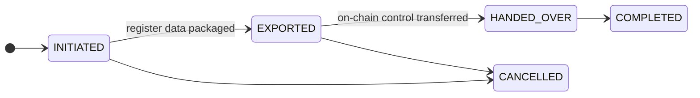

# Baja y transferencia de registro { #offboarding-and-register-transfer }

Un cliente quiere irse. Tal vez se estén mudando a un competidor, tal vez estén cerrando actividad, tal vez sea usted quien esté terminando la relación.

**Salir debe funcionar correctamente y no debe ser su elección si lo hace.** Un registro del que un cliente no puede salir es un registro al que nadie prudente debería ingresar, y el bloqueo a través de fricciones operativas es una preocupación de supervisión en sí misma.

---

## Tres diferentes salidas { #three-different-departures }

Con frecuencia se confunden y tienen diferentes mecánicas.

-   **Transferencia de registro**

    ---

    Un **emisor** mueve un valor completo a un registrador sucesor. El activo se va, todos los titulares con él.

    §§21–22 eWpG.

-   **Migración de cartera**

    ---

    Un **inversor** mueve una tenencia a otro registrador. Todos los demás se quedan.

    La contraparte del lado del titular.

-   **Baja de cliente**

    ---

    Una organización deja de usar el registro. Cuentas desactivadas, listados retirados.

    Por sí sola no mueve valores a ninguna parte.

!!! warning "La baja de un cliente no mueve sus valores"
    Al desactivar una entidad se cierran cuentas y se retiran listados. **No** transfiere tenencias a otro registrador.

    Un emisor que se da de baja sin una transferencia de registro deja un valor activo en un registro que ya no utiliza. Secuéncielo: primero la transferencia, después la baja.

---

## Transferencia de registro { #register-transfer }

Mover un valor a un registrador sucesor, según §§21–22 eWpG.

```mermaid
stateDiagram-v2
    direction LR
    [*] --> INITIATED
    INITIATED --> EXPORTED: register data packaged
    EXPORTED --> HANDED_OVER: on-chain control transferred
    HANDED_OVER --> COMPLETED
    INITIATED --> CANCELLED
    EXPORTED --> CANCELLED
```

**Iniciar**: registre el registrador de destino y el motivo.

**Exportar**: empaqueta el contenido completo del registro: cada titular, cada entrada, restricciones, historial de extractos registrales. La exportación se **hashea**, y el hash se conserva. El sucesor puede verificar que recibió exactamente lo que se envió, y ninguna de las partes puede discutir posteriormente sobre el contenido.

**Entregar el control en la cadena**: si el activo tiene funciones de administrador en la cadena, se transfiere al sucesor. Registrado con el hash de transacción.

**Completo.**

!!! warning "El registro queda congelado entre la exportación y la finalización"
    La primera **exportación** pone el activo en `TRANSFER_PENDING` (se conserva el estado anterior). Hasta que la transferencia se complete o se cancele, se rechazan la negociación, el mint/burn y las operaciones forzadas, el procesamiento de operaciones societarias (incluidas las tareas diarias), las suscripciones primarias y los cambios en el registro; la sincronización de titulares sigue funcionando para detectar desviaciones. **Cancelar** restablece el estado anterior. Las operaciones societarias cuya fecha de pago sea hoy o posterior deben liquidarse o cancelarse *antes* de la exportación. La exportación (y cada reexportación) también se rechaza mientras el activo esté pignorado en una operación de repo abierta, bloqueado por una posición de préstamo abierta o tenga una operación de mercado secundario en curso (reservada, pago declarado o sin resolver); en un registro congelado no se acepta ninguna operación de repo nueva ni liquidación de apertura. Primero hay que cerrarlas, liquidarlas o deshacerlas.

    La exportación lleva un **hash del contenido del registro** que abarca solo el registro (datos del activo, titulares con sus atributos del §17(2), bloqueos de titulares activos, condiciones del bono y calendario de cupones, hash de la ficha de condiciones, operaciones societarias y órdenes de suscripción abiertas), no la marca de tiempo de la exportación. La **finalización** lo recalcula y se rechaza si algo cambió desde la exportación, indicando las secciones modificadas; en ese caso hay que exportar de nuevo. El paquete identifica a los titulares por su número de entidad interno y su LEI; no incluye nombres ni direcciones en claro (decisión de fondo abierta).

    El control en la cadena se registra **por despliegue**. En los despliegues EVM la plataforma lee `registry()`/`owner()` y exige la dirección del sucesor indicada al iniciar; las demás cadenas requieren por ahora una atestación explícita del operador (la verificación en cadena llegará después). La transferencia solo se considera *entregada* cuando cada despliegue está registrado. Tras la finalización el activo pasa a `TRANSFERRED_OUT`: los extractos, las inspecciones y las descargas se rechazan con «registro transferido a …».

!!! danger "Los dos tramos no pueden hacerse atómicos"
    La exportación del registro y la transferencia del control en cadena se realizan en diferentes sistemas. No hay ninguna transacción que abarque ambos.

    Entre ellos hay una ventana en la que el sucesor mantiene los datos y usted aún mantiene el control en cadena, o al revés. Acuerde la secuencia con el sucesor de antemano, mantenga la ventana breve y registre las marcas de tiempo de cada tramo.

!!! info "Usted conserva su copia"
    Una transferencia de registro no elimina sus registros. Las obligaciones de retención sobreviven a la relación con el cliente, y una inscripción registral §16 que desaparece no puede satisfacer los requisitos de evidencia frente a manipulación.

    Las filas de titulares se **marcan como eliminadas, nunca se suprimen**, en toda la plataforma. Todo permanece consultable y está marcado como cerrado.

---

## Migración de cartera { #portfolio-migration }

Un inversor, una tenencia, a otro registrador. Misma forma: iniciar, establecer destino, exportar con hash, registrar la transferencia en cadena, completar, con alcance a un solo titular en lugar de a todo el activo.

Esto existe porque, sin ello, la única salida de un inversor de un registro es vender. Poder transferir una tenencia sin realizar una venta es una parte genuina de la protección del inversor, no una conveniencia.

!!! note "El traspaso se verifica, no se da por bueno"
    - El **destino** solo puede fijarse mientras la migración está *iniciada*; tras la exportación, el paquete y su hash describen ese destino. Para cambiarlo, cancele y empiece de nuevo.
    - El **registro de la transferencia on-chain** se comprueba contra la transferencia indexada y finalizada: la transacción debe mover exactamente el nominal del titular desde su wallet a la wallet de destino en un despliegue del valor. Si la transferencia aún no está indexada, el paso se rechaza; reintente cuando sea final. Si el valor no tiene un despliegue indexado (registro off-chain, por ahora Solana y Canton) se exige en su lugar una **atestación del operador**.
    - Para **completar**, la wallet de destino debe tener una entrada activa en el registro (por ejemplo, una entrada de pool nominee del registrador sucesor). De lo contrario, la siguiente sincronización de titulares bloquearía todo el valor.
    - El paquete de exportación incluye el contenido de la entrada según el § 17(2) eWpG (tipo de entrada, referencia del titular, indicador de consumidor, derechos de terceros, restricciones de disposición, nota de capacidad jurídica) y los bloqueos legales activos. Una entrada con derechos de terceros o restricciones de disposición solo migra con una **referencia de consentimiento del beneficiario**.

---

## Baja de clientes { #customer-offboarding }

Cuando una organización deja de utilizar el registro:

1. **Consulte posiciones abiertas.** Tenencias, listados, préstamos, operaciones pendientes. Cualquier cosa abierta debe resolverse o migrarse primero.
2. **Retire los listados de negociación.** Se maneja automáticamente: los listados de un cliente que causa baja se cancelan en lugar de quedar huérfanos para que alguien tropiece con ellos. También se tratan las operaciones en curso: una operación sin pagar se cancela, una operación con pago declarado pasa a la cola de pagos no resueltos (`GET /api/v1/admin/trading/unresolved`) para una decisión con doble control — nunca se descarta automáticamente.
3. **Desactive usuarios.** Inmediato, reversible, no elimina nada.
4. **Establezca el estado de la entidad.** Suspendido o disuelto según corresponda.
5. **Anote el motivo**, con una fecha y una referencia.

!!! warning "No dé de baja a un emisor con un título activo"
    Un valor emitido y no canjeado cuyo emisor ha causado baja todavía tiene titulares con reclamaciones, cupones vencidos y, eventualmente, un reembolso.

    Amortícelo o transfiéralo a un registrador sucesor antes de dar de baja al emisor. De lo contrario, tendrá obligaciones que se ejecutan a través de un registro que nadie está administrando.

### Reincorporar a un cliente cerrado o disuelto { #reinstating-a-closed-or-dissolved-customer }

Un cliente `CLOSED` o `DISSOLVED` nunca vuelve a `ACTIVE` directamente. Un `REGISTRY_ADMIN` inicia la reincorporación con `POST /api/v1/entities/{id}/reinstate`; son obligatorios un motivo y una referencia legal, y la llamada exige autenticación reforzada y un segundo aprobador (`ENTITY_REINSTATE`).

- El cliente pasa a `PENDING_REACTIVATION`: el KYC se restablece a «no iniciado», el filtrado se ejecuta de nuevo y se crean dos [tareas de entidad](entity-tasks.md) (`REINSTATEMENT_KYC_REQUIRED`, `REINSTATEMENT_USERS_REVIEW`). Mientras está pendiente, nadie del cliente puede iniciar sesión, negociar ni ser suplantado, y sus usuarios siguen deshabilitados.
- Volver a aprobar el KYC (se aplican todas las puertas habituales de KYC) deja al cliente `ACTIVE` y crea `CHAIN_REINSTATEMENT_REQUIRED`. Los claims de identidad en cadena y el vínculo de organización **no** se reemiten automáticamente; restablecerlos es un paso explícito de doble control del operador. Los registros previos de cierre y de propagación en cadena siguen vigentes hasta que se apruebe el KYC.
- Una reincorporación pendiente puede abandonarse dando de baja de nuevo al cliente. No hay comprobación de Sperrvermerk al completarla; las puertas de las partes aplican los bloqueos en cada transacción.

---

## Lo que debe conservarse { #what-must-be-retained }

La baja no es una eliminación, y ambas cosas no deben combinarse, especialmente cuando un cliente saliente solicita el borrado.

| | |
|---|---|
| **Inscripciones registrales** | Retenidas. Marcadas como eliminadas, nunca suprimidas. |
| **Registro de auditoría** | Retenido. Encadenado mediante hash: eliminar entradas rompe la cadena. |
| **Extractos registrales** | Se conservan como registros del registro. |
| **Registros de operaciones societarias** | Retenidos. |
| **Documentos KYC** | Se conservan durante el período legal y luego quedan sujetos a supresión. |

!!! danger "Una solicitud de derecho de supresión no anula la retención"
    Un cliente saliente puede invocar el artículo 17 del RGPD. No le da derecho a que se eliminen las inscripciones registrales o los registros de auditoría: se conservan por obligación legal, lo cual es una excepción explícita.

    Lo que sí le da derecho es a una respuesta adecuada, una evaluación considerada y la supresión de todo lo que realmente no esté cubierto. Diríjalos a través de su proceso de [protección de datos](../../compliance/data-protection.md) en lugar de responder en la consola, y no permita que un administrador bien intencionado elimine filas de auditoría para resultar útil. La cadena lo mostrará.

    [:octicons-arrow-right-24: Protección de datos](../../compliance/data-protection.md) · [:octicons-arrow-right-24: Registros de procesamiento](../../compliance/ropa.md)

---

## Adónde ir ahora { #where-next }

- [Incorporación de un cliente](onboarding-flow.md) — el otro extremo
- [Registro de auditoría](../../platform/audit-log.md)
- [Protección de datos](../../compliance/data-protection.md)
