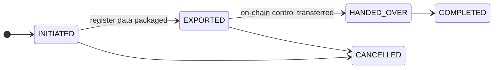

# Offboarding et transfert de registre

Un client souhaite partir. Peut-être migre-t-il vers un concurrent, peut-être cesse-t-il son activité, peut-être mettez-vous fin à la relation.

**Le départ doit fonctionner correctement, et cela ne doit pas être votre choix.** Un registre dont un client ne peut pas sortir est un registre dans lequel personne de prudent ne devrait entrer, et le verrouillage par friction opérationnelle est une préoccupation de surveillance à part entière.

---

## Trois départs différents

Ils sont fréquemment confondus, et ils ont des mécanismes différents.

-   **Transfert de registre**

    ---

    Un **émetteur** déplace un titre entier vers un registraire successeur. L'actif part, avec tous ses détenteurs.

    §§21–22 eWpG.

-   **Migration de portefeuille**

    ---

    Un **investisseur** déplace un avoir vers un autre registraire. Tous les autres restent.

    La contrepartie côté titulaire.

-   **Résiliation client (offboarding)**

    ---

    Une organisation cesse d'utiliser le registre. Comptes désactivés, inscriptions retirées.

    Ne déplace pas de titres, en elle-même.

!!! warning "Résilier un client ne déplace pas ses titres"
    La désactivation d'une entité ferme les comptes et retire les inscriptions. Elle ne transfère **pas** les avoirs vers un autre registraire.

    Un émetteur qui se résilie sans transfert de registre laisse un titre actif dans un registre qu'il n'utilise plus. Séquencez-le : transfert d'abord, résiliation ensuite.

---

## Transfert de registre

Déplacement d'un titre vers un registraire successeur, en vertu des §§21–22 eWpG.

**Initier** — enregistrez le registraire de destination et le motif.

**Exporter** — regroupez le contenu complet du registre : chaque titulaire, chaque entrée, restrictions, historique des relevés. L'exportation est **hachée** et le hachage est conservé. Le successeur peut vérifier qu'il a reçu exactement ce qui a été envoyé, et aucune des parties ne peut discuter ultérieurement du contenu.

**Remettre le contrôle on-chain** — si l'actif a des rôles d'administrateur on-chain, ils sont transférés au successeur. Enregistré avec le hachage de transaction.

**Terminé.**

!!! danger "Les deux volets ne peuvent pas être rendus atomiques"
    L'exportation du registre et le transfert du contrôle on-chain se produisent sur des systèmes différents. Il n'y a aucune transaction couvrant les deux.

    Entre les deux, il y a une fenêtre pendant laquelle le successeur détient les données et vous détenez encore le contrôle on-chain, ou l'inverse. Convenez à l'avance de la séquence avec le successeur, gardez la fenêtre courte et enregistrez les horodatages de chaque volet.

!!! info "Vous conservez votre copie"
    Un transfert de registre ne supprime pas vos dossiers. Les obligations de conservation survivent à la relation client, et une entrée de registre §16 qui disparaît ne peut pas satisfaire aux exigences de preuve d'inviolabilité.

    Les lignes de titulaires sont **supprimées de manière logicielle, jamais supprimées**, sur toute la plateforme. Tout reste interrogeable et est marqué fermé.

---

## Migration de portefeuille

Un investisseur, un avoir, vers un autre registraire. Même forme — initier, définir la destination, exporter avec hachage, enregistrer le transfert on-chain, terminer — limitée à un seul détenteur plutôt qu'à l'ensemble de l'actif.

Cela existe parce que sans cela, la seule sortie d'un investisseur d'un registre est de vendre. Pouvoir déplacer un avoir sans vente est un véritable élément de protection des investisseurs, et non une commodité.

---

## Résiliation client (offboarding)

Lorsqu'une organisation cesse d'utiliser le registre :

1. **Vérifiez les positions ouvertes.** Avoirs, inscriptions, prêts, transactions en attente. Tout ce qui est ouvert doit d'abord être résolu ou migré.
2. **Retirez les offres de vente.** Géré automatiquement : les offres d'un client sortant sont annulées plutôt que laissées orphelines pour que quelqu'un les exécute par erreur.
3. **Désactivez les utilisateurs.** Immédiat, réversible, ne supprime rien.
4. **Définissez le statut de l'entité.** Suspendue ou dissoute selon le cas.
5. **Enregistrez pourquoi**, avec une date et une référence.

!!! warning "Ne pas résilier un émetteur ayant un titre actif"
    Un titre émis et non remboursé dont l'émetteur a été résilié a toujours des détenteurs porteurs de créances, des coupons arrivant à échéance et, à terme, un remboursement.

    Soit vous le remboursez, soit vous le transférez à un registraire successeur, avant de résilier l'émetteur. Sinon, vous avez des obligations qui courent au sein d'un registre que personne n'administre.

---

## Ce qui doit être conservé

L'offboarding n'est pas une suppression, et les deux ne doivent pas être confondus — en particulier lorsqu'un client qui part demande l'effacement.

| | |
|---|---|
| **Entrées du registre** | Retenues. Supprimées de manière logicielle, jamais supprimées. |
| **Journal d'audit** | Retenu. Enchaîné par hachage — la suppression d'entrées brise la chaîne. |
| **Relevés de registre** | Conservés en tant que documents du registre. |
| **Dossiers d'opérations sur titres** | Retenus. |
| **Documents KYC** | Conservés pendant la durée légale, puis soumis à suppression. |

!!! danger "Une demande de droit à l'effacement ne remplace pas la conservation"
    Un client qui part peut invoquer l'article 17 du RGPD. Cela ne lui donne pas le droit de faire supprimer les entrées du registre ou les enregistrements d'audit : ceux-ci sont conservés en vertu d'une obligation légale, ce qui constitue une exception explicite.

    Ce à quoi cela lui donne droit, c'est une réponse appropriée, une évaluation réfléchie, et l'effacement de tout ce qui n'est réellement pas couvert. Faites transiter ces demandes par votre processus de [protection des données](../../compliance/data-protection.md) plutôt que d'y répondre à la console — et ne laissez pas un administrateur bien intentionné supprimer des lignes d'audit pour rendre service. La chaîne le montrera.

    [:octicons-arrow-right-24: Protection des données](../../compliance/data-protection.md) · [:octicons-arrow-right-24: Registre des activités de traitement](../../compliance/ropa.md)

---

## Où suivant

- [Intégration d'un client](onboarding-flow.md) — l'autre extrémité
- [Journal d'audit](../../platform/audit-log.md)
- [Protection des données](../../compliance/data-protection.md)
