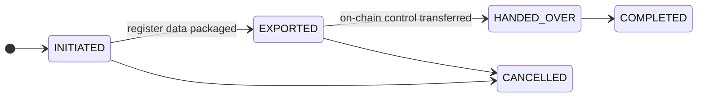

# Cessazione (offboarding) e trasferimento del registro { #offboarding-and-register-transfer }

Un cliente vuole andarsene. Forse sta passando a un concorrente, forse sta chiudendo l'attività, forse sei tu a porre fine al rapporto.

**La partenza deve funzionare correttamente e non deve essere una tua scelta se lo fa.** Un registro da cui un cliente non può uscire è un registro in cui nessuno prudente dovrebbe entrare, e il blocco attraverso attriti operativi è una preoccupazione di supervisione a sé stante.

---

## Tre diverse uscite { #three-different-departures }

Sono spesso confuse tra loro, e hanno meccaniche diverse.

-   **Trasferimento del registro**

    ---

    Un **emittente** sposta un intero titolo a un registrar successore. L'asset se ne va, insieme a tutti i titolari.

    §§21–22 eWpG.

-   **Migrazione del portafoglio**

    ---

    Un **investitore** sposta una singola partecipazione verso un altro registrar. Tutti gli altri restano.

    La controparte lato titolare.

-   **Cessazione del cliente**

    ---

    Un'organizzazione smette di usare il registro. Account disattivati, proposte di vendita ritirate.

    Non sposta di per sé alcun titolo.

!!! warning "La cessazione di un cliente non sposta i suoi titoli"
    Disattivare un'entità chiude gli account e ritira le proposte di vendita. **Non** trasferisce le partecipazioni a un altro registrar.

    Un emittente la cui cessazione avviene senza un trasferimento di registro lascia un titolo attivo in un registro che non usa più. Segui l'ordine: prima il trasferimento, poi la cessazione.

---

## Trasferimento del registro { #register-transfer }

Spostamento di un titolo a un registrar successivo, ai sensi dei §§21–22 eWpG.

**Avvio** — registra il registrar di destinazione e il motivo.

**Esportazione** — impacchetta il contenuto completo del registro: ogni titolare, ogni voce, le restrizioni, la cronologia degli estratti. L'esportazione viene sottoposta ad **hashing**, e l'hash viene conservato. Il successore può verificare di aver ricevuto esattamente ciò che è stato inviato, e nessuna delle due parti può in seguito discutere sul contenuto.

**Consegna del controllo on-chain** — se l'asset ha ruoli amministrativi on-chain, questi passano al successore. Registrata con l'hash della transazione.

**Completamento.**

!!! danger "Le due tappe non possono essere rese atomiche"
    L'esportazione del registro e il trasferimento del controllo on-chain avvengono su sistemi diversi. Non esiste una transazione che copra entrambe.

    Tra le due c'è una finestra in cui il successore detiene i dati e tu detieni ancora il controllo on-chain, o viceversa. Concorda la sequenza con il successore in anticipo, mantieni la finestra breve e registra i timestamp di ciascuna tappa.

!!! info "Conservi la tua copia"
    Un trasferimento di registro non cancella i tuoi record. Gli obblighi di conservazione sopravvivono alla relazione con il cliente, e una registrazione a registro ai sensi del §16 eWpG che sparisse non potrebbe soddisfare i requisiti di tracciabilità a prova di manomissione.

    Le righe dei titolari vengono **eliminate in modo reversibile (soft-delete), mai rimosse**, in tutta la piattaforma. Tutto resta interrogabile ed è contrassegnato come chiuso.

---

## Migrazione del portafoglio { #portfolio-migration }

Un investitore, una partecipazione, verso un altro registrar. Stessa forma — avvio, impostazione della destinazione, esportazione con hash, registrazione del trasferimento on-chain, completamento — ma limitata a un singolo titolare anziché all'intero asset.

Esiste perché, senza di essa, l'unica via d'uscita di un investitore da un registro è la vendita. Poter spostare una partecipazione senza vendere è una parte autentica della tutela dell'investitore, non una comodità.

---

## Cessazione del cliente { #customer-offboarding }

Quando un'organizzazione smette di usare il registro:

1. **Verifica le posizioni aperte.** Partecipazioni, proposte di vendita, prestiti, operazioni in sospeso. Tutto ciò che è aperto va prima risolto o migrato.
2. **Ritira le proposte di vendita.** Gestito automaticamente: le proposte di vendita di un cliente in cessazione vengono annullate invece di restare orfane in attesa che qualcuno le colga.
3. **Disattiva gli utenti.** Immediato, reversibile, non cancella nulla.
4. **Imposta lo stato dell'entità.** Sospesa o sciolta, a seconda dei casi.
5. **Registra il perché**, con una data e un riferimento.

!!! warning "Non cessare un emittente con un titolo attivo"
    Un titolo emesso e non rimborsato il cui emittente è stato cessato ha comunque titolari con diritti, cedole in scadenza e, prima o poi, un rimborso.

    Rimborsalo, oppure trasferiscilo a un registrar successore, prima di cessare l'emittente. Altrimenti hai obblighi in corso in un registro che nessuno amministra più.

---

## Cosa deve essere conservato { #what-must-be-retained }

La cessazione non è una cancellazione, e le due cose non vanno confuse — in particolare quando un cliente in uscita chiede la cancellazione dei dati.

| | |
|---|---|
| **Voci di registro** | Conservate. Eliminazione reversibile (soft-delete), mai rimosse. |
| **Pista di controllo** | Conservata. Concatenata con hash: la rimozione di voci spezza la catena. |
| **Estratti di registro** | Conservati come documenti di registro. |
| **Registrazioni delle operazioni societarie** | Conservate. |
| **Documenti KYC** | Conservati per il periodo previsto dalla legge, poi soggetti a cancellazione. |

!!! danger "Una richiesta di diritto alla cancellazione non prevale sulla conservazione"
    Un cliente in uscita può invocare l'articolo 17 GDPR. Ciò non gli dà diritto alla cancellazione delle voci di registro o delle registrazioni di audit: questi dati sono conservati in base a un obbligo legale, che costituisce un'eccezione esplicita.

    Ciò a cui dà diritto è una risposta adeguata, una valutazione ponderata e la cancellazione di tutto quanto non è realmente coperto. Fai passare queste richieste attraverso il tuo processo di [protezione dei dati](../../compliance/data-protection.md) invece di rispondere direttamente dalla console — e non lasciare che un amministratore ben intenzionato cancelli righe della pista di controllo per essere d'aiuto. La catena lo rivelerebbe.

    [:octicons-arrow-right-24: Protezione dei dati](../../compliance/data-protection.md) · [:octicons-arrow-right-24: Registri del trattamento](../../compliance/ropa.md)

---

## Dove andare adesso { #where-next }

- [Onboarding di un cliente](onboarding-flow.md) — l'altro capo
- [Pista di controllo](../../platform/audit-log.md)
- [Protezione dei dati](../../compliance/data-protection.md)
