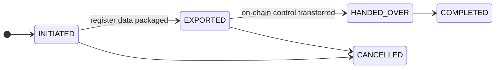

# Offboarding and register transfer

A customer wants to leave. Perhaps they are moving to a competitor, perhaps winding down, perhaps you are ending the relationship.

**Leaving must work properly, and it must not be your choice whether it does.** A registry a customer cannot exit is a registry nobody prudent should enter, and lock-in through operational friction is a supervisory concern in its own right.

---

## Three different departures

They are frequently confused, and they have different mechanics.

-   **Register transfer**

    ---

    An **issuer** moves an entire security to a successor registrar. The asset leaves, all holders with it.

    §§21–22 eWpG.

-   **Portfolio migration**

    ---

    One **investor** moves one holding out to another registrar. Everyone else stays.

    The holder-side counterpart.

-   **Customer offboarding**

    ---

    An organisation stops using the registry. Accounts deactivated, listings withdrawn.

    Does not by itself move securities anywhere.

!!! warning "Offboarding a customer does not move their securities"
    Deactivating an entity closes accounts and withdraws listings. It does **not** transfer holdings to another registrar.

    An issuer who offboards without a register transfer leaves a live security in a registry they no longer use. Sequence it: transfer first, offboard second.

---

## Register transfer

Moving a security to a successor registrar, under §§21–22 eWpG.

**Initiate** — record the destination registrar and the reason.

**Export** — package the complete register content: every holder, every entry, restrictions, statement history. The export is **hashed**, and the hash is retained. The successor can verify they received exactly what was sent, and neither party can later argue about content.

**Hand over on-chain control** — if the asset has on-chain admin roles, they transfer to the successor. Recorded with the transaction hash.

**Complete.**

!!! danger "The two legs cannot be made atomic"
    Exporting the register and transferring on-chain control happen on different systems. There is no transaction spanning both.

    Between them there is a window in which the successor holds the data and you still hold on-chain control, or the reverse. Agree the sequence with the successor in advance, keep the window short, and record the timestamps of each leg.

!!! info "You keep your copy"
    A register transfer does not delete your records. Retention obligations survive the customer relationship, and a §16 register entry that vanishes cannot satisfy tamper-evidence requirements.

    Holder rows are **soft-deleted, never removed**, throughout the platform. Everything stays queryable and is marked closed.

---

## Portfolio migration

One investor, one holding, out to another registrar. Same shape — initiate, set destination, export with hash, record the on-chain transfer, complete — scoped to a single holder rather than the whole asset.

This exists because without it an investor's only exit from a registry is to sell. Being able to move a holding without a sale is a genuine part of investor protection, not a convenience.

---

## Customer offboarding

When an organisation stops using the registry:

1. **Check for open positions.** Holdings, listings, loans, pending trades. Anything open needs resolving or migrating first.
2. **Withdraw trading listings.** Handled automatically — an offboarding customer's listings are cancelled rather than left orphaned for someone to hit.
3. **Deactivate users.** Immediate, reversible, deletes nothing.
4. **Set the entity's status.** Suspended or dissolved as appropriate.
5. **Record why**, with a date and a reference.

!!! warning "Do not offboard an issuer with a live security"
    An issued, unredeemed security whose issuer has been offboarded still has holders with claims, coupons falling due, and eventually a redemption.

    Either redeem it, or transfer it to a successor registrar, before offboarding the issuer. Otherwise you have obligations running through a registry nobody is administering.

---

## What must be retained

Offboarding is not deletion, and the two must not be conflated — particularly when a departing customer asks for erasure.

| | |
|---|---|
| **Register entries** | Retained. Soft-deleted, never removed. |
| **Audit log** | Retained. Hash-chained — removing entries breaks the chain. |
| **Register statements** | Retained as register records. |
| **Corporate action records** | Retained. |
| **KYC documents** | Retained for the statutory period, then subject to deletion. |

!!! danger "A right-to-erasure request does not override retention"
    A departing customer may invoke GDPR Article 17. It does not entitle them to have register entries or audit records deleted: those are retained under a legal obligation, which is an explicit exception.

    What it does entitle them to is a proper answer, a considered assessment, and erasure of anything genuinely not covered. Route these through your [data protection](../../compliance/data-protection.md) process rather than answering at the console — and do not let a well-meaning administrator delete audit rows to be helpful. The chain will show it.

    [:octicons-arrow-right-24: Data protection](../../compliance/data-protection.md) · [:octicons-arrow-right-24: Records of processing](../../compliance/ropa.md)

---

## Where next

- [Onboarding a customer](onboarding-flow.md) — the other end
- [Audit log](../../platform/audit-log.md)
- [Data protection](../../compliance/data-protection.md)
